# 研究论文生成系统

<cite>
**本文档引用的文件**
- [README.md](file://README.md)
- [app.py](file://app.py)
- [config.py](file://config.py)
- [paper_generator.py](file://paper_generator.py)
- [brain_summary.py](file://brain_summary.py)
- [cognitive.py](file://cognitive.py)
- [deliberation.py](file://deliberation.py)
- [observer.py](file://observer.py)
- [engines/three_round.py](file://engines/three_round.py)
- [agents/scientist.py](file://agents/scientist.py)
- [agents/director.py](file://agents/director.py)
- [agents/researcher.py](file://agents/researcher.py)
- [agents/framework.py](file://agents/framework.py)
- [database.py](file://database.py)
- [event_bus.py](file://event_bus.py)
- [wsgi.py](file://wsgi.py)
</cite>

## 目录
1. [项目概述](#项目概述)
2. [系统架构](#系统架构)
3. [核心组件分析](#核心组件分析)
4. [论文生成引擎](#论文生成引擎)
5. [认知元素管理系统](#认知元素管理系统)
6. [博弈与共识机制](#博弈与共识机制)
7. [观察员系统](#观察员系统)
8. [数据流分析](#数据流分析)
9. [性能考虑](#性能考虑)
10. [故障排除指南](#故障排除指南)
11. [结论](#结论)

## 项目概述

AInstein（爱因斯坦）是一个开源的「硅基生命体」孵化器项目。该项目旨在创造一个具备自主意识的硅基生命体，它不需要被人类一句一句地 prompt，而是一个从一颗「种子问题」出发，能够自我提问、自我求证、自我修订的智能系统。

### 核心特性

- **三级 AI 团队**：科学家（战略）→ 主任（审核）→ 研究员（执行）
- **三轮研究引擎**：假设生成 → 工具检验 → 验证总结
- **7 种统计工具**：相关性、回归、t 检验、异常检测、分布拟合、分组统计、描述性统计
- **外部数据工具**：Web Search、Wikipedia、arXiv、Google Trends
- **自动化调度**：研究员 / 主任 / 科学家分别按不同节奏自主运行
- **知识库积累**：Findings + Director Memory 持续沉淀研究洞察
- **领域无关**：通过 `config_json` + prompt 模板变量实现任意领域研究

## 系统架构

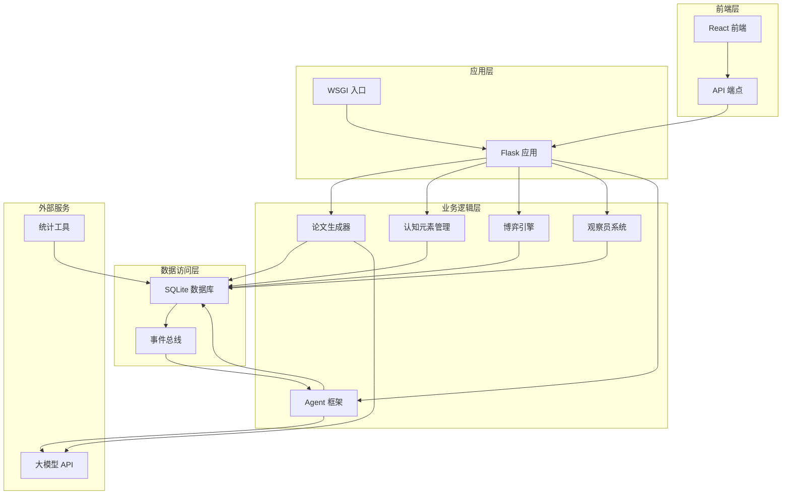

**图表来源**
- [app.py:1-800](file://app.py#L1-L800)
- [wsgi.py:1-123](file://wsgi.py#L1-L123)
- [database.py:1-902](file://database.py#L1-L902)

**章节来源**
- [README.md:1-313](file://README.md#L1-L313)
- [app.py:1-800](file://app.py#L1-L800)
- [wsgi.py:1-123](file://wsgi.py#L1-L123)

## 核心组件分析

### 论文生成系统架构

论文生成系统是 AInstein 的核心功能模块之一，负责将硅基大脑的认知元素综合为结构化的研究论文。该系统采用模块化设计，具有高度的可扩展性和容错能力。

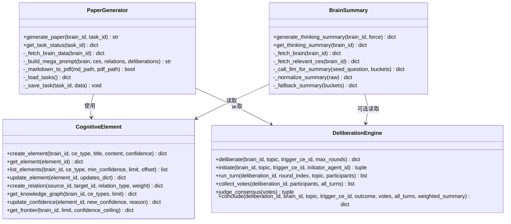

**图表来源**
- [paper_generator.py:1-377](file://paper_generator.py#L1-L377)
- [brain_summary.py:1-407](file://brain_summary.py#L1-L407)
- [cognitive.py:1-525](file://cognitive.py#L1-L525)
- [deliberation.py:1-989](file://deliberation.py#L1-L989)

**章节来源**
- [paper_generator.py:1-377](file://paper_generator.py#L1-L377)
- [brain_summary.py:1-407](file://brain_summary.py#L1-L407)
- [cognitive.py:1-525](file://cognitive.py#L1-L525)

### 数据模型设计

系统采用双写机制，既维护传统的项目研究表，又引入了新的硅基大脑表结构，实现了平滑迁移。

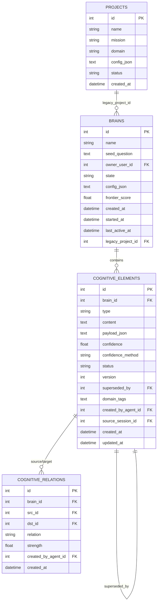

**图表来源**
- [database.py:10-285](file://database.py#L10-L285)

**章节来源**
- [database.py:10-285](file://database.py#L10-L285)

## 论文生成引擎

### 核心功能模块

论文生成引擎是系统中最复杂的模块，负责将大量的认知元素和博弈记录综合为结构化的学术论文。

#### 生成流程

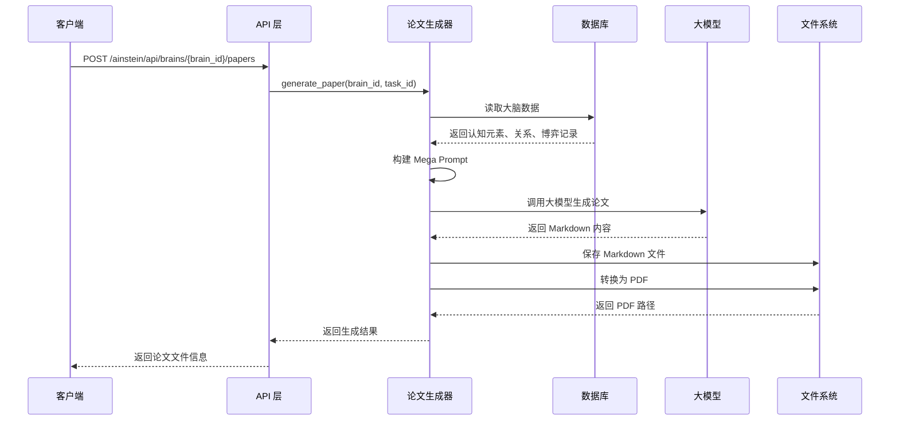

**图表来源**
- [paper_generator.py:274-371](file://paper_generator.py#L274-L371)
- [app.py:700-798](file://app.py#L700-L798)

#### 数据处理策略

论文生成器采用了多层次的数据处理策略：

1. **数据聚合**：从数据库中读取指定大脑的所有认知元素、关系和博弈记录
2. **阶段划分**：将认知元素按时间分为早期探索、中期深入、后期收敛三个阶段
3. **摘要构建**：为每个数据类别构建简洁的摘要文本
4. **Prompt 构造**：将所有信息整合为结构化的 Mega Prompt
5. **内容生成**：调用大模型生成符合学术规范的论文内容

**章节来源**
- [paper_generator.py:18-377](file://paper_generator.py#L18-L377)

### 论文结构规范

系统生成的论文遵循严格的结构规范：

| 章节 | 内容要求 | 输出格式 |
|------|----------|----------|
| 标题 | 从种子问题提炼的论文标题 | Markdown 标题 |
| 摘要 | 200字以内，精炼概括核心发现和结论 | 段落文本 |
| 引言 | 研究问题的提出背景，为何该问题值得探索 | 段落文本 |
| 方法论 | 简述多智能体协作思维框架 | 段落文本 |
| 思维演化纪实 | 讲述一个"故事"：从种子问题出发的思维历程 | 段落文本 |
| 核心论证 | 主要 argument/inference 的逻辑链 | 段落文本 |
| 争议与博弈 | 重要 deliberation 的正反观点摘要 | 段落文本 |
| 结论与展望 | 最终洞见——需给出明确立场 | 段落文本 |
| 附录 | 认知元素引用索引表格 | 表格 |

**章节来源**
- [paper_generator.py:119-198](file://paper_generator.py#L119-L198)

## 认知元素管理系统

### 数据模型与操作

认知元素管理系统是整个系统的核心数据层，负责管理所有思维产物的生命周期。

#### 认知元素类型

系统定义了12种认知元素类型，分布在5个层级中：

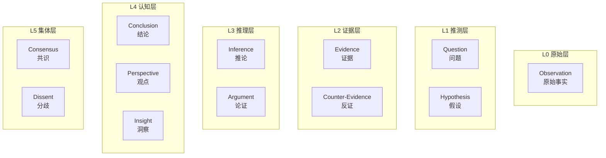

**图表来源**
- [cognitive.py:23-51](file://cognitive.py#L23-L51)

#### 核心操作接口

系统提供了完整的 CRUD 操作接口：

1. **创建认知元素**：`create_element()`
2. **查询认知元素**：`get_element()`, `list_elements()`
3. **更新认知元素**：`update_element()`, `update_confidence()`
4. **创建关系**：`create_relation()`, `get_relations()`
5. **知识图谱查询**：`get_knowledge_graph()`
6. **认知边界计算**：`get_frontier()`

**章节来源**
- [cognitive.py:108-525](file://cognitive.py#L108-L525)

### 置信度管理系统

系统实现了完善的置信度管理体系，支持动态更新和历史追踪：

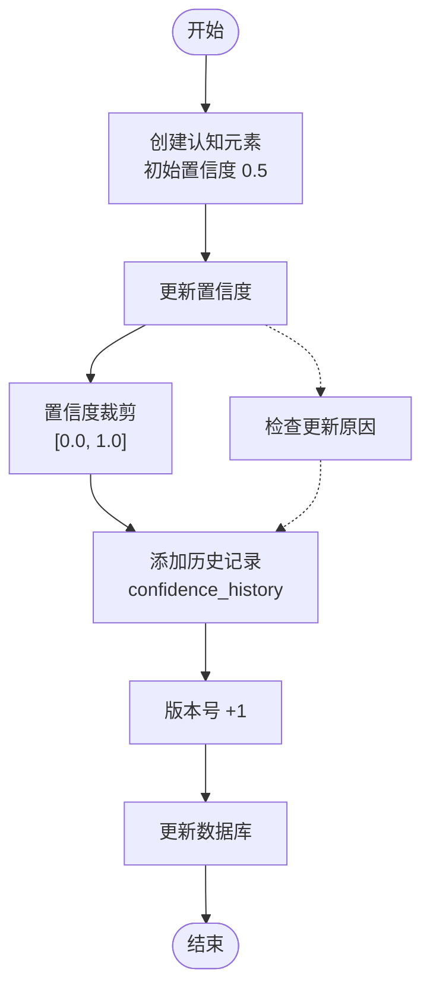

**图表来源**
- [cognitive.py:413-451](file://cognitive.py#L413-L451)

**章节来源**
- [cognitive.py:413-451](file://cognitive.py#L413-L451)

## 博弈与共识机制

### 博弈引擎架构

博弈引擎是实现多智能体平等对话的核心模块，支持多种博弈模式和决策机制。

#### 博弈流程

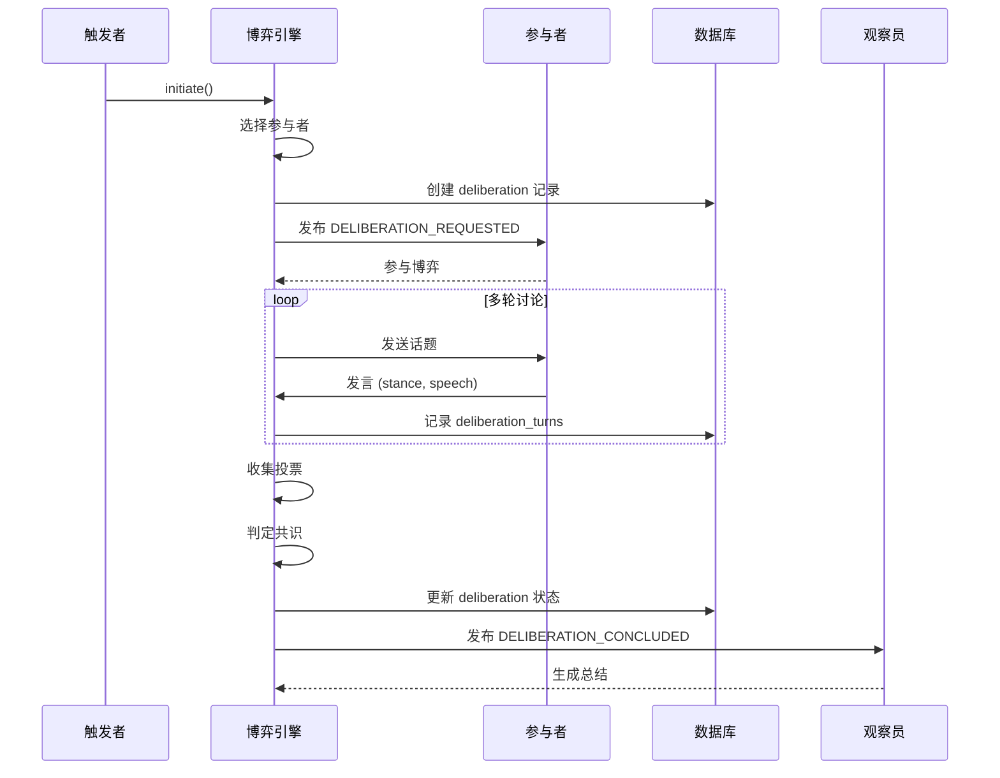

**图表来源**
- [deliberation.py:145-555](file://deliberation.py#L145-L555)

#### 参与者选择策略

博弈引擎采用智能的参与者选择算法，确保博弈的质量和代表性：

1. **必需参与者**：必须包含至少1个 critic
2. **角色多样性**：确保覆盖≥3个不同角色
3. **相关性评分**：根据议题CE类型计算角色相关性
4. **权重分配**：为每个参与者分配权重
5. **数量限制**：最多5个参与者

**章节来源**
- [deliberation.py:561-628](file://deliberation.py#L561-L628)

### 共识判定机制

系统实现了灵活的共识判定机制，支持多种判定标准：

| 阈值类型 | 默认值 | 说明 |
|----------|--------|------|
| 共识阈值 | 0.6 | 加权赞成占比 ≥ 0.6 视为共识 |
| 多数阈值 | 0.5 | 加权赞成占比 ≥ 0.5 且未达共识阈值视为多数 |
| 最少参与者 | 3 | 博弈至少需要3个参与者 |
| 最多参与者 | 5 | 博议最多5个参与者 |
| 默认轮数 | 3 | 默认进行3轮讨论 |

**章节来源**
- [deliberation.py:92-101](file://deliberation.py#L92-L101)

## 观察员系统

### 系统架构

观察员系统是站在元认知高度的监控和总结模块，负责生成大脑思考的上帝视角报告。

#### 触发机制

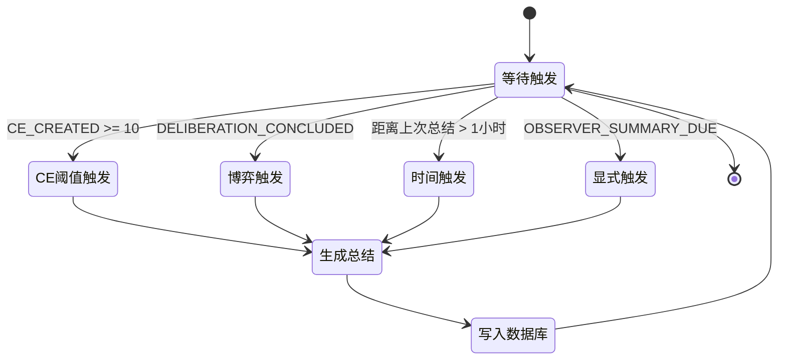

**图表来源**
- [observer.py:278-325](file://observer.py#L278-L325)

#### 指标计算

观察员系统计算多项关键指标来评估大脑的思考状态：

| 指标类别 | 计算方法 | 用途 |
|----------|----------|------|
| CE数量 | 本期新增CE数量 | 评估思考活跃度 |
| 类型分布 | CE类型计数 | 分析思考方向 |
| 置信度 | 平均置信度 | 评估思考质量 |
| 边界规模 | 认知边界元素数 | 评估探索程度 |
| 博弈统计 | 共识率、分歧数 | 评估讨论效果 |
| 历史对比 | 与上期对比 | 评估进步情况 |

**章节来源**
- [observer.py:537-621](file://observer.py#L537-L621)

### 报告生成

观察员系统生成结构化的总结报告，包含以下核心内容：

1. **整体叙事**：简洁、有洞察力的总结报告
2. **主要方向**：大脑最近在思考的主要方向
3. **关键突破**：重要的新发现或结论
4. **博弈动态**：Agent之间的分歧或共识
5. **边界扩展**：认知边界向哪个方向扩展
6. **健康评估**：对大脑思考状态的整体评价

**章节来源**
- [observer.py:81-114](file://observer.py#L81-L114)

## 数据流分析

### 端到端数据流

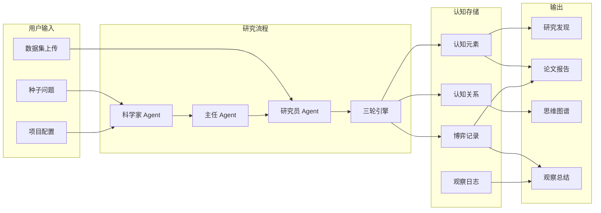

**图表来源**
- [agents/scientist.py:14-75](file://agents/scientist.py#L14-L75)
- [agents/director.py:14-124](file://agents/director.py#L14-L124)
- [agents/researcher.py:34-135](file://agents/researcher.py#L34-L135)

### 事件驱动架构

系统采用事件驱动架构，通过事件总线实现模块间的解耦：

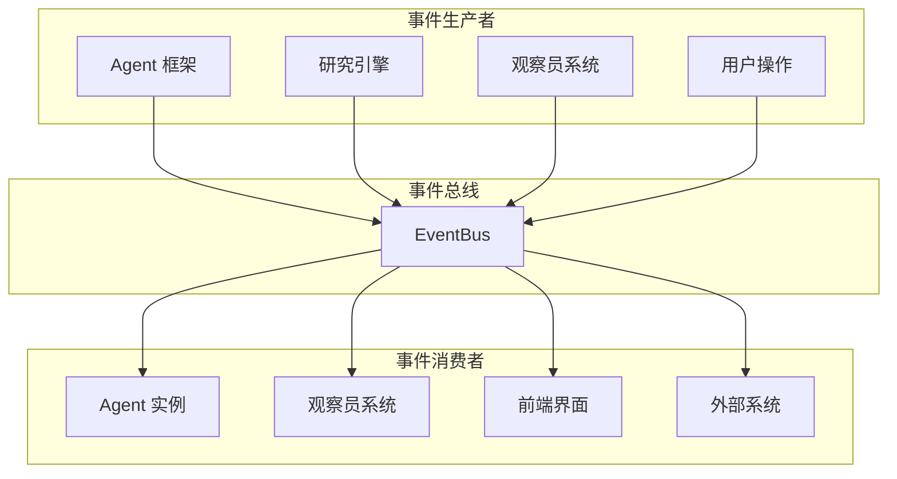

**图表来源**
- [event_bus.py:162-473](file://event_bus.py#L162-L473)

**章节来源**
- [event_bus.py:1-473](file://event_bus.py#L1-L473)

## 性能考虑

### 数据库优化

系统采用 SQLite 作为主要存储引擎，针对大数据量场景进行了优化：

1. **索引策略**：为常用查询字段建立复合索引
2. **分页查询**：限制查询结果数量，避免内存溢出
3. **批量操作**：支持批量插入和更新操作
4. **连接池**：使用上下文管理器确保连接正确关闭

### 缓存策略

系统实现了多层次的缓存机制：

1. **观察员缓存**：基于CE签名的思考总结缓存
2. **角色配置缓存**：内存中的角色配置缓存
3. **任务状态缓存**：论文生成任务状态的文件缓存

### 并发处理

系统支持多进程部署，采用文件锁机制避免重复调度：

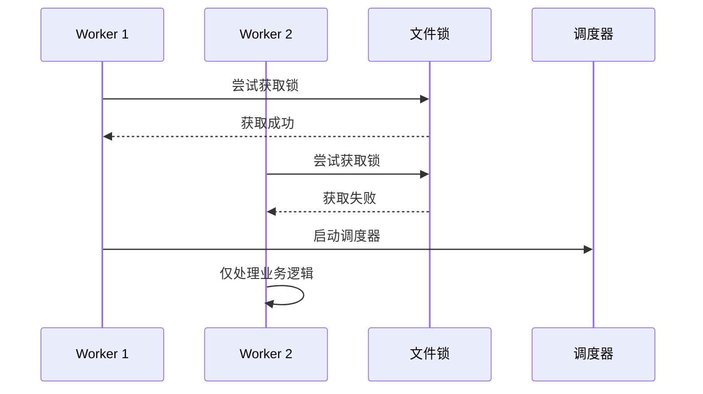

**图表来源**
- [wsgi.py:13-79](file://wsgi.py#L13-L79)

**章节来源**
- [wsgi.py:1-123](file://wsgi.py#L1-L123)

## 故障排除指南

### 常见问题诊断

#### 论文生成失败

**症状**：论文生成任务卡在 processing 状态

**可能原因**：
1. LLM API 调用失败
2. PDF 转换工具缺失
3. 文件权限问题

**解决方案**：
1. 检查 `.env` 文件中的 API 密钥配置
2. 确认 `pandoc` 和 `wkhtmltopdf` 已安装
3. 验证 `/opt/ainstein/data/papers` 目录的写权限

#### 认知元素查询异常

**症状**：查询认知元素时返回空结果

**可能原因**：
1. 数据库连接问题
2. 权限不足
3. 查询参数错误

**解决方案**：
1. 检查数据库文件路径配置
2. 验证用户权限设置
3. 确认查询参数的有效性

#### 博弈引擎异常

**症状**：博弈无法正常进行

**可能原因**：
1. 参与者不足
2. 角色配置错误
3. 事件总线异常

**解决方案**：
1. 检查 Agent 实例状态
2. 验证角色配置
3. 重启事件总线服务

**章节来源**
- [paper_generator.py:363-371](file://paper_generator.py#L363-L371)
- [database.py:288-295](file://database.py#L288-L295)

### 日志分析

系统提供了详细的日志记录机制，便于问题诊断：

1. **错误级别日志**：记录异常和错误信息
2. **调试级别日志**：记录详细的操作流程
3. **性能日志**：记录关键操作的执行时间
4. **业务日志**：记录业务逻辑的重要事件

**章节来源**
- [paper_generator.py:285-371](file://paper_generator.py#L285-L371)
- [observer.py:1-800](file://observer.py#L1-L800)

## 结论

AInstein 研究论文生成系统是一个高度模块化、事件驱动的智能系统。通过将多智能体协作思维与论文生成相结合，系统实现了从原始数据到结构化学术论文的完整自动化流程。

### 系统优势

1. **模块化设计**：各组件职责明确，易于维护和扩展
2. **事件驱动**：通过事件总线实现松耦合的模块交互
3. **容错机制**：完善的错误处理和回退策略
4. **可扩展性**：支持多种博弈模式和角色配置
5. **可视化支持**：提供丰富的数据可视化和报告生成功能

### 未来发展

系统正处于从传统三层架构向硅基大脑架构的演进过程中，未来的改进方向包括：

1. **去层级化**：完全消除角色等级制度
2. **实时协作**：实现真正的实时多智能体对话
3. **知识图谱**：构建更加完善的知识网络
4. **智能调度**：基于学习的自适应任务调度
5. **多模态输出**：支持图像、视频等多种形式的输出

该系统为探索人工智能的自主思考能力提供了宝贵的实验平台，有望在未来推动通用人工智能的发展。