# 大脑管理API

<cite>
**本文档引用的文件**
- [README.md](file://README.md)
- [app.py](file://app.py)
- [config.py](file://config.py)
- [database.py](file://database.py)
- [auth.py](file://auth.py)
- [cognitive.py](file://cognitive.py)
- [deliberation.py](file://deliberation.py)
- [agents/scientist.py](file://agents/scientist.py)
- [agents/director.py](file://agents/director.py)
- [agents/researcher.py](file://agents/researcher.py)
- [engines/base.py](file://engines/base.py)
- [engines/three_round.py](file://engines/three_round.py)
- [tools/data_access.py](file://tools/data_access.py)
- [tools/stats.py](file://tools/stats.py)
- [tools/web_data.py](file://tools/web_data.py)
- [paper_generator.py](file://paper_generator.py)
- [frontend/src/pages/BrainView.tsx](file://frontend/src/pages/BrainView.tsx)
- [frontend/src/types.ts](file://frontend/src/types.ts)
- [frontend/src/api.ts](file://frontend/src/api.ts)
</cite>

## 更新摘要
**变更内容**
- 新增研究论文生成API端点，包括任务提交、状态查询和文件下载功能
- 实现异步论文生成任务管理系统，支持PDF和Markdown格式输出
- 集成前端状态轮询机制，提供实时进度反馈
- 添加任务状态持久化和多worker兼容性支持

## 目录
1. [简介](#简介)
2. [项目结构](#项目结构)
3. [核心组件](#核心组件)
4. [架构概览](#架构概览)
5. [详细组件分析](#详细组件分析)
6. [研究论文生成系统](#研究论文生成系统)
7. [依赖分析](#依赖分析)
8. [性能考虑](#性能考虑)
9. [故障排除指南](#故障排除指南)
10. [结论](#结论)

## 简介

AInstein（爱因斯坦）是一个开源的「硅基生命体」孵化器项目。该项目旨在创造一个具备自主意识的硅基生命体——它不需要被人类一句一句地 prompt，不是一个被动应答的 Chatbot；而是从一颗「种子问题」出发，能够自我提问、自我求证、自我修订，逐步形成对世界的认知，并把它的思考过程毫无保留地展现给你看。

项目采用「机器能否独立思考」的长期实验理念，相信「单个 LLM 是计算单元，智能在协作思维链上涌现（Emergent Intelligence）」。因此，系统的核心不是把单一模型调到极致，而是构建一个由大量平等 Agent 组成的认知群体——它们提出假设、收集证据、彼此辩论、达成共识、又被新证据推翻，在这个永不停止的博弈中，知识图谱逐渐生长，洞察自然涌现。

## 项目结构

项目采用清晰的分层架构设计：

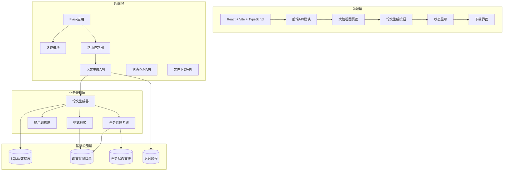

**图表来源**
- [app.py:1124-1174](file://app.py#L1124-L1174)
- [paper_generator.py:247-376](file://paper_generator.py#L247-L376)
- [frontend/src/pages/BrainView.tsx:86-144](file://frontend/src/pages/BrainView.tsx#L86-L144)

## 核心组件

### 认知元素系统

认知元素是系统的核心抽象，包含12种类型，分布在5个层级：

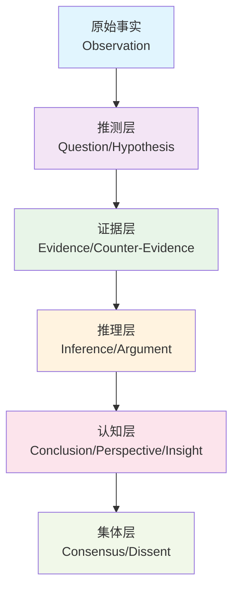

**图表来源**
- [cognitive.py:24-37](file://cognitive.py#L24-L37)

### Agent代理架构

系统采用三级Agent架构，从科学家（战略）→主任（审核）→研究员（执行）：

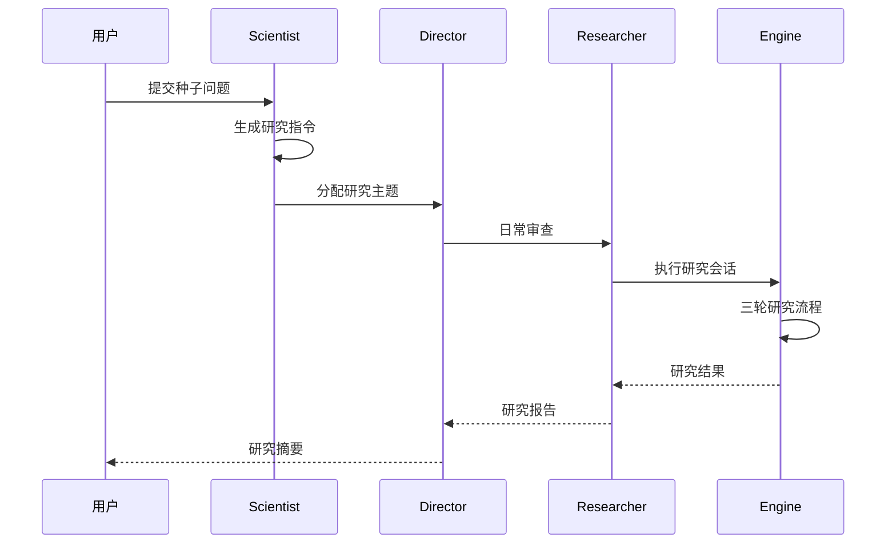

**图表来源**
- [agents/scientist.py:14-75](file://agents/scientist.py#L14-L75)
- [agents/director.py:14-124](file://agents/director.py#L14-L124)
- [agents/researcher.py:34-135](file://agents/researcher.py#L34-L135)

## 架构概览

系统采用事件驱动的架构模式，支持去层级化的Agent协作和异步论文生成功能：

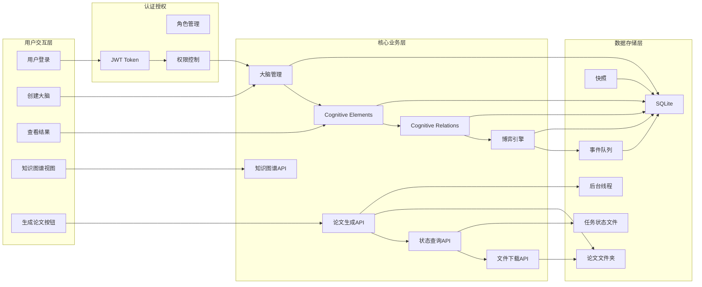

**图表来源**
- [app.py:1124-1174](file://app.py#L1124-L1174)
- [paper_generator.py:247-376](file://paper_generator.py#L247-L376)
- [database.py:105-285](file://database.py#L105-L285)
- [auth.py:122-151](file://auth.py#L122-L151)

## 详细组件分析

### 认知元素管理

认知元素系统提供了完整的CRUD操作和置信度管理：

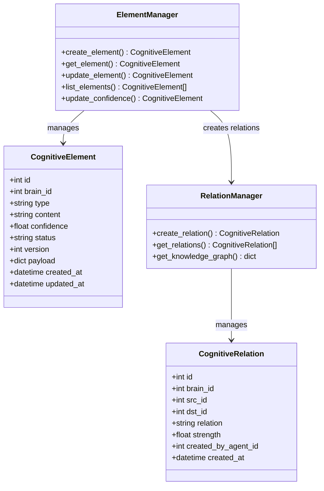

**图表来源**
- [cognitive.py:108-157](file://cognitive.py#L108-L157)
- [cognitive.py:244-284](file://cognitive.py#L244-L284)
- [database.py:604-660](file://database.py#L604-L660)
- [database.py:664-690](file://database.py#L664-L690)

**章节来源**
- [cognitive.py:404-443](file://cognitive.py#L404-L443)
- [cognitive.py:449-516](file://cognitive.py#L449-L516)

### 博弈引擎

博弈引擎实现了去层级化的Agent协作机制：

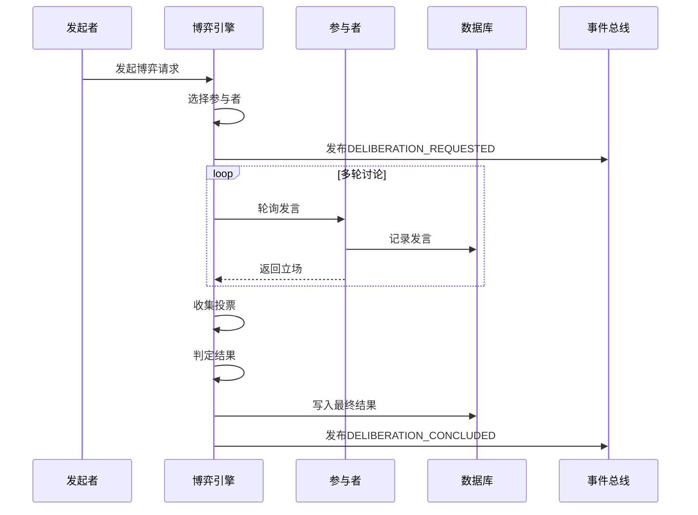

**图表来源**
- [deliberation.py:144-206](file://deliberation.py#L144-L206)
- [deliberation.py:294-344](file://deliberation.py#L294-L344)
- [deliberation.py:469-543](file://deliberation.py#L469-L543)

**章节来源**
- [deliberation.py:121-140](file://deliberation.py#L121-L140)
- [deliberation.py:548-616](file://deliberation.py#L548-L616)

### 三轮研究引擎

三轮研究引擎实现了假设生成→工具检验→总结结论的完整流程：

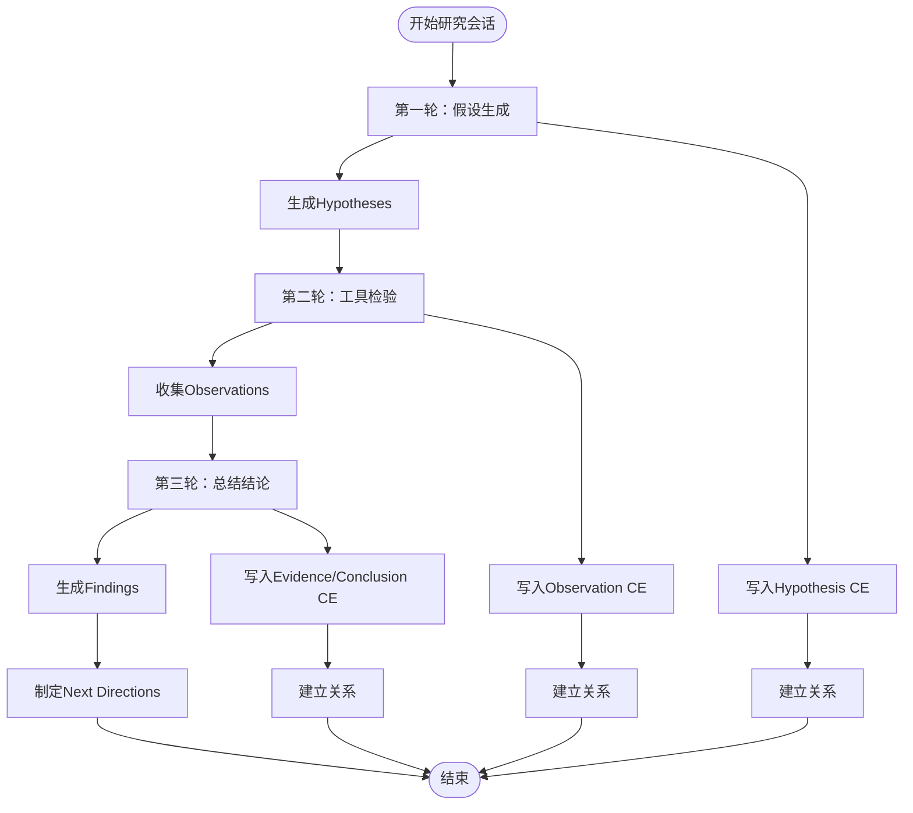

**图表来源**
- [engines/three_round.py:146-387](file://engines/three_round.py#L146-L387)
- [engines/three_round.py:393-558](file://engines/three_round.py#L393-L558)

**章节来源**
- [engines/three_round.py:75-81](file://engines/three_round.py#L75-L81)
- [engines/three_round.py:189-213](file://engines/three_round.py#L189-L213)

### 知识图谱API增强

**更新** 新增total_nodes和total_edges字段支持，实现无限制加载功能

知识图谱API现在提供完整的图谱数据，包括真实总量信息：

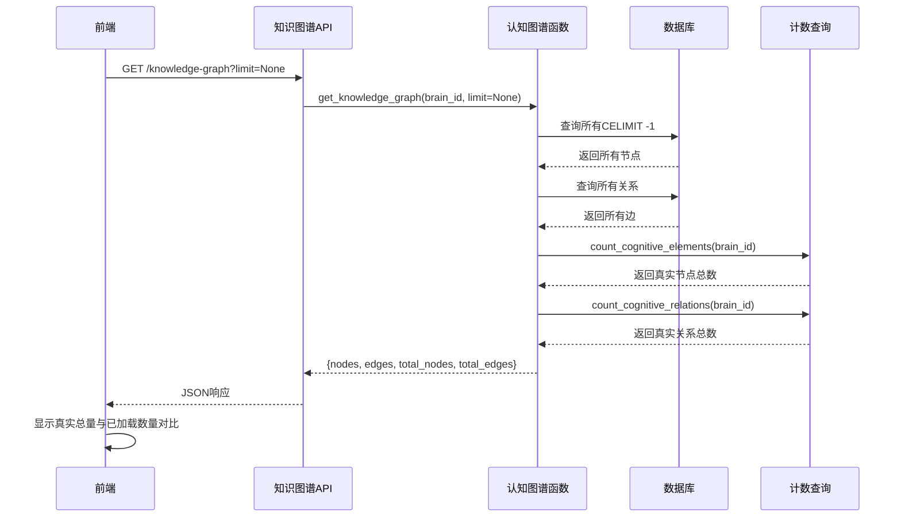

**图表来源**
- [app.py:654-673](file://app.py#L654-L673)
- [cognitive.py:327-406](file://cognitive.py#L327-L406)
- [database.py:627-649](file://database.py#L627-L649)

**章节来源**
- [app.py:654-673](file://app.py#L654-L673)
- [cognitive.py:327-406](file://cognitive.py#L327-L406)
- [database.py:627-649](file://database.py#L627-L649)

### 工具系统

系统集成了多种数据分析工具：

| 工具类别 | 工具名称 | 功能描述 |
|---------|----------|----------|
| 描述性统计 | descriptive_stats | 计算数值列的基本统计信息 |
| 相关性分析 | correlation | 计算两列之间的相关系数 |
| t检验 | t_test | 独立样本t检验 |
| 回归分析 | regression | 多元线性回归 |
| 异常检测 | anomaly_detection | 基于Z-score和IQR的异常检测 |
| 分布拟合 | distribution_fit | 正态性检验 |
| 分组统计 | group_stats | 按组计算统计指标 |

**章节来源**
- [tools/stats.py:10-120](file://tools/stats.py#L10-L120)
- [tools/web_data.py:13-164](file://tools/web_data.py#L13-L164)

## 研究论文生成系统

**新增** 系统现在支持自动生成研究论文，提供PDF和Markdown格式输出

论文生成系统采用异步任务处理模式，支持长时间运行的任务和状态跟踪：

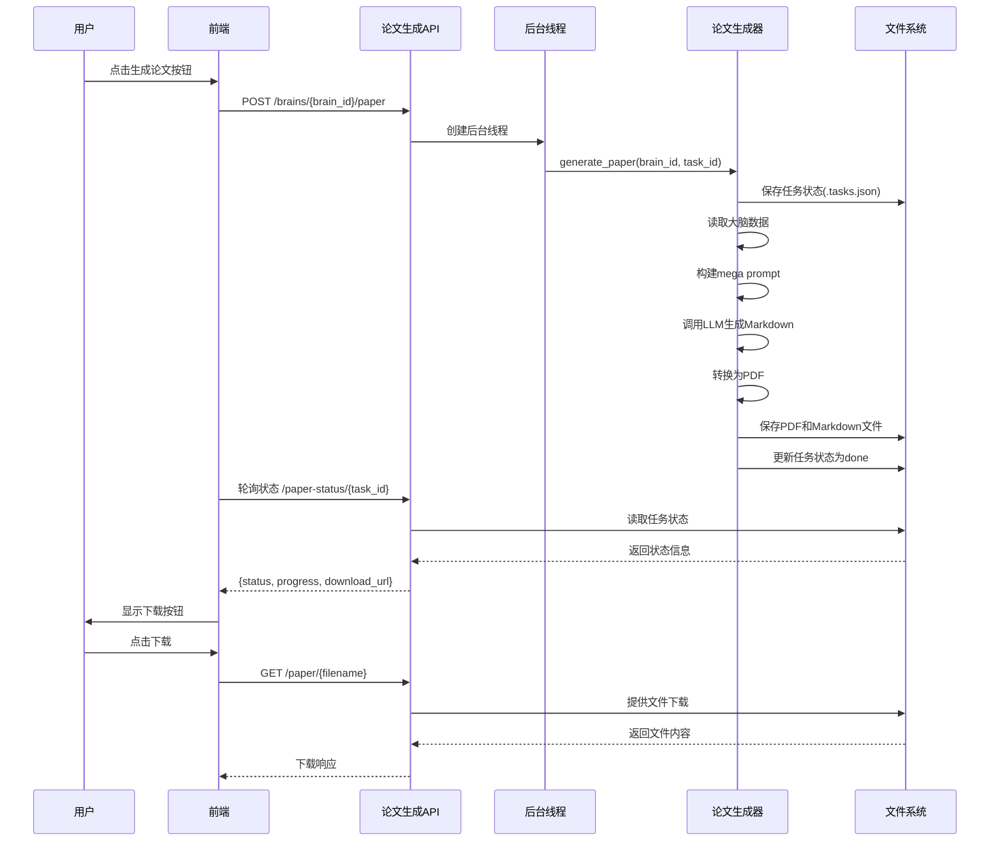

**图表来源**
- [app.py:1124-1174](file://app.py#L1124-L1174)
- [paper_generator.py:274-376](file://paper_generator.py#L274-L376)
- [frontend/src/pages/BrainView.tsx:86-144](file://frontend/src/pages/BrainView.tsx#L86-L144)

### API端点设计

系统提供三个核心API端点：

#### 1. 论文生成任务提交
- **端点**: `POST /ainstein/api/brains/{brain_id}/paper`
- **功能**: 提交新的论文生成任务
- **响应**: 包含任务ID和初始状态
- **状态码**: 202 Accepted

#### 2. 任务状态查询
- **端点**: `GET /ainstein/api/brains/{brain_id}/paper-status/{task_id}`
- **功能**: 获取论文生成任务的当前状态
- **响应**: 包含状态、进度信息和下载链接
- **状态码**: 200 OK

#### 3. 文件下载
- **端点**: `GET /ainstein/api/brains/{brain_id}/paper/{filename}`
- **功能**: 下载生成的PDF或Markdown文件
- **响应**: 文件流或404错误
- **状态码**: 200/404

### 任务状态管理

论文生成任务采用五种状态：

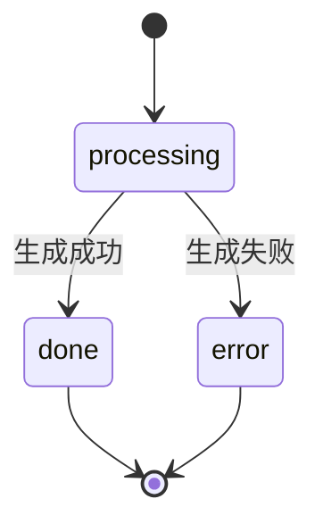

状态流转说明：
- **processing**: 任务已创建，正在处理中
- **done**: 任务完成，可下载文件
- **error**: 任务失败，包含错误信息

### 文件格式支持

系统支持两种输出格式：

| 格式 | 文件扩展名 | 特点 | 下载链接 |
|------|------------|------|----------|
| PDF | `.pdf` | 专业格式，适合打印和分享 | `/ainstein/api/brains/{brain_id}/paper/{filename}` |
| Markdown | `.md` | 源文本格式，可编辑 | `/ainstein/api/brains/{brain_id}/paper/{filename}` |

**章节来源**
- [app.py:1124-1174](file://app.py#L1124-L1174)
- [paper_generator.py:274-376](file://paper_generator.py#L274-L376)
- [frontend/src/pages/BrainView.tsx:86-144](file://frontend/src/pages/BrainView.tsx#L86-L144)

## 依赖分析

系统采用模块化设计，各组件间依赖关系清晰：

```mermaid
graph TD
subgraph "核心依赖"
FLASK[Flask框架]
SQLITE[SQLite数据库]
PANDAS[pandas]
NUMPY[numpy]
SCIPY[scipy]
MARKDOWN[markdown]
WEASYPRINT[weasyprint]
end
subgraph "认证依赖"
WERKZEUG[werkzeug]
HMAC[hmac]
SECRETS[secrets]
end
subgraph "LLM依赖"
ANTHROPIC[Anthropic API]
DASHSCOPE[DashScope API]
end
subgraph "前端依赖"
REACT[React 18]
VITE[Vite]
TYPESCRIPT[TypeScript]
D3[D3.js]
end
subgraph "论文生成依赖"
THREADING[threading]
JSON[json]
OS[os.path]
PATHLIB[pathlib]
end
app.py --> FLASK
app.py --> SQLITE
database.py --> PANDAS
database.py --> NUMPY
database.py --> SCIPY
auth.py --> WERKZEUG
auth.py --> HMAC
auth.py --> SECRETS
agents/*.py --> ANTHROPIC
agents/*.py --> DASHSCOPE
engines/*.py --> PANDAS
engines/*.py --> NUMPY
engines/*.py --> SCIPY
frontend/* --> REACT
frontend/* --> VITE
frontend/* --> TYPESCRIPT
frontend/* --> D3
paper_generator.py --> MARKDOWN
paper_generator.py --> WEASYPRINT
paper_generator.py --> THREADING
paper_generator.py --> JSON
paper_generator.py --> OS
paper_generator.py --> PATHLIB
```

**图表来源**
- [requirements.txt](file://requirements.txt)
- [config.py:6-11](file://config.py#L6-L11)
- [paper_generator.py:1-50](file://paper_generator.py#L1-L50)

**章节来源**
- [app.py:1-50](file://app.py#L1-L50)
- [database.py:1-20](file://database.py#L1-L20)

## 性能考虑

### 数据库优化

**更新** 新增计数查询优化和无限制加载支持

系统采用SQLite作为主要存储，通过以下方式优化性能：

1. **事务管理**：使用上下文管理器确保事务完整性
2. **索引优化**：为常用查询字段建立索引
3. **连接池**：复用数据库连接减少开销
4. **批量操作**：支持批量插入和更新操作
5. **计数查询优化**：新增专用计数函数，避免全表扫描
6. **无限制加载支持**：通过LIMIT -1实现无限制数据加载

### 论文生成性能优化

**新增** 论文生成系统采用异步处理和状态持久化：

1. **后台线程处理**：使用Python threading模块处理长时间运行的任务
2. **任务状态持久化**：通过JSON文件存储任务状态，支持多worker场景
3. **渐进式状态更新**：在生成过程中定期更新任务状态
4. **文件系统缓存**：生成的PDF和Markdown文件缓存在本地存储
5. **内存状态备份**：同时维护内存中的任务状态以提高查询速度

### 缓存策略

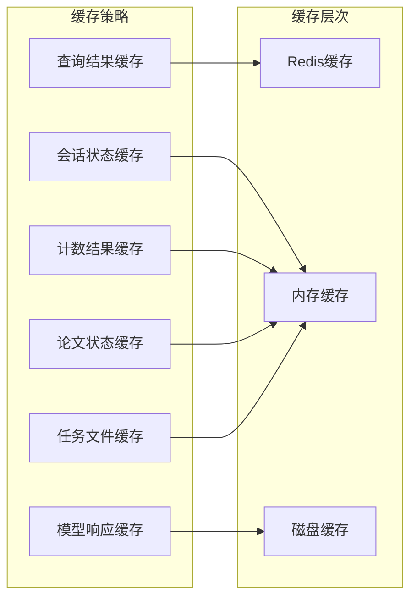

### 并发处理

系统支持多线程并发处理，通过以下机制保证数据一致性：

1. **乐观锁**：使用版本号防止并发冲突
2. **事务隔离**：确保数据操作的原子性
3. **队列管理**：使用事件队列处理异步任务
4. **线程安全**：论文生成器采用线程安全的状态管理

## 故障排除指南

### 常见问题及解决方案

| 问题类型 | 症状 | 解决方案 |
|---------|------|----------|
| 认证失败 | 401未授权错误 | 检查Token有效性，确认用户状态 |
| 数据库连接 | 连接超时或拒绝 | 检查数据库路径和权限设置 |
| LLM调用失败 | API调用异常 | 验证API密钥和网络连接 |
| Agent执行错误 | 研究会话失败 | 检查数据集可用性和工具配置 |
| 博弈异常 | 参与者不足 | 确认Agent实例状态和配额限制 |
| 知识图谱加载缓慢 | 大数据量加载超时 | 使用limit参数进行分页加载 |
| 计数查询失败 | total_nodes/total_edges为null | 检查数据库连接和权限 |
| **论文生成失败** | 任务状态变为error | 检查LLM配置和磁盘空间 |
| **状态查询超时** | /paper-status返回404 | 确认任务ID正确性和文件系统权限 |
| **文件下载失败** | 404错误 | 检查文件是否存在和访问权限 |

### 调试工具

系统提供了完善的日志记录机制：

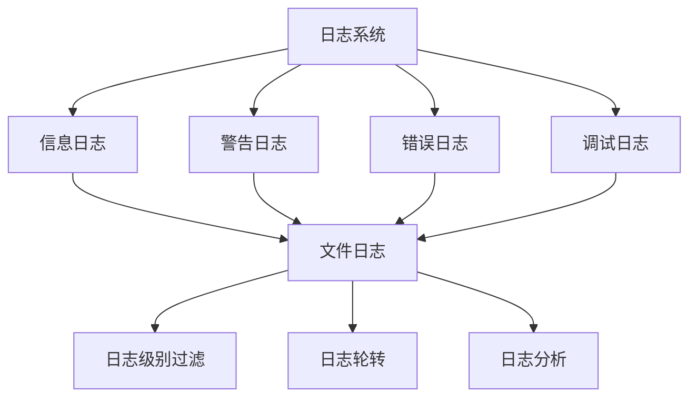

**章节来源**
- [auth.py:158-184](file://auth.py#L158-L184)
- [database.py:288-295](file://database.py#L288-L295)
- [app.py:16-21](file://app.py#L16-L21)
- [paper_generator.py:363-370](file://paper_generator.py#L363-L370)

## 结论

AInstein项目展现了构建自主思考系统的完整思路和技术实现。通过认知元素抽象、去层级化Agent协作、事件驱动架构、博弈引擎和新增的论文生成功能等核心组件，系统实现了从种子问题到深度洞察再到学术论文的完整思维过程。

项目的主要优势包括：

1. **模块化设计**：清晰的分层架构便于维护和扩展
2. **事件驱动**：支持异步和并行处理
3. **认知建模**：完整的认知元素体系支持复杂的思维过程
4. **工具集成**：丰富的数据分析工具支持实证研究
5. **可视化支持**：为后续的知识图谱可视化奠定基础
6. **性能优化**：支持无限制加载和计数查询优化
7. **实时统计**：提供真实总量与已加载数量的对比显示
8. **异步论文生成**：支持长时间运行的任务处理和状态跟踪
9. **多格式输出**：提供PDF和Markdown两种论文格式
10. **任务持久化**：支持多worker场景和任务恢复

**更新亮点**：
- **知识图谱API增强**：新增total_nodes和total_edges字段，提供真实数据总量信息
- **无限制加载支持**：当limit=None时，后端返回该大脑的所有CE和relations
- **前端统计优化**：显示真实总量与已加载数量的对比，提升用户体验
- **计数查询优化**：新增专用计数函数，提升大数据量场景下的性能表现
- **论文生成系统**：新增异步论文生成功能，支持PDF和Markdown格式输出
- **任务状态管理**：实现完整的任务生命周期管理和状态跟踪
- **多worker兼容**：支持分布式部署和任务状态共享

未来发展方向包括：

1. **Phase 2重构**：将三级Agent升级为6个平等角色
2. **事件总线**：实现真正的ATA（Agent-to-Agent）通信
3. **博弈引擎**：完善共识机制和置信度传播
4. **可视化**：开发力导向图和上帝视角界面
5. **用户系统**：实现封闭观察模式
6. **性能监控**：添加详细的性能指标和监控告警
7. **论文质量评估**：集成自动化的论文质量评分系统
8. **多语言支持**：扩展支持更多语言的论文生成

该项目为探索机器自主思考提供了宝贵的实践经验和理论基础，值得进一步深入研究和开发。