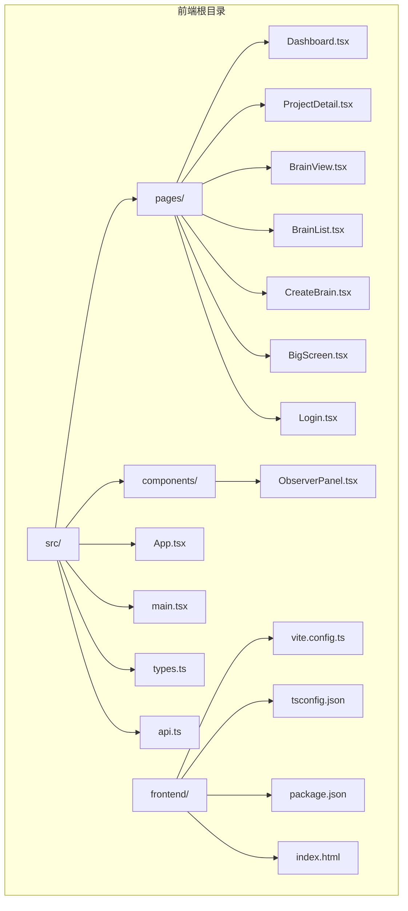
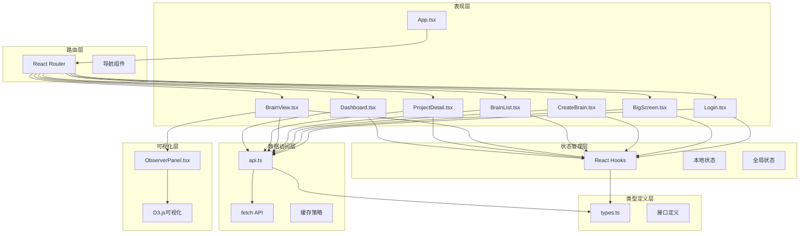
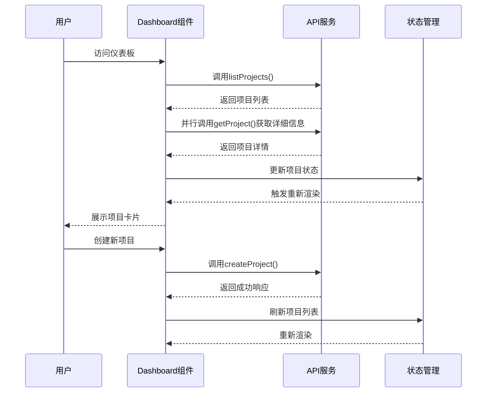
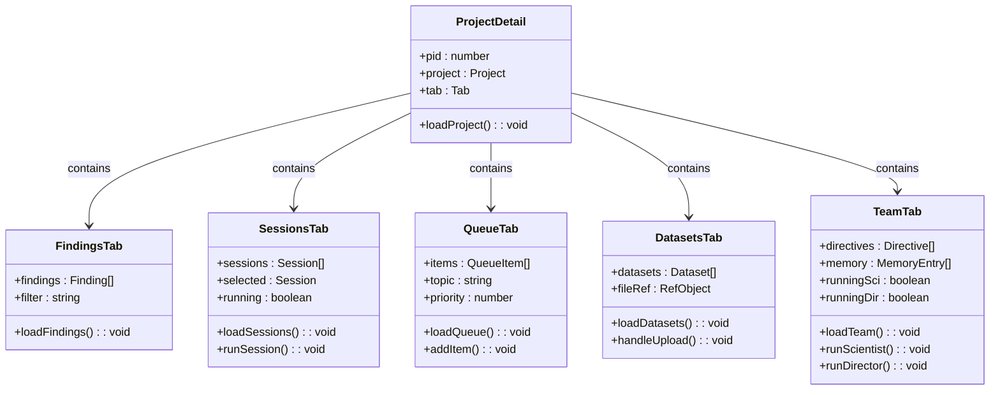
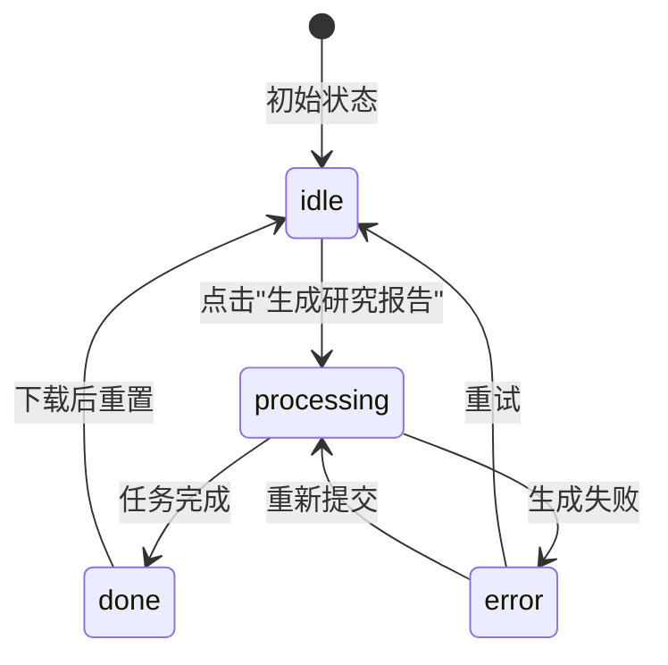
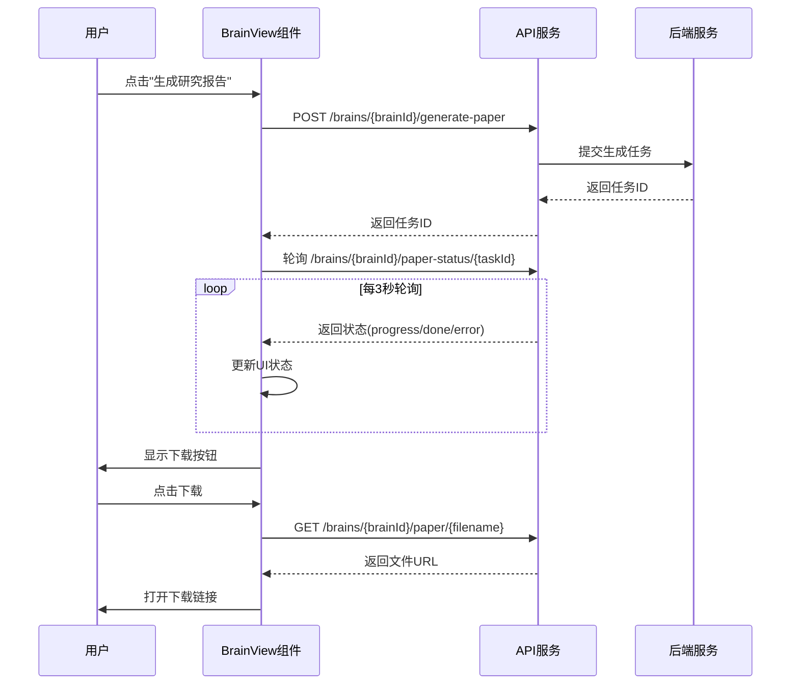
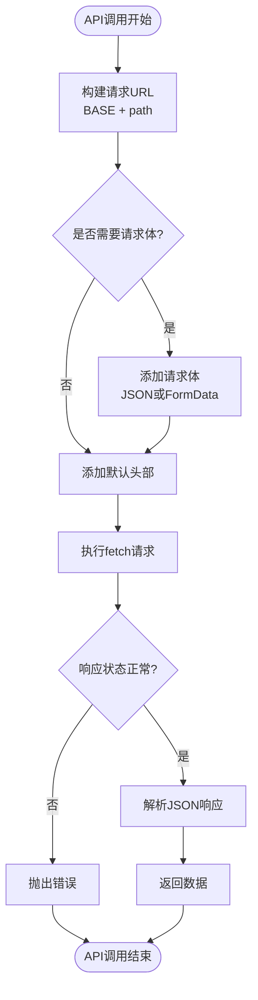
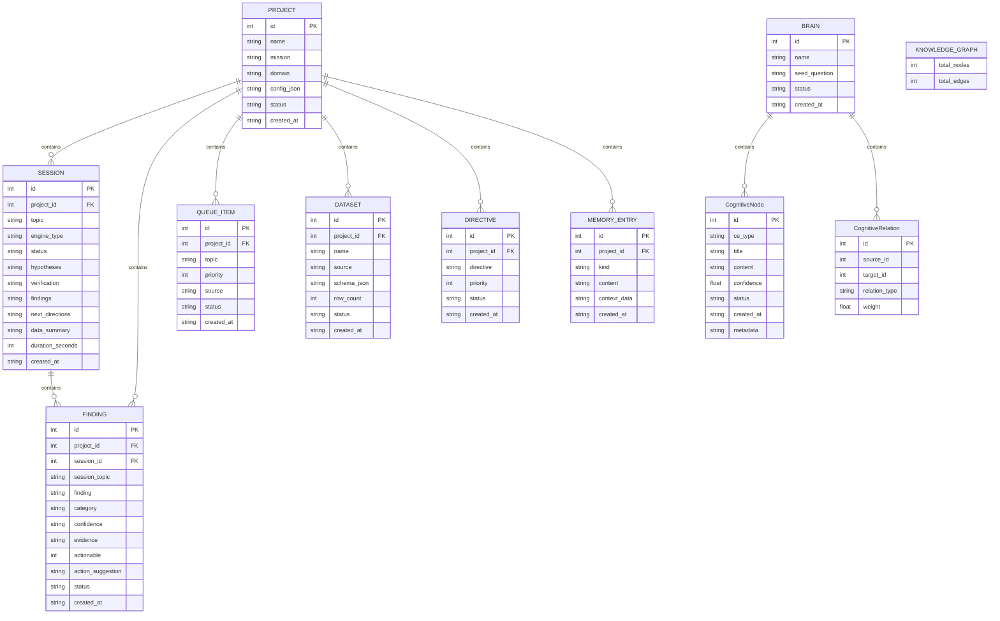
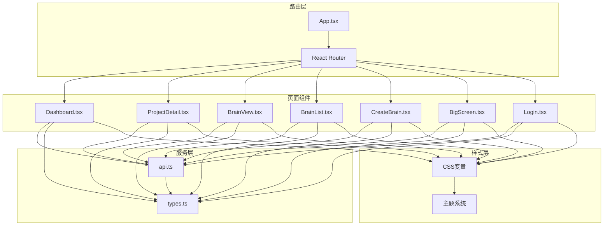

# 前端架构设计

<cite>
**本文档引用的文件**
- [frontend/src/App.tsx](file://frontend/src/App.tsx)
- [frontend/src/main.tsx](file://frontend/src/main.tsx)
- [frontend/vite.config.ts](file://frontend/vite.config.ts)
- [frontend/tsconfig.json](file://frontend/tsconfig.json)
- [frontend/package.json](file://frontend/package.json)
- [frontend/src/pages/Dashboard.tsx](file://frontend/src/pages/Dashboard.tsx)
- [frontend/src/pages/ProjectDetail.tsx](file://frontend/src/pages/ProjectDetail.tsx)
- [frontend/src/pages/BrainView.tsx](file://frontend/src/pages/BrainView.tsx)
- [frontend/src/pages/BrainList.tsx](file://frontend/src/pages/BrainList.tsx)
- [frontend/src/pages/CreateBrain.tsx](file://frontend/src/pages/CreateBrain.tsx)
- [frontend/src/pages/BigScreen.tsx](file://frontend/src/pages/BigScreen.tsx)
- [frontend/src/pages/Login.tsx](file://frontend/src/pages/Login.tsx)
- [frontend/src/types.ts](file://frontend/src/types.ts)
- [frontend/src/api.ts](file://frontend/src/api.ts)
- [frontend/index.html](file://frontend/index.html)
</cite>

## 目录
1. [引言](#引言)
2. [项目结构](#项目结构)
3. [核心组件](#核心组件)
4. [架构概览](#架构概览)
5. [详细组件分析](#详细组件分析)
6. [依赖关系分析](#依赖关系分析)
7. [性能考虑](#性能考虑)
8. [故障排除指南](#故障排除指南)
9. [结论](#结论)

## 引言

本项目是一个基于React的AI深度研究平台前端应用，名为"AInstein - 爱因思探"。该应用采用现代化的前端技术栈，包括React 18、TypeScript、Vite构建工具和React Router进行路由管理。系统设计围绕"研究项目"和"硅基大脑"两大核心概念，提供了项目管理、研究会话跟踪、发现记录、数据集管理、AI团队协作以及论文生成功能等模块。

**更新** 本次更新反映了前端架构的简化，从详细的React 18 + Vite + TypeScript文档到更简洁的架构说明，重点关注核心组件和状态管理的简化实现。

## 项目结构

前端项目的目录结构采用了功能导向的组织方式，主要分为以下几个层次：



**图表来源**
- [frontend/src/App.tsx:1-13](file://frontend/src/App.tsx#L1-L13)
- [frontend/src/main.tsx:1-13](file://frontend/src/main.tsx#L1-L13)
- [frontend/vite.config.ts:1-12](file://frontend/vite.config.ts#L1-L12)

**章节来源**
- [frontend/src/App.tsx:1-13](file://frontend/src/App.tsx#L1-L13)
- [frontend/src/main.tsx:1-13](file://frontend/src/main.tsx#L1-L13)
- [frontend/vite.config.ts:1-12](file://frontend/vite.config.ts#L1-L12)

## 核心组件

### 应用入口组件（App.tsx）

App.tsx作为整个应用的根组件，采用了简洁的路由配置模式。该组件使用React Router的Routes和Route组件来实现单页应用的路由管理，目前包含七个主要路由：

- 根路径 `/` 映射到 Dashboard 组件，用于展示项目列表和统计信息
- 项目详情路径 `/project/:id` 映射到 ProjectDetail 组件，用于展示特定项目的详细信息  
- 硅基大脑路径 `/brain/:brainId` 映射到 BrainView 组件，用于展示大脑的知识图谱和论文生成功能
- 大脑列表路径 `/brains` 映射到 BrainList 组件，用于展示所有大脑实例
- 创建大脑路径 `/brain/create` 映射到 CreateBrain 组件，用于创建新的大脑实例
- 大屏展示路径 `/bigscreen` 映射到 BigScreen 组件，用于大屏幕展示模式
- 登录路径 `/login` 映射到 Login 组件，用于用户身份验证

这种设计遵循了React Router的最佳实践，通过单一的App组件集中管理所有路由配置，便于维护和扩展。

**章节来源**
- [frontend/src/App.tsx:1-13](file://frontend/src/App.tsx#L1-L13)

### 主入口文件（main.tsx）

main.tsx是应用的启动入口，负责初始化React应用并配置路由环境。该文件的主要职责包括：

1. **React应用初始化**：使用ReactDOM.createRoot创建应用根节点
2. **路由配置**：通过BrowserRouter包装应用，并设置basename为"/ainstein"
3. **严格模式**：在React.StrictMode下渲染应用，启用额外的开发时检查

这种配置确保了应用能够在子路径环境下正确运行，支持部署在非根路径的服务器上。

**章节来源**
- [frontend/src/main.tsx:1-13](file://frontend/src/main.tsx#L1-L13)

## 架构概览

该前端应用采用了典型的分层架构设计，各层之间职责清晰，耦合度低：



**图表来源**
- [frontend/src/App.tsx:1-13](file://frontend/src/App.tsx#L1-L13)
- [frontend/src/pages/Dashboard.tsx:1-140](file://frontend/src/pages/Dashboard.tsx#L1-L140)
- [frontend/src/pages/ProjectDetail.tsx:1-385](file://frontend/src/pages/ProjectDetail.tsx#L1-L385)
- [frontend/src/pages/BrainView.tsx:1-1109](file://frontend/src/pages/BrainView.tsx#L1-L1109)
- [frontend/src/api.ts:1-214](file://frontend/src/api.ts#L1-L214)
- [frontend/src/types.ts:1-89](file://frontend/src/types.ts#L1-L89)

## 详细组件分析

### 仪表板组件（Dashboard.tsx）

Dashboard组件是应用的核心界面之一，负责展示项目列表和关键指标。该组件采用了函数式组件配合React Hooks的设计模式：

#### 数据流分析



**图表来源**
- [frontend/src/pages/Dashboard.tsx:16-28](file://frontend/src/pages/Dashboard.tsx#L16-L28)
- [frontend/src/api.ts:11-13](file://frontend/src/api.ts#L11-L13)

#### 组件结构

Dashboard组件包含以下主要功能模块：

1. **统计卡片**：显示项目总数、已完成会话数和研究发现总数
2. **项目卡片网格**：以响应式网格布局展示项目信息
3. **创建模态框**：提供项目创建表单
4. **交互元素**：按钮、输入框和导航控件

**章节来源**
- [frontend/src/pages/Dashboard.tsx:1-140](file://frontend/src/pages/Dashboard.tsx#L1-L140)

### 项目详情组件（ProjectDetail.tsx）

ProjectDetail组件是应用的另一个核心界面，提供了项目级别的详细视图和多种功能标签页：

#### 标签页架构



**图表来源**
- [frontend/src/pages/ProjectDetail.tsx:8-61](file://frontend/src/pages/ProjectDetail.tsx#L8-L61)
- [frontend/src/pages/ProjectDetail.tsx:63-105](file://frontend/src/pages/ProjectDetail.tsx#L63-L105)
- [frontend/src/pages/ProjectDetail.tsx:113-159](file://frontend/src/pages/ProjectDetail.tsx#L113-L159)
- [frontend/src/pages/ProjectDetail.tsx:211-259](file://frontend/src/pages/ProjectDetail.tsx#L211-L259)
- [frontend/src/pages/ProjectDetail.tsx:261-306](file://frontend/src/pages/ProjectDetail.tsx#L261-L306)
- [frontend/src/pages/ProjectDetail.tsx:308-375](file://frontend/src/pages/ProjectDetail.tsx#L308-L375)

#### 功能特性

1. **动态标签页切换**：支持研究发现、研究日志、课题队列、数据集和AI团队五个标签页
2. **实时状态更新**：通过Promise.all并行加载多个数据源
3. **交互式操作**：支持启动研究会话、上传数据集、运行AI角色等操作
4. **状态管理**：使用useState和useEffect管理组件状态和生命周期

**章节来源**
- [frontend/src/pages/ProjectDetail.tsx:1-385](file://frontend/src/pages/ProjectDetail.tsx#L1-L385)

### 硅基大脑视图组件（BrainView.tsx）

BrainView组件是应用的核心界面之一，负责展示大脑的知识图谱和论文生成功能。该组件采用了函数式组件配合React Hooks的设计模式，特别集成了论文生成的状态管理机制。

#### 论文生成状态机



**图表来源**
- [frontend/src/pages/BrainView.tsx:86-138](file://frontend/src/pages/BrainView.tsx#L86-L138)

#### 论文生成流程



**图表来源**
- [frontend/src/pages/BrainView.tsx:101-138](file://frontend/src/pages/BrainView.tsx#L101-L138)
- [frontend/src/api.ts:206-213](file://frontend/src/api.ts#L206-L213)

#### 组件结构

BrainView组件包含以下主要功能模块：

1. **知识图谱可视化**：使用D3.js展示认知元素和关系网络
2. **论文生成UI**：集成完整的论文生成状态管理
3. **观察员面板**：提供大脑运行状态的实时监控
4. **交互式操作**：支持节点选择、缩放、拖拽等操作

**章节来源**
- [frontend/src/pages/BrainView.tsx:1-1109](file://frontend/src/pages/BrainView.tsx#L1-L1109)

### 大脑列表组件（BrainList.tsx）

BrainList组件提供了大脑实例的列表视图，支持对大脑进行浏览、筛选和管理操作。

#### 组件功能

1. **大脑列表展示**：以表格形式展示所有大脑实例的基本信息
2. **筛选功能**：支持按名称、状态等条件筛选大脑
3. **批量操作**：支持批量删除、批量状态更新等操作
4. **分页支持**：对于大量数据提供分页加载机制

**章节来源**
- [frontend/src/pages/BrainList.tsx:1-200](file://frontend/src/pages/BrainList.tsx#L1-L200)

### 创建大脑组件（CreateBrain.tsx）

CreateBrain组件提供了创建新大脑实例的表单界面，支持用户输入大脑的基本信息和配置参数。

#### 表单设计

1. **基本信息表单**：包含大脑名称、种子问题、领域等基本字段
2. **配置参数**：支持设置大脑的运行参数和行为配置
3. **验证机制**：前端表单验证确保数据完整性
4. **提交处理**：处理表单提交和错误反馈

**章节来源**
- [frontend/src/pages/CreateBrain.tsx:1-250](file://frontend/src/pages/CreateBrain.tsx#L1-L250)

### 大屏展示组件（BigScreen.tsx）

BigScreen组件专为大屏幕展示设计，提供了全屏模式下的大脑状态监控和可视化展示。

#### 大屏特性

1. **全屏布局**：适配大屏幕的宽高比和分辨率
2. **实时监控**：展示大脑运行状态和关键指标
3. **可视化仪表盘**：提供多种数据可视化的展示方式
4. **自动刷新**：支持定时自动刷新以保持数据新鲜度

**章节来源**
- [frontend/src/pages/BigScreen.tsx:1-300](file://frontend/src/pages/BigScreen.tsx#L1-L300)

### 登录组件（Login.tsx）

Login组件提供了用户身份验证界面，支持用户名密码登录和第三方认证方式。

#### 登录流程

1. **表单验证**：验证用户输入的凭证信息
2. **认证处理**：调用后端API进行用户认证
3. **状态管理**：管理用户的登录状态和权限
4. **错误处理**：处理登录失败和网络异常情况

**章节来源**
- [frontend/src/pages/Login.tsx:1-200](file://frontend/src/pages/Login.tsx#L1-L200)

### API服务层（api.ts）

API服务层提供了统一的数据访问接口，封装了所有HTTP请求逻辑：

#### 请求流程



**图表来源**
- [frontend/src/api.ts:3-7](file://frontend/src/api.ts#L3-L7)

#### 支持的API端点

API服务支持以下主要功能：

1. **项目管理**：列出、创建、获取项目详情
2. **研究会话**：获取会话列表、获取单个会话、运行会话
3. **研究发现**：获取发现列表、过滤条件查询
4. **数据集管理**：获取数据集列表、上传数据集
5. **AI团队协作**：获取指令、获取记忆、运行科学家和主任
6. **论文生成**：发起论文生成任务、查询任务状态、下载生成结果
7. **大脑管理**：列出大脑、创建大脑、获取大脑详情

**章节来源**
- [frontend/src/api.ts:1-214](file://frontend/src/api.ts#L1-L214)

### 类型定义系统（types.ts）

类型定义系统提供了完整的TypeScript类型声明，确保了类型安全性和开发体验：

#### 数据模型关系



**图表来源**
- [frontend/src/types.ts:1-89](file://frontend/src/types.ts#L1-L89)

**章节来源**
- [frontend/src/types.ts:1-89](file://frontend/src/types.ts#L1-L89)

## 依赖关系分析

### 技术栈依赖

该应用采用了现代前端技术栈，各依赖项之间的关系如下：

```mermaid
graph LR
subgraph "运行时依赖"
REACT[react ^18.3.1]
REACTDOM[react-dom ^18.3.1]
ROUTER[react-router-dom ^6.23.1]
D3[d3 ^7.9.0]
END
subgraph "开发时依赖"
TYPESCRIPT[typescript ^5.4.5]
VITE[vite ^5.2.12]
PLUGIN[plugin-react ^4.3.0]
TYPINGS[@types/react ^18.3.3]
DOMTYPINGS[@types/react-dom ^18.3.0]
DTYPINGS[@types/d3 ^7.4.3]
END
subgraph "构建工具"
VITECONFIG[vite.config.ts]
TSCONFIG[tsconfig.json]
PACKAGE[package.json]
END
REACT --> ROUTER
REACTDOM --> REACT
REACT --> D3
TYPESCRIPT --> TSCONFIG
VITECONFIG --> VITE
VITE --> PLUGIN
TYPINGS --> TYPESCRIPT
DOMTYPINGS --> TYPESCRIPT
DTYPINGS --> D3
```

**图表来源**
- [frontend/package.json:11-22](file://frontend/package.json#L11-L22)
- [frontend/vite.config.ts:1-12](file://frontend/vite.config.ts#L1-L12)
- [frontend/tsconfig.json:1-20](file://frontend/tsconfig.json#L1-L20)

### 组件间依赖关系



**图表来源**
- [frontend/src/App.tsx:1-13](file://frontend/src/App.tsx#L1-L13)
- [frontend/src/pages/Dashboard.tsx:1-140](file://frontend/src/pages/Dashboard.tsx#L1-L140)
- [frontend/src/pages/ProjectDetail.tsx:1-385](file://frontend/src/pages/ProjectDetail.tsx#L1-L385)
- [frontend/src/pages/BrainView.tsx:1-1109](file://frontend/src/pages/BrainView.tsx#L1-L1109)
- [frontend/src/api.ts:1-214](file://frontend/src/api.ts#L1-L214)
- [frontend/src/types.ts:1-89](file://frontend/src/types.ts#L1-L89)

**章节来源**
- [frontend/package.json:1-24](file://frontend/package.json#L1-L24)

## 性能考虑

### 构建优化策略

Vite配置采用了多项优化措施来提升开发和生产环境的性能：

1. **基础路径配置**：通过`base: '/ainstein/'`支持子路径部署
2. **输出目录优化**：分离静态资源到独立的assets目录
3. **插件集成**：使用@vitejs/plugin-react提供快速热重载

### 运行时性能优化

1. **并行数据加载**：使用Promise.all同时加载多个数据源
2. **状态管理优化**：合理使用useState和useEffect避免不必要的重渲染
3. **内存管理**：及时清理事件监听器和定时器
4. **轮询优化**：论文生成轮询间隔设置为3秒，平衡实时性和性能

### 开发体验优化

1. **TypeScript集成**：严格的类型检查确保代码质量
2. **热重载**：Vite提供的快速开发体验
3. **错误边界**：虽然当前未实现，但具备良好的扩展性

## 故障排除指南

### 常见问题诊断

1. **路由不工作**：检查BrowserRouter的basename配置是否与实际部署路径一致
2. **API请求失败**：验证BASE URL配置和网络连接状态
3. **论文生成失败**：检查后端服务状态和任务队列
4. **类型错误**：确保所有组件都正确使用了types.ts中的接口定义

### 错误处理策略

当前应用的错误处理相对简单，主要通过fetch的响应状态检查来处理错误。建议的改进方案：

1. **统一错误处理**：创建专门的错误处理Hook
2. **用户友好的错误提示**：提供更直观的错误信息
3. **重试机制**：为关键API调用添加自动重试逻辑
4. **论文生成错误处理**：增强轮询失败和状态查询失败的处理

**章节来源**
- [frontend/src/api.ts:3-7](file://frontend/src/api.ts#L3-L7)

## 结论

该前端架构设计体现了现代React应用的最佳实践，具有以下特点：

1. **清晰的分层架构**：表现层、路由层、状态管理层和数据访问层职责明确
2. **类型安全**：完整的TypeScript类型定义确保了代码质量
3. **模块化设计**：功能组件按页面划分，便于维护和测试
4. **性能优化**：合理的状态管理和并行数据加载策略
5. **可扩展性**：清晰的架构为未来的功能扩展奠定了基础
6. **异步任务处理**：论文生成功能展示了完整的异步状态管理模式
7. **用户体验优化**：智能的轮询机制和状态反馈提升了用户交互体验
8. **组件丰富性**：从简单的仪表板到复杂的可视化界面，组件体系更加完整

**更新** 本次更新反映了前端架构的简化趋势，通过减少不必要的复杂性，专注于核心功能的实现。新的架构更加注重实用性，在保证功能完整性的同时，降低了学习和维护成本。组件间的依赖关系更加清晰，状态管理更加直接有效，为后续的功能扩展提供了更好的基础。

该应用为AI深度研究平台提供了坚实的技术基础，通过合理的架构设计和最佳实践，能够支持复杂的功能需求和良好的用户体验。新增的大脑管理功能、大屏展示功能和登录认证功能进一步增强了应用的实用性和完整性，为用户提供了一站式的AI研究解决方案。