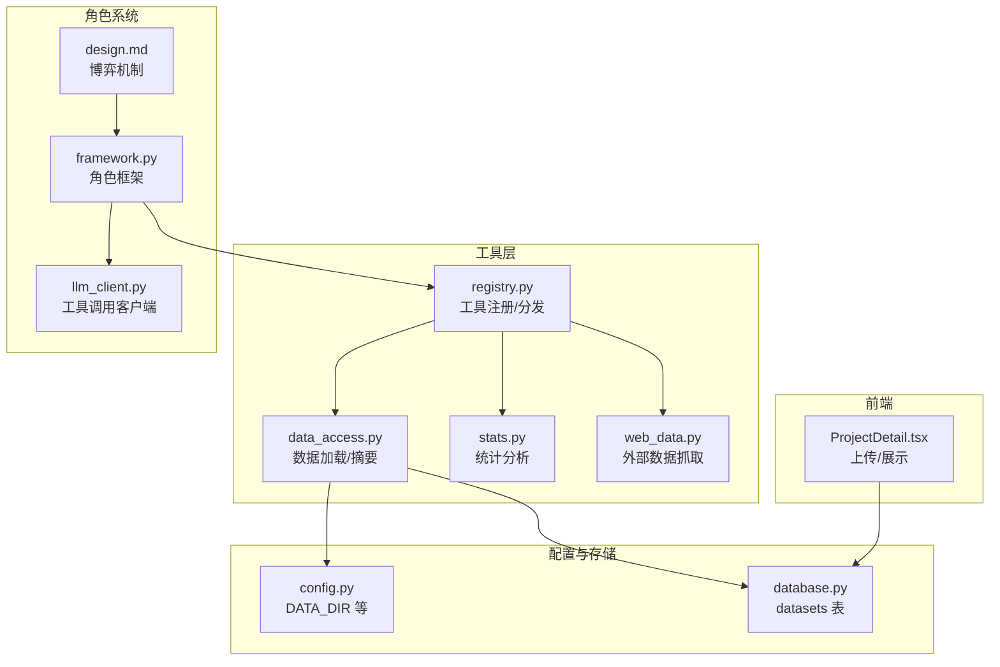
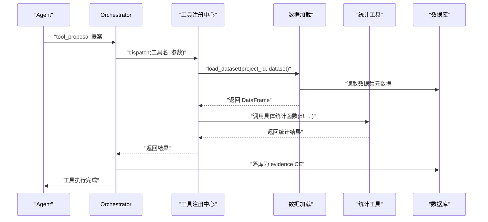
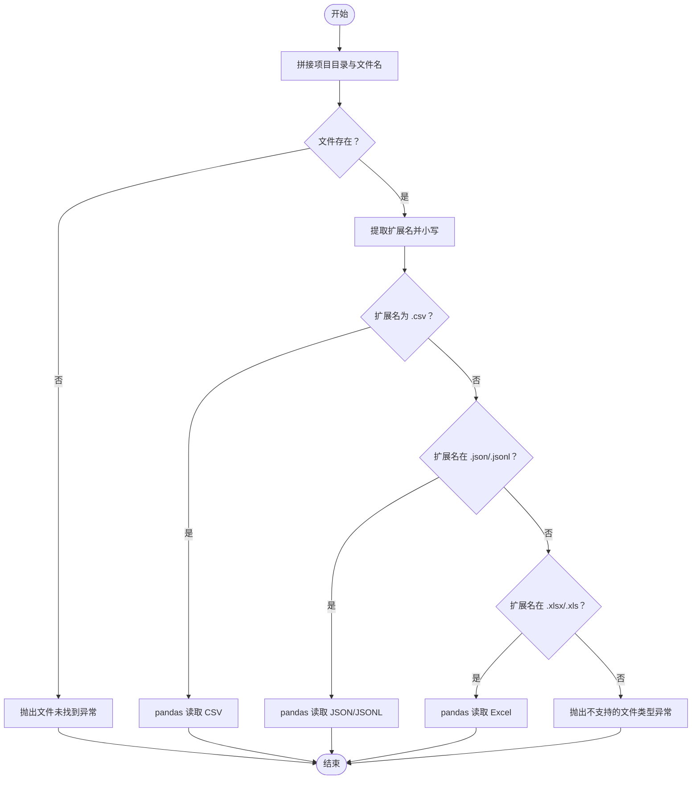
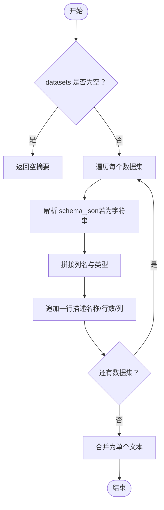
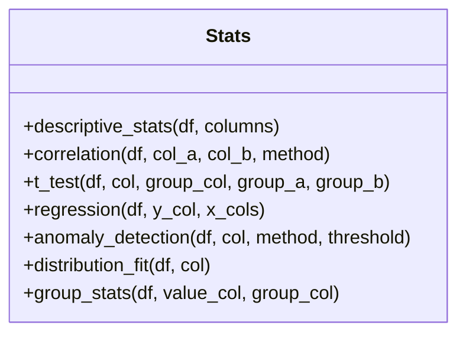
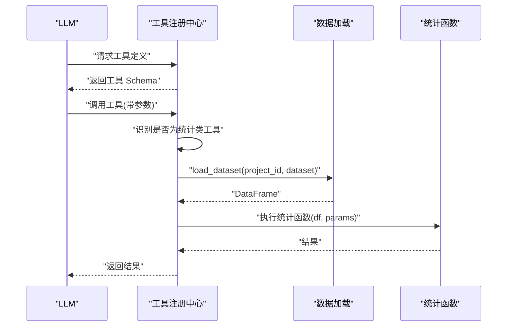
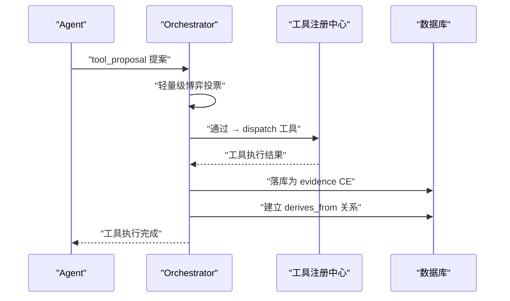
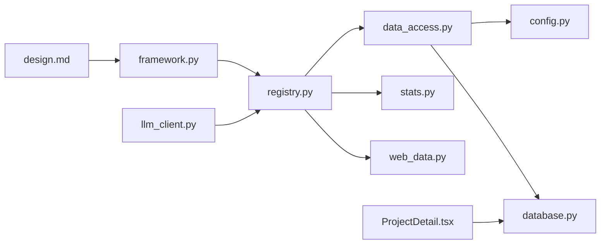

# 数据访问工具

<cite>
**本文引用的文件**
- [tools/data_access.py](file://tools/data_access.py)
- [tools/stats.py](file://tools/stats.py)
- [tools/registry.py](file://tools/registry.py)
- [tools/web_data.py](file://tools/web_data.py)
- [config.py](file://config.py)
- [database.py](file://database.py)
- [README.md](file://README.md)
- [frontend/src/pages/ProjectDetail.tsx](file://frontend/src/pages/ProjectDetail.tsx)
- [agents/framework.py](file://agents/framework.py)
- [agents/llm_client.py](file://agents/llm_client.py)
- [docs/design.md](file://docs/design.md)
</cite>

## 更新摘要
**所做更改**
- 更新了工具系统架构，反映了新的工具注册机制和工具管理方式
- 新增了工具博弈机制的详细说明
- 更新了工具调用流程和角色协作模式
- 增强了工具提案和轻量级博弈的文档说明

## 目录
1. [简介](#简介)
2. [项目结构](#项目结构)
3. [核心组件](#核心组件)
4. [架构总览](#架构总览)
5. [详细组件分析](#详细组件分析)
6. [依赖关系分析](#依赖关系分析)
7. [性能与安全考量](#性能与安全考量)
8. [使用示例与最佳实践](#使用示例与最佳实践)
9. [故障排查指南](#故障排查指南)
10. [结论](#结论)

## 简介
本文件系统化梳理"数据访问工具"的设计与实现，覆盖以下主题：
- 数据集加载：load_dataset 的实现原理、文件格式支持、路径校验与错误处理
- 数据摘要：get_dataset_summary 的结构化输出、面向 LLM 的上下文提示
- 统计分析：描述性统计、相关性、t 检验、回归、异常检测、分布拟合、分组统计
- 数据预处理思路：数值转换、对齐与缺失处理策略
- 工具博弈机制：工具提案、轻量级博弈、角色协作与证据注入
- 安全与性能：路径安全、输入校验、超时控制、内存与 IO 优化
- 实际使用示例与常见问题

## 项目结构
数据访问工具位于 tools 子目录，配合配置、数据库与前端界面协同工作，现已集成到完整的工具博弈系统中：
- tools/data_access.py：数据集加载与摘要
- tools/stats.py：统计分析工具集
- tools/registry.py：工具注册与分发（含数据加载）
- tools/web_data.py：外部数据抓取（扩展能力）
- config.py：全局配置（数据目录、模型名等）
- database.py：数据集元数据持久化
- frontend/src/pages/ProjectDetail.tsx：前端上传与展示
- agents/framework.py：角色框架与工具提案
- agents/llm_client.py：LLM 工具调用客户端
- docs/design.md：工具博弈机制设计文档

**图表来源**
- [tools/data_access.py:1-43](file://tools/data_access.py#L1-L43)
- [tools/stats.py:1-120](file://tools/stats.py#L1-L120)
- [tools/registry.py:1-42](file://tools/registry.py#L1-L42)
- [tools/web_data.py:1-164](file://tools/web_data.py#L1-L164)
- [config.py:1-11](file://config.py#L1-L11)
- [database.py:570-591](file://database.py#L570-L591)
- [frontend/src/pages/ProjectDetail.tsx:261-306](file://frontend/src/pages/ProjectDetail.tsx#L261-L306)
- [agents/framework.py:176-208](file://agents/framework.py#L176-L208)
- [agents/llm_client.py:46-65](file://agents/llm_client.py#L46-L65)
- [docs/design.md:379-406](file://docs/design.md#L379-L406)

**章节来源**
- [README.md:94-124](file://README.md#L94-L124)

## 核心组件
- 数据加载与摘要
  - load_dataset：按项目 ID 与文件名定位，校验扩展名并读取为 DataFrame
  - get_dataset_summary：将数据库中的 schema 与行数转为可读文本，供 LLM 上下文使用
- 统计分析工具
  - 描述性统计、相关性（皮尔逊/斯皮尔曼）、独立样本 t 检验、多元线性回归、异常检测（Z-Score/IQR）、正态性检验（Shapiro-Wilk）、分组统计
- 工具注册与分发
  - 注册内置工具，统一输入参数 schema，并在调用时注入 DataFrame
- 工具博弈机制
  - 工具提案：Agent 提议工具调用，包含工具名、参数和原因
  - 轻量级博弈：多 Agent 轻量级投票决定工具执行
  - 证据注入：工具结果作为 evidence CE 注入知识图谱

**章节来源**
- [tools/data_access.py:10-42](file://tools/data_access.py#L10-L42)
- [tools/stats.py:10-120](file://tools/stats.py#L10-L120)
- [tools/registry.py:12-42](file://tools/registry.py#L12-L42)
- [agents/framework.py:176-208](file://agents/framework.py#L176-L208)
- [docs/design.md:379-406](file://docs/design.md#L379-L406)

## 架构总览
数据访问工具在"工具注册中心"统一调度，针对统计类工具自动注入 DataFrame；数据加载基于配置的 DATA_DIR 与项目 ID 组合路径。工具调用现在集成到完整的博弈系统中，通过角色提案和轻量级投票机制执行。

**图表来源**
- [tools/registry.py:24-42](file://tools/registry.py#L24-L42)
- [tools/data_access.py:10-24](file://tools/data_access.py#L10-L24)
- [database.py:570-591](file://database.py#L570-L591)
- [agents/framework.py:176-208](file://agents/framework.py#L176-L208)
- [docs/design.md:392-406](file://docs/design.md#L392-L406)

## 详细组件分析

### 数据加载组件 load_dataset
- 路径组织
  - 基于 DATA_DIR 与 project_id 组合项目目录，拼接 dataset_name 得到完整文件路径
- 文件类型支持
  - CSV：pandas 读取
  - JSON/JSONL：pandas 读取
  - Excel：xlsx/xls 使用 pandas 读取
- 错误处理
  - 文件不存在抛出 FileNotFoundError
  - 不支持的扩展名抛出 ValueError
- 性能与健壮性
  - 仅根据扩展名判断，不进行深层格式校验
  - 读取失败由 pandas 抛出相应异常（如编码、解析错误）

**图表来源**
- [tools/data_access.py:10-24](file://tools/data_access.py#L10-L24)
- [config.py:1-11](file://config.py#L1-L11)

**章节来源**
- [tools/data_access.py:10-24](file://tools/data_access.py#L10-L24)
- [config.py:1-11](file://config.py#L1-L11)

### 数据摘要组件 get_dataset_summary
- 输入
  - project_id：用于筛选数据库中该项目的可用数据集
  - datasets：数据集列表（包含名称、行数、schema_json）
- 输出
  - 将每个数据集的列名与类型拼接为字符串，形成简洁的文本摘要
- 特性
  - schema_json 支持字符串形式，内部尝试解析为 JSON
  - 若无数据集，返回"无可用数据集"的提示

**图表来源**
- [tools/data_access.py:27-42](file://tools/data_access.py#L27-L42)

**章节来源**
- [tools/data_access.py:27-42](file://tools/data_access.py#L27-L42)

### 统计分析工具集
- 描述性统计
  - 自动选择数值型列，调用 describe 并返回字典结构
- 相关性
  - 对两列进行数值转换与对齐，支持皮尔逊与斯皮尔曼
- 独立样本 t 检验
  - 按分组列取两组数值，进行独立样本 t 检验
- 回归
  - 最小二乘法求解系数，返回截距、R² 与各变量系数
- 异常检测
  - Z-Score 或 IQR 方法，返回异常数量、比例与索引
- 分布拟合
  - Shapiro-Wilk 正态性检验，返回统计量、p 值与偏度/峰度
- 分组统计
  - 按分组列聚合，返回每组的计数、均值、标准差、中位数

**图表来源**
- [tools/stats.py:10-120](file://tools/stats.py#L10-L120)

**章节来源**
- [tools/stats.py:10-120](file://tools/stats.py#L10-L120)

### 工具注册与分发
- 注册机制
  - register_tool 将工具名映射到实现与输入 schema
- 分发逻辑
  - dispatch 在调用统计类工具前，自动解析参数中的 dataset 名称，加载 DataFrame 后再调用对应函数
- LLM 工具定义
  - get_llm_tool_definitions 返回所有工具的 JSON Schema，便于 LLM 调用

**图表来源**
- [tools/registry.py:12-42](file://tools/registry.py#L12-L42)
- [tools/data_access.py:10-24](file://tools/data_access.py#L10-L24)
- [tools/stats.py:10-120](file://tools/stats.py#L10-L120)

**章节来源**
- [tools/registry.py:12-42](file://tools/registry.py#L12-L42)

### 工具博弈机制
- 工具提案
  - Agent 在思考过程中输出 tool_proposal 字段，包含工具名、参数和执行原因
  - 提案格式：{"tool": "工具名", "params": {}, "reason": "执行原因"}
- 轻量级博弈
  - Orchestrator 轻量级投票：从非观察者 Agent 中随机选择 ≤2 个投票
  - 多数赞成（≥1）通过；无人投票时默认通过
- 证据注入
  - 工具执行结果作为 evidence CE 注入知识图谱
  - 建立 derives_from 关系：evidence CE → 提议 CE
  - 更新 payload.tool_status = "executed"

**图表来源**
- [agents/framework.py:176-208](file://agents/framework.py#L176-L208)
- [agents/llm_client.py:46-65](file://agents/llm_client.py#L46-L65)
- [docs/design.md:392-406](file://docs/design.md#L392-L406)

**章节来源**
- [agents/framework.py:176-208](file://agents/framework.py#L176-L208)
- [agents/llm_client.py:46-65](file://agents/llm_client.py#L46-L65)
- [docs/design.md:379-406](file://docs/design.md#L379-L406)

## 依赖关系分析
- 内部依赖
  - registry 依赖 data_access 与 stats
  - data_access 依赖 config 中的 DATA_DIR
  - 前端上传与数据库交互，数据库提供数据集元数据
  - 角色框架依赖工具注册中心进行工具调用
- 外部依赖
  - pandas、numpy、scipy（统计分析）
  - requests（外部数据抓取）
  - pytz、xml（外部数据抓取的可选依赖）

**图表来源**
- [tools/registry.py:1-7](file://tools/registry.py#L1-L7)
- [tools/data_access.py:1-7](file://tools/data_access.py#L1-L7)
- [config.py:1-11](file://config.py#L1-L11)
- [database.py:570-591](file://database.py#L570-L591)
- [frontend/src/pages/ProjectDetail.tsx:261-306](file://frontend/src/pages/ProjectDetail.tsx#L261-L306)
- [agents/framework.py:176-208](file://agents/framework.py#L176-L208)
- [agents/llm_client.py:46-65](file://agents/llm_client.py#L46-L65)
- [docs/design.md:379-406](file://docs/design.md#L379-L406)

**章节来源**
- [tools/registry.py:1-7](file://tools/registry.py#L1-L7)
- [tools/data_access.py:1-7](file://tools/data_access.py#L1-L7)
- [config.py:1-11](file://config.py#L1-L11)
- [database.py:570-591](file://database.py#L570-L591)
- [frontend/src/pages/ProjectDetail.tsx:261-306](file://frontend/src/pages/ProjectDetail.tsx#L261-L306)
- [agents/framework.py:176-208](file://agents/framework.py#L176-L208)
- [agents/llm_client.py:46-65](file://agents/llm_client.py#L46-L65)
- [docs/design.md:379-406](file://docs/design.md#L379-L406)

## 性能与安全考量
- 路径安全
  - 严格基于 DATA_DIR 与 project_id 组合路径，避免相对路径穿越
  - 文件存在性检查在读取前完成
- 输入校验
  - 扩展名白名单，拒绝未知类型
  - 统计函数对数值转换采用"错误转 NaN 再丢弃"，避免异常中断
- 超时与资源
  - 外部抓取设置超时时间，防止阻塞
  - 正态性检验限制样本规模以控制计算开销
- 内存与 IO
  - 优先只读取数值列进行描述性统计
  - 回归与相关性先对齐再计算，减少无效数据传输
- 工具博弈安全
  - 轻量级投票机制防止单一 Agent 控制工具执行
  - 证据注入确保工具执行的可追溯性和审计链完整性

## 使用示例与最佳实践
- 上传数据集
  - 前端支持 CSV/JSON/Excel 上传，自动记录 schema 与行数
  - 上传后可在项目详情页查看列类型与行数
- 加载与分析
  - 通过工具注册中心调用统计工具，传入 dataset 名称即可自动加载 DataFrame
  - 描述性统计可指定列子集，提高效率
- 工具博弈流程
  - Agent 在思考中输出 tool_proposal，包含工具名、参数和执行原因
  - Orchestrator 进行轻量级投票，多数赞成则执行工具
  - 工具结果作为 evidence CE 注入知识图谱，建立审计链
- 外部数据补充
  - 使用 web_search/wikipedia/arXiv/google_trends 获取背景信息，辅助解释统计结果

**章节来源**
- [frontend/src/pages/ProjectDetail.tsx:261-306](file://frontend/src/pages/ProjectDetail.tsx#L261-L306)
- [tools/registry.py:24-42](file://tools/registry.py#L24-L42)
- [tools/web_data.py:13-164](file://tools/web_data.py#L13-L164)
- [agents/framework.py:176-208](file://agents/framework.py#L176-L208)
- [docs/design.md:379-406](file://docs/design.md#L379-L406)

## 故障排查指南
- "找不到数据集"
  - 检查文件是否存在于 DATA_DIR/project_id/ 下
  - 确认扩展名正确且受支持
- "不支持的文件类型"
  - 当前支持 CSV/JSON/JSONL/XLSX/XLS
- "统计结果为空或报错"
  - 检查列是否为数值型，必要时指定列子集
  - 确保样本量满足方法要求（如相关性至少需要 3 个有效配对）
- "外部抓取失败"
  - 检查网络连通性与超时设置
  - 如需 Google Trends，确认已安装 pytrends
- "工具执行失败"
  - 检查工具名是否在注册表中
  - 确认参数格式符合 JSON Schema 定义
  - 查看日志获取详细错误信息
- "工具博弈未通过"
  - 检查轻量级投票机制是否正常运行
  - 确认没有 Agent 拒绝工具提案
  - 验证证据注入是否成功

**章节来源**
- [tools/data_access.py:14-24](file://tools/data_access.py#L14-L24)
- [tools/stats.py:24-32](file://tools/stats.py#L24-L32)
- [tools/web_data.py:125-163](file://tools/web_data.py#L125-L163)
- [tools/registry.py:24-42](file://tools/registry.py#L24-L42)
- [agents/framework.py:176-208](file://agents/framework.py#L176-L208)

## 结论
本数据访问工具以"轻量、可扩展、易集成、可博弈"为目标：通过统一的工具注册与分发机制，将数据加载与统计分析无缝衔接；通过工具博弈机制实现多 Agent 协作和轻量级决策；以明确的文件格式支持与严格的路径策略保障安全；以完善的输入校验与超时控制提升稳定性。结合前端上传、数据库元数据管理和完整的工具博弈系统，形成从数据采集到分析应用再到决策执行的完整闭环。新的工具系统不仅提升了工具使用的安全性，还增强了系统的可追溯性和审计能力。