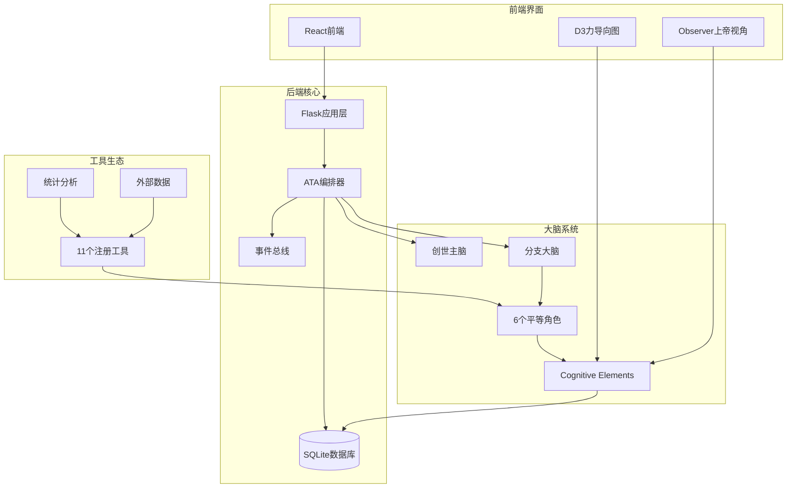
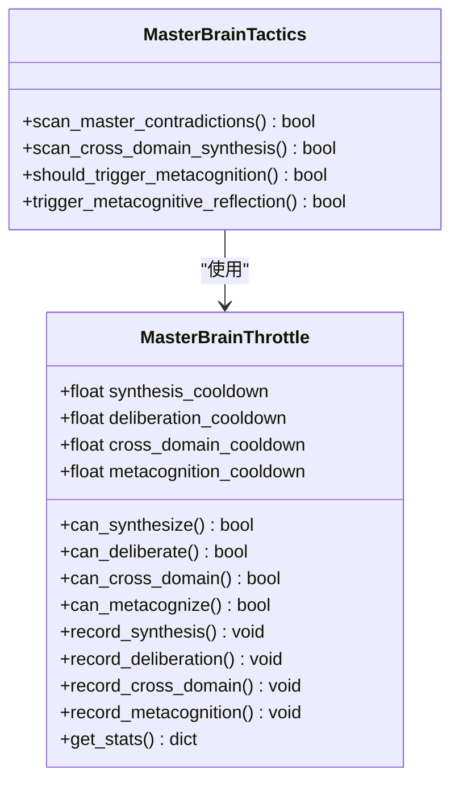
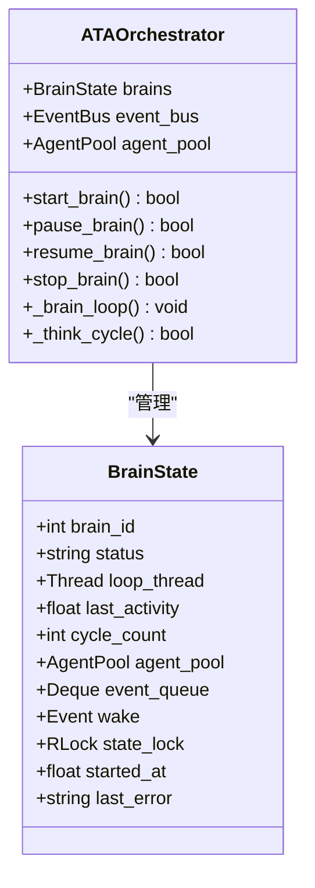
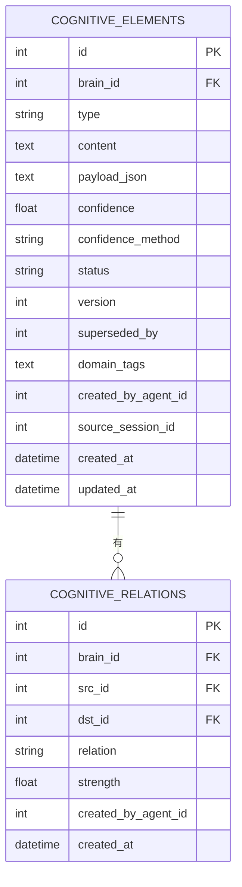
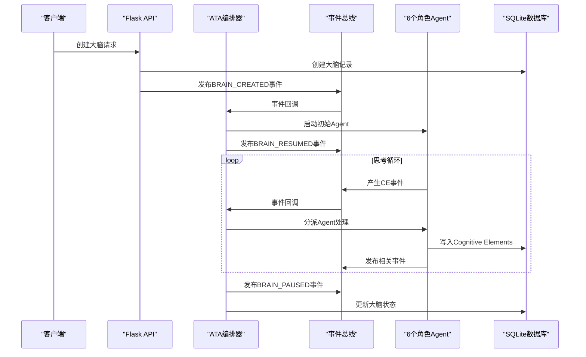
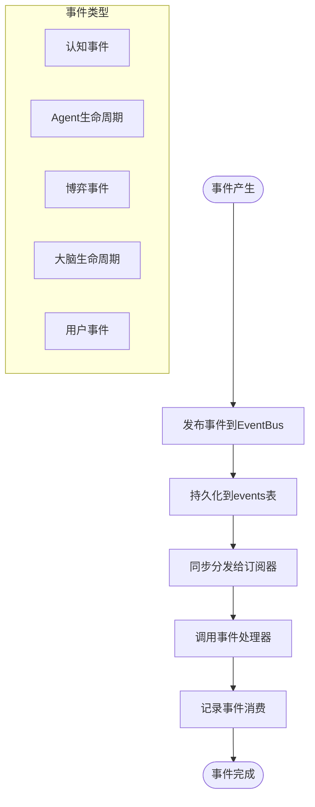
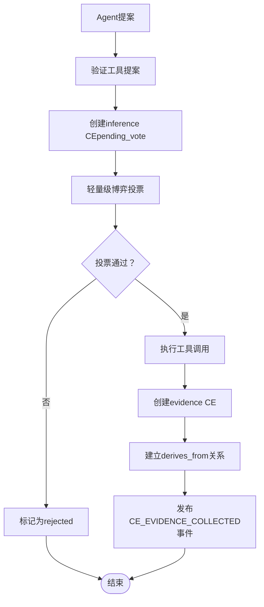
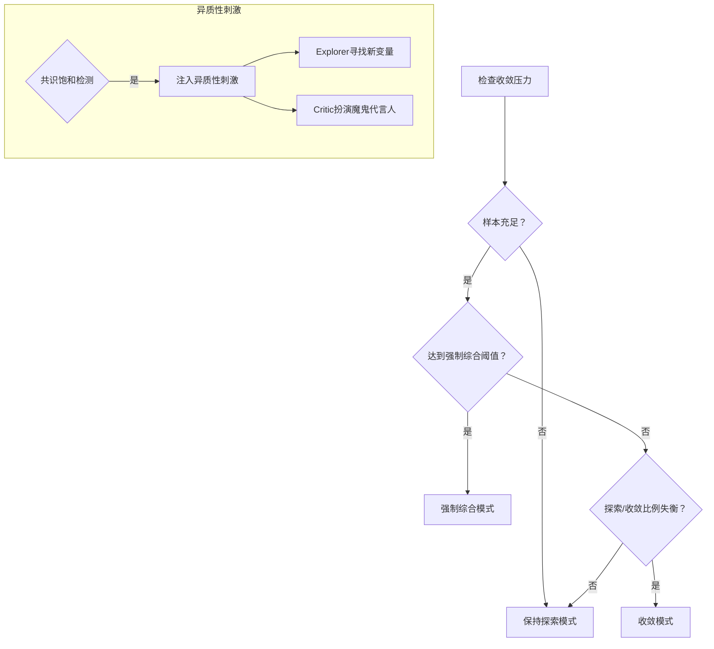
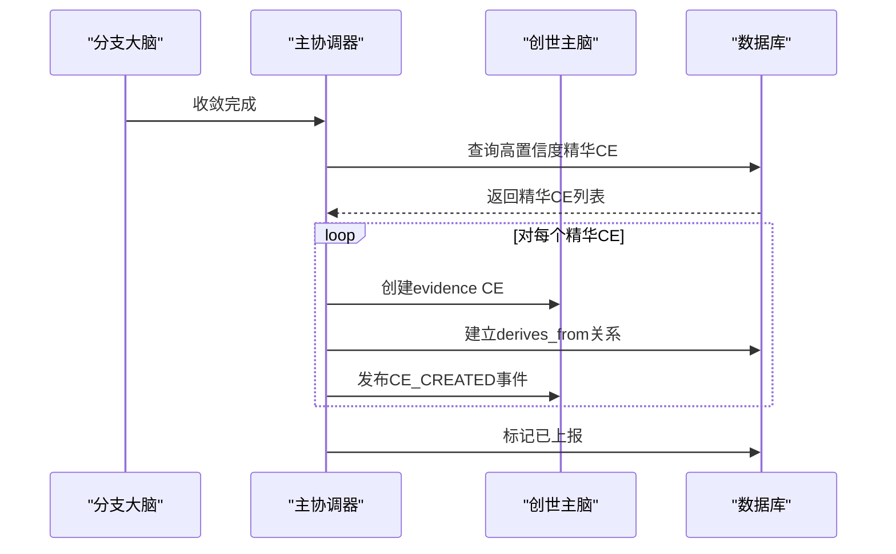
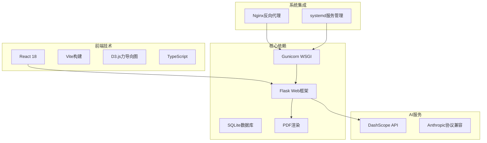

# 主脑战术系统

<cite>
**本文档引用的文件**
- [README.md](file://README.md)
- [app.py](file://app.py)
- [master_brain_tactics.py](file://master_brain_tactics.py)
- [orchestrator/core.py](file://orchestrator/core.py)
- [orchestrator/constants.py](file://orchestrator/constants.py)
- [orchestrator/deliberation_trigger.py](file://orchestrator/deliberation_trigger.py)
- [orchestrator/master_coordinator.py](file://orchestrator/master_coordinator.py)
- [orchestrator/strategy.py](file://orchestrator/strategy.py)
- [orchestrator/tool_proposal.py](file://orchestrator/tool_proposal.py)
- [cognitive.py](file://cognitive.py)
- [event_bus.py](file://event_bus.py)
- [database.py](file://database.py)
- [config.py](file://config.py)
- [agents/director.py](file://agents/director.py)
- [agents/scientist.py](file://agents/scientist.py)
- [engines/base.py](file://engines/base.py)
</cite>

## 目录
1. [简介](#简介)
2. [项目结构](#项目结构)
3. [核心组件](#核心组件)
4. [架构概览](#架构概览)
5. [详细组件分析](#详细组件分析)
6. [依赖分析](#依赖分析)
7. [性能考虑](#性能考虑)
8. [故障排除指南](#故障排除指南)
9. [结论](#结论)

## 简介

主脑战术系统（AInstein）是一个开源的「硅基大脑」孵化器，旨在构建一个**自主思考的硅基大脑**。该项目不是传统的AI工具或聊天机器人，而是一个关于「机器能否独立思考」的长期实验。

### 核心特性

1. **创世主脑（Master Brain）** - 所有思考的汇流之处
   - 全局唯一单例，系统初始化即被创建
   - 自动上报：分支大脑收敛终止时，筛选confidence > 0.7的精华结论整体注入主脑
   - 三种自主思辨：主脑内博弈、跨域综合、元认知反思
   - 多维节流（cooldown-based）：以"按需思考"代替硬上限

2. **ATA事件驱动编排器** - 每颗大脑由_brain_loop主循环驱动
   - 事件驱动：CE落库即触发事件，唤醒相关Agent，而非定时轮询
   - frontier探索：维护一个待展开的认知前沿，按价值排序消费
   - 跨worker同步：Gunicorn多worker下通过文件锁保证单写者，DB轮询保持状态一致

3. **6个平等角色 + Observer**
   - 去层级化后的6个角色彼此完全平等，没有谁能拍板
   - 角色包括：investigator（求证者）、reasoner（推导者）、synthesizer（综合者）、critic（质检者）、explorer（探索者）、observer（观察员）

4. **认知元素（CE）体系**
   - 一切「思维产物」被统一抽象为CE节点，分布在13种类型上
   - 状态生命周期：open → testing/supported/refuted/revised → confirmed/archived
   - CE再激活：被refute的CE遇到新证据时自动reopen

5. **三轨博弈引擎**
   - 旧版本只懂「推翻」。v3起，博弈引擎拥有三种模式
   - 博弈类型：推翻式、建设性综合、建设性确认
   - 共识阈值0.6（v3从0.75下调，让建设性共识更容易形成）

6. **tool_proposal：工具调用作为可博弈的认知元素**
   - Agent提议使用工具 → 落库为inference类型CE（payload.tool_status='pending_vote'）
   - 轻量级博弈（≤2Agent投票） → 通过则执行
   - 工具结果作为evidence类型CE注入，建立derives_from关系

7. **自调节闭环（v3.1+）**
   - 大脑现在拥有完整的**自我调节系统**——像生物体一样，能感知自己的认知偏差并主动纠正
   - 包括：已知问题优先解决、异质性刺激、收敛压力、强制综合脉冲、工具不够用的tool_gap元认知CE

8. **双轨终止 + 自动上报**
   - 主轨：synthesizer产出conclusion且confidence ≥ 0.75 → 自动停止 → 思考总结 → 论文生成
   - 兜底轨：CE总数≥500或运行时长≥1小时 → 强制综合 + 终结
   - 任何方式终止后，结论自动上报创世主脑

## 项目结构

**图表来源**
- [app.py:1-800](file://app.py#L1-L800)
- [orchestrator/core.py:1-800](file://orchestrator/core.py#L1-L800)
- [database.py:1-800](file://database.py#L1-L800)

**章节来源**
- [README.md:210-251](file://README.md#L210-L251)
- [app.py:1-800](file://app.py#L1-L800)

## 核心组件

### 1. 创世主脑战术系统

主脑战术系统是整个系统的中枢神经，负责：

- **多维节流机制**：替代原think_count>=100硬上限，每种思考行为有独立的cooldown时间
- **跨分支矛盾检测**：扫描主脑CE间的contradicts/refutes关系，触发博弈
- **跨域综合**：识别不同领域的分支结论，尝试建立联系
- **元认知反思**：收集分支统计数据，进行思维模式反思

**图表来源**
- [master_brain_tactics.py:30-104](file://master_brain_tactics.py#L30-L104)
- [master_brain_tactics.py:183-311](file://master_brain_tactics.py#L183-L311)

**章节来源**
- [master_brain_tactics.py:1-674](file://master_brain_tactics.py#L1-L674)

### 2. ATA编排器核心

ATA编排器是事件驱动的大脑思考调度器，承担：

- 单例/初始化/事件订阅
- 大脑启动/暂停/恢复/停止
- _brain_loop主循环+状态查询
- 双轨终止/共识收敛
- 事件订阅器（轻量入队）

**图表来源**
- [orchestrator/core.py:53-114](file://orchestrator/core.py#L53-L114)
- [orchestrator/constants.py:235-274](file://orchestrator/constants.py#L235-L274)

**章节来源**
- [orchestrator/core.py:1-800](file://orchestrator/core.py#L1-L800)
- [orchestrator/constants.py:1-344](file://orchestrator/constants.py#L1-L344)

### 3. 认知元素管理系统

Cognitive Elements是系统的核心数据结构，定义了13种思维产物类型：

**图表来源**
- [cognitive.py:23-53](file://cognitive.py#L23-L53)
- [database.py:142-176](file://database.py#L142-L176)

**章节来源**
- [cognitive.py:1-584](file://cognitive.py#L1-L584)
- [database.py:106-292](file://database.py#L106-L292)

## 架构概览

**图表来源**
- [app.py:242-353](file://app.py#L242-L353)
- [orchestrator/core.py:119-165](file://orchestrator/core.py#L119-L165)
- [event_bus.py:234-293](file://event_bus.py#L234-L293)

## 详细组件分析

### 1. 事件驱动架构

事件总线是系统的核心通信机制：

**图表来源**
- [event_bus.py:234-293](file://event_bus.py#L234-L293)
- [event_bus.py:66-142](file://event_bus.py#L66-L142)

**章节来源**
- [event_bus.py:1-473](file://event_bus.py#L1-L473)

### 2. 工具提案处理流程

工具调用采用可博弈的设计：

**图表来源**
- [orchestrator/tool_proposal.py:32-91](file://orchestrator/tool_proposal.py#L32-L91)
- [orchestrator/tool_proposal.py:326-453](file://orchestrator/tool_proposal.py#L326-L453)

**章节来源**
- [orchestrator/tool_proposal.py:1-453](file://orchestrator/tool_proposal.py#L1-L453)

### 3. 收敛压力机制

系统内置多种机制防止无限发散：

**图表来源**
- [orchestrator/strategy.py:321-388](file://orchestrator/strategy.py#L321-L388)
- [orchestrator/strategy.py:495-533](file://orchestrator/strategy.py#L495-L533)

**章节来源**
- [orchestrator/strategy.py:1-800](file://orchestrator/strategy.py#L1-L800)

### 4. 主脑上报机制

分支大脑的精华结论自动上报给创世主脑：

**图表来源**
- [orchestrator/master_coordinator.py:47-158](file://orchestrator/master_coordinator.py#L47-L158)
- [orchestrator/master_coordinator.py:160-230](file://orchestrator/master_coordinator.py#L160-L230)

**章节来源**
- [orchestrator/master_coordinator.py:1-355](file://orchestrator/master_coordinator.py#L1-L355)

## 依赖分析

**图表来源**
- [README.md:186-198](file://README.md#L186-L198)
- [config.py:1-11](file://config.py#L1-L11)

**章节来源**
- [README.md:186-207](file://README.md#L186-L207)
- [config.py:1-11](file://config.py#L1-L11)

## 性能考虑

### 1. 数据库优化策略

- **WAL模式**：启用预写日志模式提高并发性能
- **索引优化**：为常用查询字段建立复合索引
- **批量操作**：使用事务批量处理相似操作
- **连接池**：使用上下文管理器确保连接正确关闭

### 2. 事件处理优化

- **事件去重**：通过query_hash防止重复执行相同工具调用
- **冷却机制**：为不同类型的操作设置冷却时间
- **批处理**：每轮循环处理有限数量的事件，避免长时间阻塞

### 3. 内存管理

- **分页查询**：对大量数据使用分页避免内存溢出
- **惰性加载**：只在需要时加载完整的JSON数据
- **缓存策略**：对频繁访问的数据使用进程内缓存

## 故障排除指南

### 1. 常见问题诊断

**问题：大脑无法启动**
- 检查数据库连接是否正常
- 验证主脑是否存在且状态正确
- 查看事件总线是否正常工作

**问题：事件丢失**
- 检查events表中pending状态的事件
- 验证EventBus的process_pending_events功能
- 检查订阅器是否正确注册

**问题：工具调用失败**
- 检查工具注册表中是否存在该工具
- 验证工具参数的有效性
- 查看工具执行结果的错误信息

### 2. 日志分析

系统提供了详细的日志记录：

- **INFO级别**：正常操作的确认信息
- **WARNING级别**：潜在问题的警告
- **ERROR级别**：异常情况的错误信息

**章节来源**
- [orchestrator/core.py:452-457](file://orchestrator/core.py#L452-L457)
- [event_bus.py:306-313](file://event_bus.py#L306-L313)

## 结论

主脑战术系统是一个复杂而精巧的AI思维实验平台，它通过以下创新实现了真正的自主思考：

1. **事件驱动架构**：完全基于事件的异步处理机制，避免了传统轮询的资源浪费
2. **平等角色设计**：6个角色的去层级化设计消除了权威中心，促进了真正的思想碰撞
3. **自调节机制**：内置的收敛压力、异质性刺激等机制确保了思维的健康平衡
4. **可博弈的工具调用**：将工具使用提升为可讨论、可投票的认知行为
5. **主脑协同**：创世主脑作为全局智慧中枢，实现了跨大脑的知识融合

该系统展现了未来AI发展的新方向：不是简单的工具提供者，而是真正能够独立思考、自我调节的智能体。虽然目前仍处于实验阶段，但其设计理念和技术实现为AI领域的未来发展提供了宝贵的参考。

随着系统的不断完善，我们期待看到更多突破性的进展，包括更好的工具生态、更高效的分布式架构、以及更强大的主脑战术能力。这个项目的成功不仅在于技术实现，更在于它对AI本质的深刻思考和探索。