# 硅基大脑蓝图

<cite>
**本文档引用的文件**
- [README.md](file://README.md)
- [app.py](file://app.py)
- [cognitive.py](file://cognitive.py)
- [config.py](file://config.py)
- [database.py](file://database.py)
- [event_bus.py](file://event_bus.py)
- [scientist.py](file://agents/scientist.py)
- [director.py](file://agents/director.py)
- [researcher.py](file://agents/researcher.py)
- [three_round.py](file://engines/three_round.py)
- [orchestrator.py](file://orchestrator.py)
- [master_brain_tactics.py](file://master_brain_tactics.py)
- [brain_summary.py](file://brain_summary.py)
- [stats.py](file://tools/stats.py)
- [web_data.py](file://tools/web_data.py)
- [wsgi.py](file://wsgi.py)
- [frontend/src/App.tsx](file://frontend/src/App.tsx)
- [frontend/src/pages/Dashboard.tsx](file://frontend/src/pages/Dashboard.tsx)
- [frontend/src/types.ts](file://frontend/src/types.ts)
- [docs/design.md](file://docs/design.md)
</cite>

## 更新摘要
**所做更改**
- 更新架构理念以反映从v1的'单脑思考'到v3的'群脑共识'再到'自我调节'的转变
- 新增Master Brain创世主脑核心概念和三大战术模块
- 更新ATA事件驱动编排器为进程内单例架构
- 新增6角色平等编队体系和去层级化设计理念
- 更新思维收敛策略为自我调节闭环系统
- 新增工具博弈机制和建设性综合博弈模式

## 目录
1. [引言](#引言)
2. [项目结构](#项目结构)
3. [核心组件](#核心组件)
4. [架构总览](#架构总览)
5. [详细组件分析](#详细组件分析)
6. [依赖关系分析](#依赖关系分析)
7. [性能考虑](#性能考虑)
8. [故障排除指南](#故障排除指南)
9. [结论](#结论)
10. [附录](#附录)

## 引言
本项目旨在构建一个「硅基生命体」的孵化平台，通过三级 AI 团队（科学家→主任→研究员）与三轮研究引擎，实现从「种子问题」出发的自主提问、自我求证与自我修订。系统采用「机器到机器」的事件驱动协议，逐步沉淀为知识图谱，最终目标是实现真正的「思考」涌现。

**更新** 系统已从v1的单脑思考架构演进为v3的群脑共识系统，通过Master Brain创世主脑实现去层级化、ATA事件驱动编排器、6角色平等编队等核心概念，构建完整的自我调节闭环。

## 项目结构
项目采用前后端分离架构，后端基于 Flask，前端基于 React + Vite。核心模块包括：
- 后端应用与路由：app.py
- 数据库层：database.py（包含传统研究表与硅基大脑蓝图表）
- 认知元素业务层：cognitive.py
- 事件总线：event_bus.py
- Agent 代理：scientist.py、director.py、researcher.py
- 研究引擎：engines/three_round.py
- **ATA编排器**：orchestrator.py（进程内单例，事件驱动大脑思考）
- **创世主脑战术**：master_brain_tactics.py（三大战术：内博弈、跨域综合、元认知反思）
- **思维收敛编排器**：orchestrator.py（自我调节闭环）
- 工具系统：tools/stats.py、tools/web_data.py
- 配置：config.py
- WSGI 入口与定时调度：wsgi.py
- 前端页面与类型定义：frontend/src/*

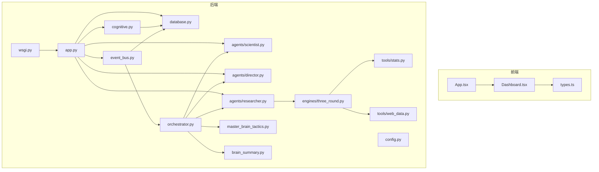

**图表来源**
- [app.py:1-365](file://app.py#L1-L365)
- [database.py:1-877](file://database.py#L1-L877)
- [cognitive.py:1-516](file://cognitive.py#L1-L516)
- [event_bus.py:1-473](file://event_bus.py#L1-L473)
- [scientist.py:1-75](file://agents/scientist.py#L1-L75)
- [director.py:1-124](file://agents/director.py#L1-L124)
- [researcher.py:1-135](file://agents/researcher.py#L1-L135)
- [three_round.py:1-558](file://engines/three_round.py#L1-L558)
- [orchestrator.py:1-3716](file://orchestrator.py#L1-L3716)
- [master_brain_tactics.py:1-674](file://master_brain_tactics.py#L1-L674)
- [brain_summary.py:1-407](file://brain_summary.py#L1-L407)
- [stats.py:1-120](file://tools/stats.py#L1-L120)
- [web_data.py:1-164](file://tools/web_data.py#L1-L164)
- [wsgi.py:1-83](file://wsgi.py#L1-L83)
- [frontend/src/App.tsx:1-13](file://frontend/src/App.tsx#L1-L13)
- [frontend/src/pages/Dashboard.tsx:1-140](file://frontend/src/pages/Dashboard.tsx#L1-L140)
- [frontend/src/types.ts:1-89](file://frontend/src/types.ts#L1-L89)

**章节来源**
- [README.md:186-211](file://README.md#L186-L211)
- [app.py:11-39](file://app.py#L11-L39)
- [wsgi.py:74-83](file://wsgi.py#L74-L83)

## 核心组件
- 应用服务与路由：提供健康检查、项目管理、队列、会话、发现、数据集上传、科学家/主任运行、以及认知元素与知识图谱 API。
- 数据库层：维护传统研究表与硅基大脑蓝图表，支持项目、队列、会话、发现、数据集、认知元素、关系、代理实例、博弈、事件等。
- 认知元素业务层：封装 CE 类型与关系、置信度更新、知识图谱聚合、认知边界计算。
- 事件总线：实现进程内事件总线与数据库持久化，支持订阅/发布/消费与待处理事件重放。
- Agent 代理：科学家负责制定指令与初始主题；主任负责每日审查与记忆积累；研究员负责执行引擎并持久化结果。
- 研究引擎：三轮引擎（假设生成→工具检验→验证总结），并进行认知元素双写。
- **ATA编排器**：进程内单例的事件驱动大脑思考调度器，监听事件、唤醒大脑循环、判定何时博弈、节律控制休眠。
- **创世主脑战术**：三大战术模块（主脑内博弈、跨域综合、元认知反思），实现群脑共识与自我调节。
- **思维收敛编排器**：实现收敛压力调度、强制综合脉冲、问题深度控制和双轨终止等机制，防止大脑无限发散。
- 工具系统：统计工具与外部数据抓取工具。
- 配置：读取环境变量控制数据库路径、API Key、模型选择等。
- WSGI 入口：集成 APScheduler 实现定时任务，确保单实例锁。

**章节来源**
- [app.py:43-360](file://app.py#L43-L360)
- [database.py:10-285](file://database.py#L10-L285)
- [cognitive.py:19-516](file://cognitive.py#L19-L516)
- [event_bus.py:62-473](file://event_bus.py#L62-L473)
- [scientist.py:14-75](file://agents/scientist.py#L14-L75)
- [director.py:14-124](file://agents/director.py#L14-L124)
- [researcher.py:34-135](file://agents/researcher.py#L34-L135)
- [three_round.py:75-558](file://engines/three_round.py#L75-L558)
- [orchestrator.py:1-3716](file://orchestrator.py#L1-L3716)
- [master_brain_tactics.py:1-674](file://master_brain_tactics.py#L1-L674)
- [brain_summary.py:1-407](file://brain_summary.py#L1-L407)
- [stats.py:10-120](file://tools/stats.py#L10-L120)
- [web_data.py:13-164](file://tools/web_data.py#L13-L164)
- [config.py:1-11](file://config.py#L1-L11)
- [wsgi.py:13-83](file://wsgi.py#L13-L83)

## 架构总览
系统采用「事件驱动、去层级化、博弈共识、自我调节」的多智能体认知系统架构。后端通过 Flask 提供 REST API，前端通过 React 渲染界面。Agent 代理通过 LLM 生成策略与主题，引擎执行研究流程并将结果写入传统表与认知元素表，事件总线负责跨组件通信，创世主脑实现群脑共识，自我调节系统确保大脑在适当的时机从发散转向收敛。

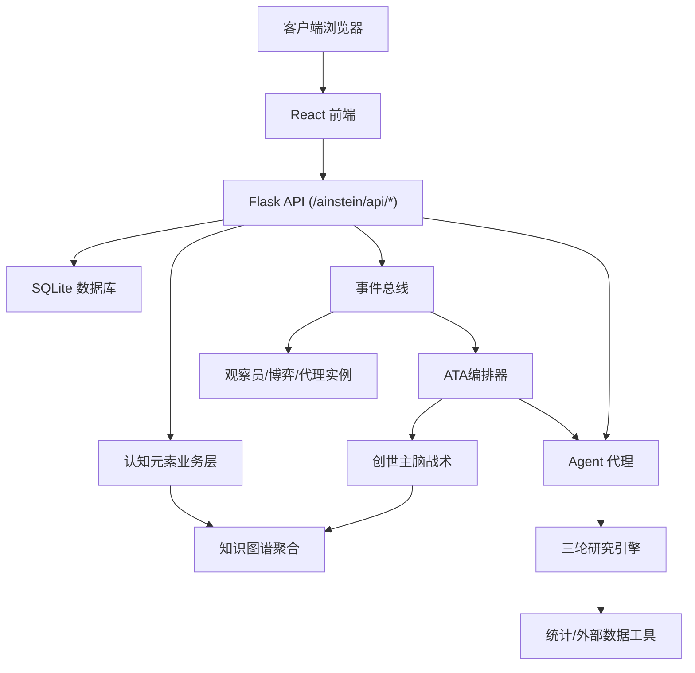

**图表来源**
- [app.py:43-360](file://app.py#L43-L360)
- [cognitive.py:327-398](file://cognitive.py#L327-L398)
- [event_bus.py:234-294](file://event_bus.py#L234-L294)
- [researcher.py:34-135](file://agents/researcher.py#L34-L135)
- [three_round.py:146-387](file://engines/three_round.py#L146-L387)
- [stats.py:10-120](file://tools/stats.py#L10-L120)
- [web_data.py:13-164](file://tools/web_data.py#L13-L164)
- [orchestrator.py:1-3716](file://orchestrator.py#L1-L3716)
- [master_brain_tactics.py:1-674](file://master_brain_tactics.py#L1-L674)

## 详细组件分析

### 创世主脑战术系统
**新增** Master Brain作为全局唯一的大脑，拥有三大核心战术能力：

#### 主脑内博弈
- **功能**：检测来自不同分支的结论存在矛盾关系，召集主脑级deliberation辩证审视
- **触发条件**：扫描主脑CE间的contradicts/refutes关系，且两端来自不同source_brain_id
- **冷却机制**：deliberation_cooldown=300秒，避免频繁触发

#### 跨域综合
- **功能**：识别不同领域的分支结论，尝试建立跨领域联系
- **触发条件**：≥2个不同领域的分支都有结论时触发综合博弈
- **领域分类**：基于关键词快速分类（生物、物理、医学、技术、哲学、社会、心理）
- **冷却机制**：cross_domain_cooldown=600秒

#### 元认知反思
- **功能**：对各分支大脑的思考模式进行元认知反思
- **触发条件**：里程碑（每增加10个不同source_brain_id）、冲突激增（最近20个CE中≥3条矛盾关系）、收敛停滞（CE>50且conclusion/consensus占比<5%）
- **冷却机制**：metacognition_cooldown=1800秒

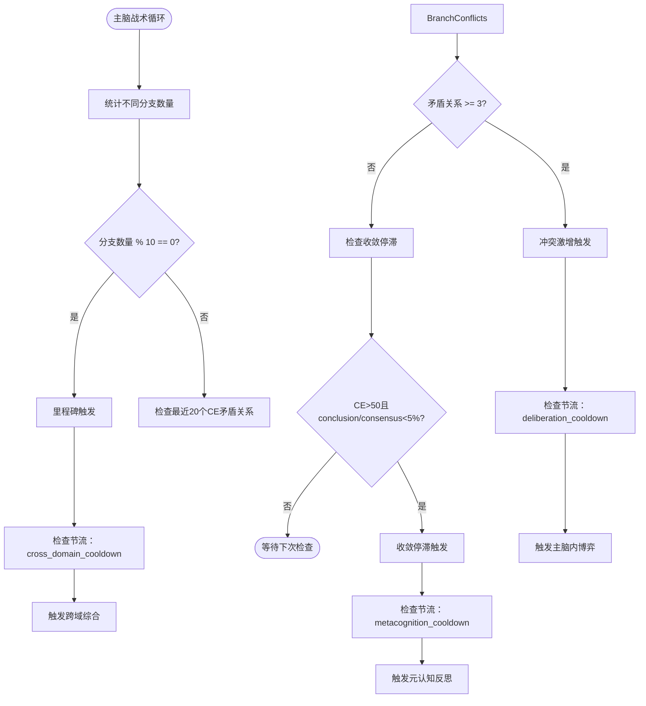

**图表来源**
- [master_brain_tactics.py:437-533](file://master_brain_tactics.py#L437-L533)
- [master_brain_tactics.py:585-673](file://master_brain_tactics.py#L585-L673)

**章节来源**
- [master_brain_tactics.py:1-674](file://master_brain_tactics.py#L1-L674)
- [docs/design.md:491-532](file://docs/design.md#L491-L532)

### ATA事件驱动编排器
**更新** ATA（Agent-to-Agent）编排器是硅基大脑的「心跳」与「神经递质」系统，采用进程内单例架构：

#### 核心特性
- **进程内单例**：每个worker进程内唯一实例，避免重复启动大脑循环
- **事件驱动**：监听EventBus上的所有事件，轻量入队+唤醒，重活交给brain_loop
- **大脑生命周期管理**：start_brain/resume_brain/pause_brain/stop_brain
- **跨进程状态同步**：多worker场景下通过DB查询最新状态

#### 主循环架构
```
while running:
  1) 状态检查（idle/paused/stopped → 跳过/退出）
  2) 兜底终止检查（_check_fallback_trigger）
  3) 主轨收敛检查（_check_convergence）
  4) _think_cycle:
     a. 事件队列消费（最多5个/轮）
     b. 收敛压力评估（_check_convergence_pressure）
     c. 异质性刺激评估（_should_inject_heterogeneous_stimulus）
     d. 已知问题优先解决（_follow_up_open_question, ratio>0.20）
     e. force_synthesis脉冲（若已积累足够CE仍未综合）
     f. frontier探索（无事件时）
     g. 矛盾扫描 → 自动博弈
     h. 综合博弈扫描（收敛模式下）
  5) cycle_count++
  6) 周期性置信度传播（每10轮）
  7) wake.wait(backoff) → 被事件唤醒或超时（指数退避1s→60s）
```

#### 事件类型与默认派遣角色
| 事件类型 | 含义 | 默认派遣角色 |
| --- | --- | --- |
| `USER_SEED_QUESTION_SUBMITTED` | 用户提交种子问题 | `investigator`, `explorer` |
| `CE_OBSERVATION_CREATED` | 观察CE落库 | `explorer`, `investigator` |
| `CE_QUESTION_RAISED` | 新问题被提出 | `investigator`, `reasoner` |
| `CE_HYPOTHESIS_PROPOSED` | 新假设提出 | `investigator`, `critic` |
| `CE_EVIDENCE_COLLECTED` | 收集到证据/反证 | `reasoner`, `critic` |
| `CE_CONCLUSION_PROPOSED` | 结论被提出 | `critic`, `synthesizer` |
| `CE_CONSENSUS_REACHED` | 博弈共识 | `synthesizer`, `observer` |
| `CE_DISSENT_DETECTED` | 博弈分歧 | `critic`, `synthesizer` |
| `CE_INSIGHT_EMERGED` | 涌现洞察 | `synthesizer`, `observer` |
| `DELIBERATION_CONCLUDED` | 博弈结束 | `synthesizer` |
| `DELIBERATION_REQUESTED` | 请求发起博弈 | （编排器代理执行） |

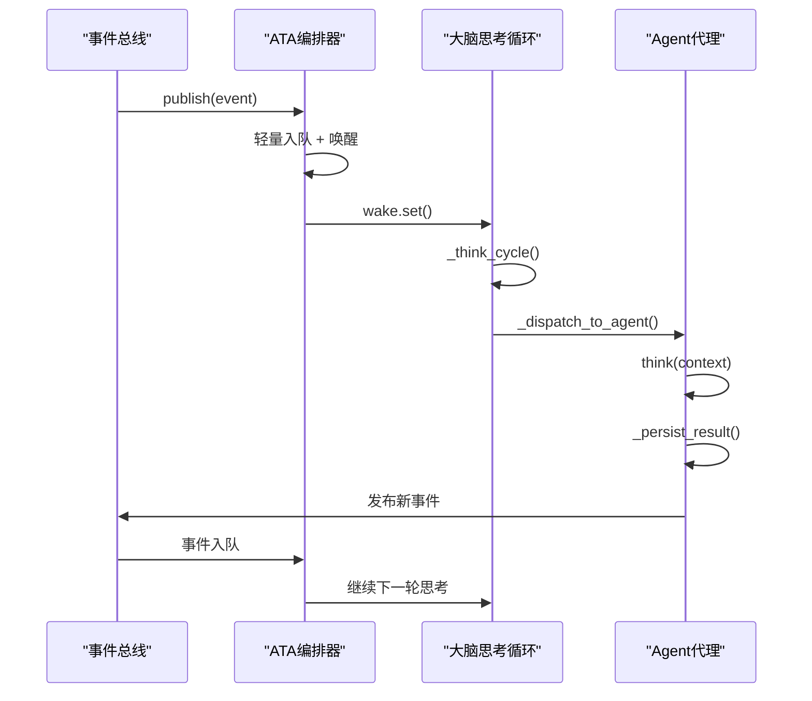

**图表来源**
- [orchestrator.py:668-775](file://orchestrator.py#L668-L775)
- [orchestrator.py:779-850](file://orchestrator.py#L779-L850)

**章节来源**
- [orchestrator.py:1-3716](file://orchestrator.py#L1-L3716)
- [docs/design.md:104-183](file://docs/design.md#L104-L183)

### 自我调节闭环系统
**更新** 大脑现在拥有完整的自我调节系统——像生物体一样，能感知自己的认知偏差并主动纠正：

#### 三大调节维度
| 偏差信号 | 调节机制 | 触发位置 |
| --- | --- | --- |
| 积压问题太多 | 已知问题优先解决 | `_follow_up_open_question` |
| 共识太顺、无人反对 | 异质性刺激 | `_inject_heterogeneous_stimulus` |
| 发散过多/长时间不综合 | 收敛压力/强制综合脉冲 | `_check_convergence_pressure`, `_force_synthesis_pulse` |

#### 已知问题优先解决机制
- **问题**：纯探索倾向下explorer一直产新question，老question永远被搁置
- **机制**：
  - `_QUESTION_RESOLVE_PRIORITY_RATIO = 0.20`：open question占比>20%触发
  - `_QUESTION_RESOLVE_PROBABILITY = 0.6`：触发后该轮派agent解答的概率
  - `_QUESTION_RESOLVE_COOLDOWN = 300`：同一question被分派后冷却5分钟

#### 共识饱和检测与异质性刺激
- **问题**：如果最近所有CE都是consensus、没有dissent，大脑会陷入"思维平庸"
- **机制**：
  - `_CONSENSUS_SATURATION_WINDOW = 15`：检测窗口最近15个CE
  - `_CONSENSUS_SATURATION_THRESHOLD = 0.5`：window内consensus占比阈值
  - `_DISSENT_DROUGHT_THRESHOLD = 0`：同时dissent≤0
  - `_HETEROGENEOUS_STIMULUS_COOLDOWN = 600`：10分钟内只触发一次

#### 收敛压力机制
- **模式**：`explore`、`converge`、`force_synthesis`
- **触发条件**：
  - `converge`：探索/收敛比>5.0或open question占比>30%
  - `force_synthesis`：距上次综合已积累≥20个CE
- **行为**：收敛模式下切换到`_CONVERGENCE_MODE_ROLES`，暂停explorer

#### 双轨终止策略
- **主轨**：synthesizer产出`conclusion`且`confidence ≥ 0.75` → 自动停止
- **兜底轨**：CE总数≥500或运行时长≥3600s → `_force_synthesizer_conclusion`

```mermaid
flowchart TD
Start(["思考循环开始"]) --> CheckEvents["检查事件队列"]
CheckEvents --> ProcessEvents["处理最多5个事件"]
ProcessEvents --> CheckConvergence["收敛压力评估"]
CheckConvergence --> Pressure{"探索/收敛比 > 5:1?"}
Pressure --> |是| ConvergeMode["进入收敛模式"]
Pressure --> |否| CheckConsensus["检查共识饱和"]
CheckConsensus --> ConsensusSaturation{"consensus占比≥50%且dissent≤0?"}
ConsensusSaturation --> |是| InjectStimulus["异质性刺激"]
ConsensusSaturation --> |否| CheckOpenQ["检查已知问题优先"]
CheckOpenQ --> OpenQ{"open question占比>20%?"}
OpenQ --> |是| ResolveQ["已知问题优先解决"]
OpenQ --> |否| FrontierExplore["frontier探索"]
InjectStimulus --> FrontierExplore
ResolveQ --> FrontierExplore
FrontierExplore --> CheckSynthesis["强制综合脉冲检查"]
CheckSynthesis --> Synthesis{"已积累≥20个CE?"}
Synthesis --> |是| ForceSynthesis["强制综合脉冲"]
Synthesis --> |否| CheckDeliberation["矛盾扫描"]
ForceSynthesis --> CheckDeliberation
CheckDeliberation --> Deliberation{"发现矛盾关系?"}
Deliberation --> |是| TriggerDeliberation["自动发起博弈"]
Deliberation --> |否| CheckConvergence2["收敛检查"]
TriggerDeliberation --> CheckConvergence2
CheckConvergence2 --> CheckMainConvergence["主轨收敛检查"]
CheckMainConvergence --> MainConvergence{"synthesizer产出高置信度conclusion?"}
MainConvergence --> |是| StopBrain["停止大脑思考"]
MainConvergence --> |否| CheckFallback["兜底终止检查"]
CheckFallback --> Fallback{"CE≥500或运行≥3600s?"}
Fallback --> |是| ForceConclusion["强制总结"]
Fallback --> |否| Wait["指数退避等待"]
ForceConclusion --> StopBrain
Wait --> End(["结束本轮循环"])
StopBrain --> End
```

**图表来源**
- [orchestrator.py:779-850](file://orchestrator.py#L779-L850)
- [orchestrator.py:1089-1150](file://orchestrator.py#L1089-L1150)
- [orchestrator.py:1151-1220](file://orchestrator.py#L1151-L1220)

**章节来源**
- [orchestrator.py:1-3716](file://orchestrator.py#L1-L3716)
- [docs/design.md:186-261](file://docs/design.md#L186-L261)

### 6角色平等编队体系
**更新** 所有Agent完全平等，角色仅是「思维偏好」标签：

#### 6个功能性角色
| 角色 | 思考偏好 | 偏好产出CE | 默认配额(min/max) | 是否参与博弈 |
| --- | --- | --- | --- | --- |
| `explorer` | 好奇心驱动，发散思维 | question, observation, hypothesis | 1/2 | ✅ |
| `investigator` | 严谨求证，偏向工具使用 | evidence, counter_evidence, observation | 1/4 | ✅ |
| `reasoner` | 逻辑优先，注重因果链 | inference, argument, conclusion | 1/3 | ✅ |
| `critic` | 怀疑论倾向，寻找反例 | counter_evidence, dissent | 1/2 | ✅ |
| `synthesizer` | 全局视角，终局思维 | insight, perspective, consensus, conclusion | 0/1 | ✅ |
| `observer` | 元认知视角，关注过程 | insight | 1/1 | ❌ |

#### 角色=视角，不是层级
- 所有Agent完全平等；角色仅是「思维偏好」标签
- 同一角色可有多个不同性格的Instance，从而在博弈中产生思维多样性
- Agent可被动态`spawn`/`despawn`/`transform_role`

#### BaseAgent核心能力
```python
class BaseAgent:
    def think(context: ThinkingContext) -> ThinkingResult: ...
    def react_to_event(event: dict) -> Optional[ThinkingResult>: ...
    def participate_in_deliberation(deliberation_id, round_index) -> dict: ...
```

**章节来源**
- [docs/design.md:264-310](file://docs/design.md#L264-L310)
- [agents/framework.py:57-106](file://agents/framework.py#L57-L106)

### 三轨博弈引擎
**更新** v3起，博弈引擎拥有三种模式，对应思维的三种姿态：

#### 三种博弈模式
| 类型 | 触发条件 | 思维姿态 | 产出CE |
| --- | --- | --- | --- |
| **推翻式** | `_scan_and_trigger_deliberation`检测到`contradicts/refutes`关系 | 否定与质疑 | dissent/consensus（取决投票） |
| **建设性综合** | `_scan_and_trigger_synthesis_deliberation`找到关系密集的CE簇（≥3成员） | 整合与提炼 | insight/consensus |
| **建设性确认** | 高置信度CE已有充分证据但尚未被「正式」共识 | 正式承认 | consensus（目标CE进入confirmed）|

#### 5步流程
```
1. initiate        创建deliberation行+选3-5名参与者+发出DELIBERATION_REQUESTED
2. run_turn        每轮内每参与者依序发言；最多3轮（DEFAULT_MAX_ROUNDS）
3. collect_votes   每位Agent最后一轮的stance→投票(agree/disagree/abstain)
                   权重=agent_instances.weight
4. judge_consensus 加权赞成比→判定outcome
5. conclude        生成consensus/perspective/dissent CE，写终态，发DELIBERATION_CONCLUDED
```

#### 加权裁决
- `DEFAULT_CONSENSUS_THRESHOLD = 0.6`：加权赞成比≥0.6且agree人数≥2→consensus
- `DEFAULT_MAJORITY_THRESHOLD = 0.5`：0.5-0.6区间→majority（求同存异）
- 否则→dissent

**章节来源**
- [docs/design.md:313-376](file://docs/design.md#L313-L376)
- [deliberation.py:127-200](file://deliberation.py#L127-L200)

### 工具博弈机制
**更新** 工具调用在AInstein中被设计为**可博弈的认知元素**：

#### 与传统tool-use的本质区别
| 传统tool-use loop | AInstein tool_proposal |
| --- | --- |
| LLM直接调用工具 | LLM**提议**调用工具，作为`inference`CE落库 |
| 工具结果直接返回给该LLM | 工具结果作为`evidence`CE注入图谱，所有Agent可见 |
| 单Agent决策 | 多Agent轻量级投票 |
| 不可回溯 | 完整审计链：提议CE→投票→执行→evidence CE，由`derives_from`关系串联 |

#### 流程
```
1. Agent.think输出tool_proposal字段（可选，prompt JSON Schema显式声明）
   {"tool": "web_search", "params": {...}, "reason": "..."}
2. orchestrator._handle_tool_proposal:
   a. 落库为inference CE，payload.tool_status="pending_vote"
   b. 轻量级博弈：从非observer Agent中随机选≤2个投票（LLM"support"/"oppose"）
      majority≥1通过；无voter时默认通过
   c. 通过→tools.registry.dispatch(tool_name, params)
      →落库为evidence CE
      →建立derives_from关系：evidence CE→提议CE
      →payload.tool_status="executed"
   d. 否决→payload.tool_status="rejected"，提议CE仍保留可追溯
```

**章节来源**
- [docs/design.md:379-430](file://docs/design.md#L379-L430)
- [orchestrator.py:180-263](file://orchestrator.py#L180-L263)

### 认知元素与知识图谱
- 认知元素类型：13种层级类型（观察、问题、假设、证据、推论、结论、共识、洞察等）。
- 关系类型：10种关系（支持、反驳、推导自、细化、泛化、矛盾、取代、依赖、启发、关联）。
- 置信度更新：支持变更历史记录与版本号递增。
- 知识图谱聚合：返回nodes与edges，支持类型过滤与节点上限。
- 认知边界：近期、低置信度、未被支撑三类元素的并集。

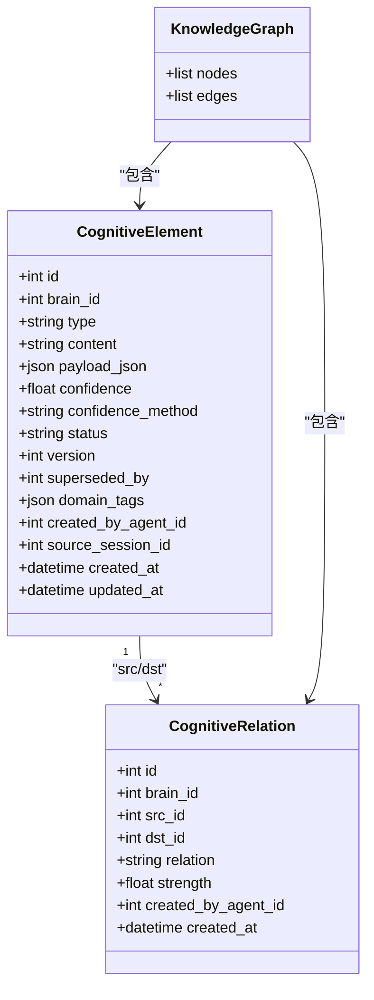

**图表来源**
- [cognitive.py:108-157](file://cognitive.py#L108-L157)
- [cognitive.py:244-284](file://cognitive.py#L244-L284)
- [cognitive.py:327-398](file://cognitive.py#L327-L398)
- [cognitive.py:449-516](file://cognitive.py#L449-L516)
- [database.py:135-169](file://database.py#L135-L169)

**章节来源**
- [cognitive.py:19-516](file://cognitive.py#L19-L516)
- [database.py:105-285](file://database.py#L105-L285)

### 事件总线与ATA协议
- 事件类型注册：统一在EventTypes中定义，支持CE、Agent、博弈、大脑生命周期、用户/管理员、观察员等事件。
- 发布：写入events表并同步分发给订阅器。
- 消费：单个消费者幂等消费，记录event_consumption。
- 待处理事件重放：process_pending_events支持崩溃恢复与调试。

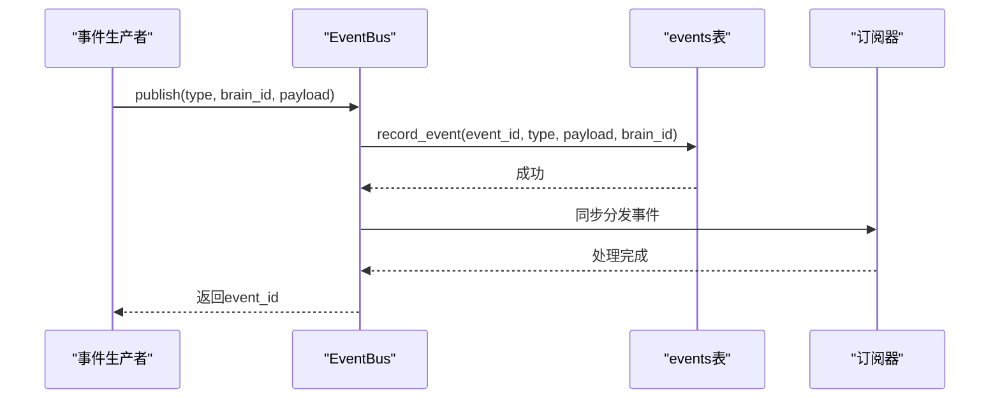

**图表来源**
- [event_bus.py:234-294](file://event_bus.py#L234-L294)
- [event_bus.py:316-361](file://event_bus.py#L316-L361)
- [event_bus.py:381-434](file://event_bus.py#L381-L434)

**章节来源**
- [event_bus.py:66-142](file://event_bus.py#L66-L142)
- [event_bus.py:234-294](file://event_bus.py#L234-L294)
- [event_bus.py:316-361](file://event_bus.py#L316-L361)
- [event_bus.py:381-434](file://event_bus.py#L381-L434)

### 三轮研究引擎与双写机制
- 第一轮：假设生成，写入hypothesis CE。
- 第二轮：工具检验，写入observation CE。
- 第三轮：验证与总结，写入evidence/counter_evidence、conclusion/inference、question，并建立supports/refutes/derives_from/inspires关系。
- 双写：在try/except内容错地调用认知元素创建与关系建立，失败仅记录日志。

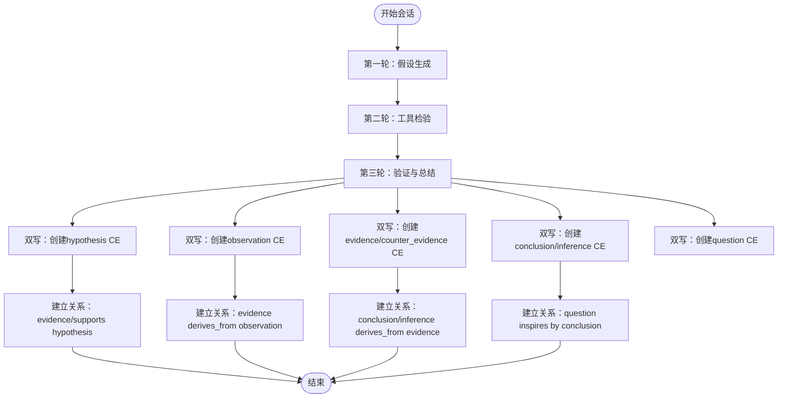

**图表来源**
- [three_round.py:146-387](file://engines/three_round.py#L146-L387)
- [three_round.py:393-558](file://engines/three_round.py#L393-L558)

**章节来源**
- [three_round.py:75-558](file://engines/three_round.py#L75-L558)

### Agent代理与定时调度
- 科学家：根据项目使命与数据集生成指令与初始主题。
- 主任：每日审查会话、发现、队列与记忆，调整优先级并累计记忆。
- 研究员：挑选主题、运行引擎、持久化结果并添加下一研究方向。
- 定时调度：APScheduler在UTC时间执行科学家（每周）、主任（每日）、研究员（每日）任务。

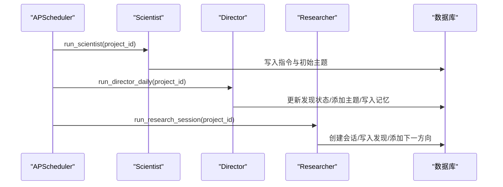

**图表来源**
- [wsgi.py:27-71](file://wsgi.py#L27-L71)
- [scientist.py:14-75](file://agents/scientist.py#L14-L75)
- [director.py:14-124](file://agents/director.py#L14-L124)
- [researcher.py:34-135](file://agents/researcher.py#L34-L135)

**章节来源**
- [scientist.py:14-75](file://agents/scientist.py#L14-L75)
- [director.py:14-124](file://agents/director.py#L14-L124)
- [researcher.py:34-135](file://agents/researcher.py#L34-L135)
- [wsgi.py:27-71](file://wsgi.py#L27-L71)

### 前端交互与数据流
- Dashboard页面：加载项目列表与统计信息，支持创建新项目。
- 类型定义：Project、Session、Finding、Dataset、Directive、MemoryEntry等。
- API调用：通过api.ts封装后端接口，实现数据获取与提交。

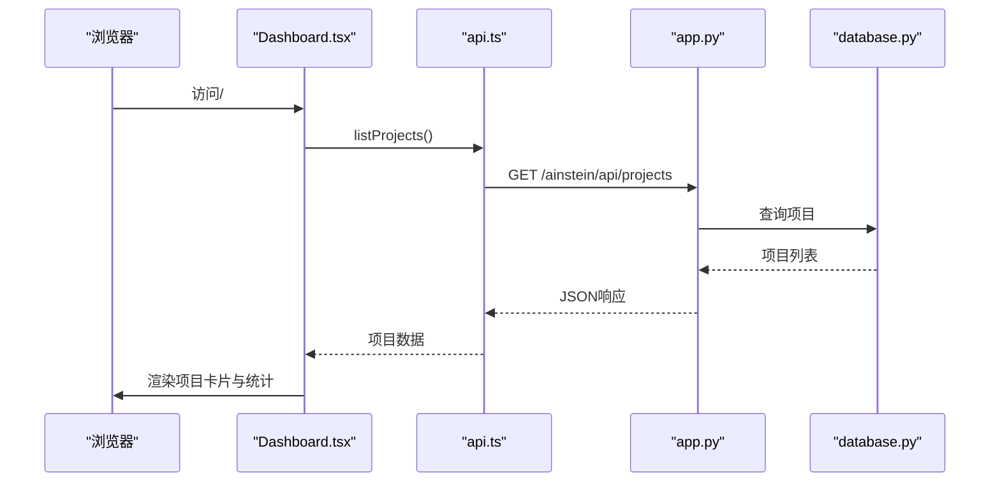

**图表来源**
- [frontend/src/pages/Dashboard.tsx:16-28](file://frontend/src/pages/Dashboard.tsx#L16-L28)
- [frontend/src/types.ts:1-89](file://frontend/src/types.ts#L1-L89)
- [app.py:50-66](file://app.py#L50-L66)
- [database.py:315-356](file://database.py#L315-L356)

**章节来源**
- [frontend/src/App.tsx:1-13](file://frontend/src/App.tsx#L1-L13)
- [frontend/src/pages/Dashboard.tsx:1-140](file://frontend/src/pages/Dashboard.tsx#L1-L140)
- [frontend/src/types.ts:1-89](file://frontend/src/types.ts#L1-L89)
- [app.py:48-105](file://app.py#L48-L105)

## 依赖关系分析
- 后端依赖：Flask、APScheduler、SQLite、pandas、numpy、scipy、requests等。
- 前端依赖：React、React Router、TypeScript、Vite。
- 事件总线与数据库：事件持久化与幂等消费依赖SQLite主键约束。
- 引擎与工具：统计工具依赖pandas/numpy/scipy，外部数据工具依赖requests。
- **ATA编排器**：与事件总线、认知元素、Agent框架深度集成，实现事件驱动的大脑思考循环。
- **创世主脑战术**：与数据库、事件总线、观察员深度集成，实现群脑共识与自我调节。

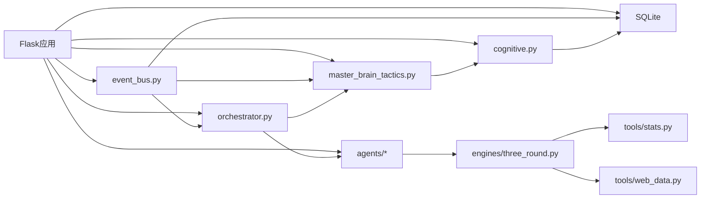

**图表来源**
- [app.py:1-11](file://app.py#L1-L11)
- [database.py:288-295](file://database.py#L288-L295)
- [cognitive.py:14-14](file://cognitive.py#L14-L14)
- [event_bus.py:57-58](file://event_bus.py#L57-L58)
- [three_round.py:20-25](file://engines/three_round.py#L20-L25)
- [stats.py:2-7](file://tools/stats.py#L2-L7)
- [web_data.py:2-6](file://tools/web_data.py#L2-L6)
- [orchestrator.py:1-3716](file://orchestrator.py#L1-L3716)
- [master_brain_tactics.py:1-674](file://master_brain_tactics.py#L1-L674)

**章节来源**
- [app.py:1-11](file://app.py#L1-L11)
- [database.py:288-295](file://database.py#L288-L295)
- [event_bus.py:57-58](file://event_bus.py#L57-L58)
- [three_round.py:20-25](file://engines/three_round.py#L20-L25)
- [orchestrator.py:1-3716](file://orchestrator.py#L1-L3716)
- [master_brain_tactics.py:1-674](file://master_brain_tactics.py#L1-L674)

## 性能考虑
- 数据库：使用WAL模式提升并发写入性能；为关键查询建立索引（如队列、会话、发现、记忆、数据集、指令等）。
- 认知元素分页：Python层过滤与切片，限制单次查询规模；知识图谱聚合支持节点上限。
- 引擎双写：在try/except内容错地调用，避免影响主流程；日志记录失败信息。
- 前端：使用React Router实现SPA，减少页面刷新；Dashboard使用并行加载项目详情。
- **ATA编排器**：事件队列上限256个，单次think_cycle最多处理5个事件，避免内存暴涨。
- **创世主脑战术**：采用cooldown-based节流机制，避免每个事件都触发完整战术循环。
- **自我调节系统**：收敛压力检查、强制综合脉冲、问题深度控制均采用轻量级查询，避免对主循环造成性能负担。

## 故障排除指南
- 数据库初始化失败：确认DB_PATH可写，检查.env中数据库路径配置。
- LLM调用错误：检查DASHSCOPE_API_KEY与BASE_URL，确认模型名称正确。
- 事件总线异常：查看事件持久化与订阅器异常日志，确认EVENT_REGISTRY注册正确。
- 引擎执行失败：检查工具调用参数与数据集可用性，查看三轮引擎日志。
- 前端接口404：确认静态资源路径与路由配置，检查Flask静态文件服务。
- **ATA编排器异常**：检查进程内单例初始化，确认事件订阅正确，查看大脑状态同步问题。
- **创世主脑战术异常**：检查节流机制，确认主脑ID为1，查看战术触发条件。
- **自我调节系统异常**：检查收敛压力参数配置，确认数据库连接正常，查看编排器日志中的收敛压力检查失败信息。

**章节来源**
- [database.py:288-295](file://database.py#L288-L295)
- [config.py:4-11](file://config.py#L4-L11)
- [event_bus.py:270-276](file://event_bus.py#L270-L276)
- [three_round.py:86-114](file://engines/three_round.py#L86-L114)
- [app.py:24-39](file://app.py#L24-L39)
- [orchestrator.py:1036-1040](file://orchestrator.py#L1036-L1040)
- [master_brain_tactics.py:110-115](file://master_brain_tactics.py#L110-L115)

## 结论
本项目通过「事件驱动、去层级化、博弈共识、自我调节」的多智能体认知系统架构，构建了从「种子问题」到「知识图谱」的完整闭环。系统已从v1的单脑思考演进为v3的群脑共识系统，通过Master Brain创世主脑实现去层级化、ATA事件驱动编排器、6角色平等编队等核心概念，构建完整的自我调节闭环。系统在v1阶段已实现基本研究流程与知识沉淀，新增的创世主脑战术和自我调节系统有效防止大脑陷入无限发散，确保研究过程的效率与质量。后续将推进到「硅基大脑」形态，实现真正的「思考」涌现。

## 附录
- 快速开始：克隆仓库、安装依赖、配置环境变量、初始化数据库、启动后端与前端。
- 部署：使用Gunicorn启动，结合Nginx反代与前端构建产物。
- 蓝图与路线图：参见README中的愿景路线图与核心概念速览。
- **架构演进**：从v1的单脑思考到v3的群脑共识，核心在于去层级化和平等编队。
- **自我调节参数**：收敛压力、异质性刺激、问题深度控制等参数均可通过配置文件调整。

**章节来源**
- [README.md:130-183](file://README.md#L130-L183)
- [README.md:46-75](file://README.md#L46-L75)
- [README.md:78-114](file://README.md#L78-L114)
- [README.md:256-313](file://README.md#L256-L313)
- [docs/design.md:1-800](file://docs/design.md#L1-L800)