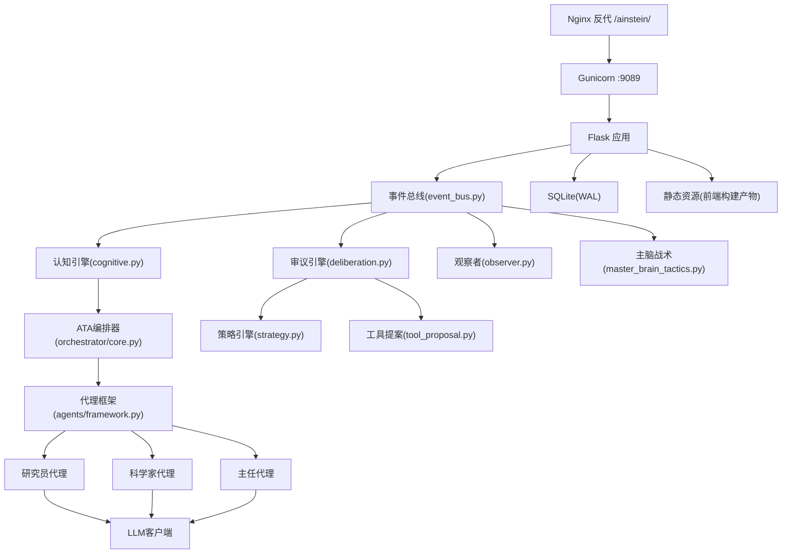
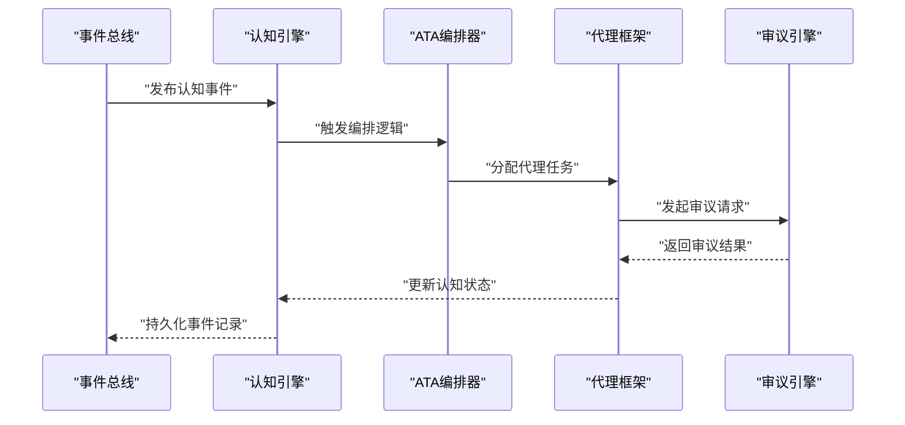
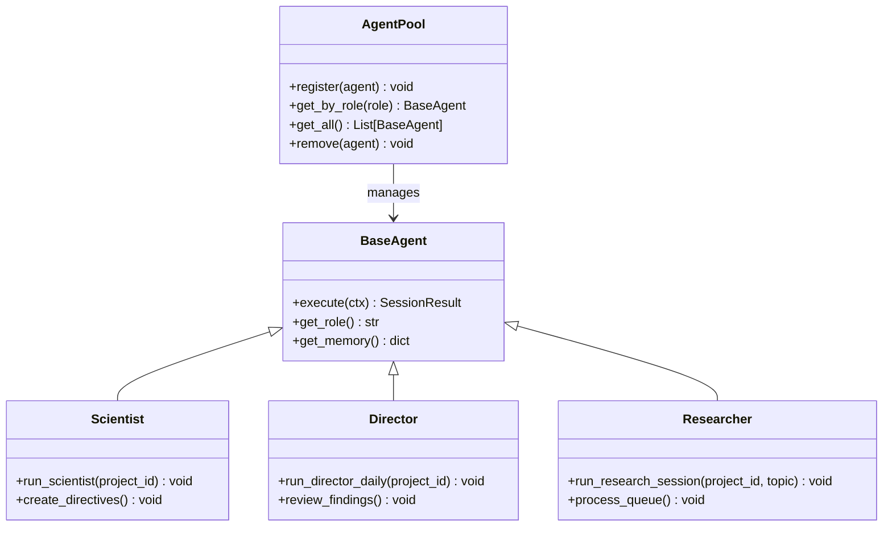
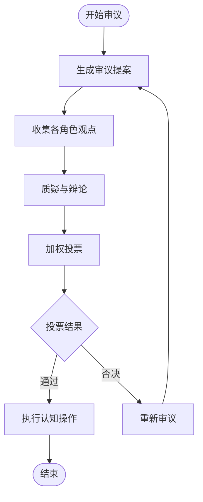
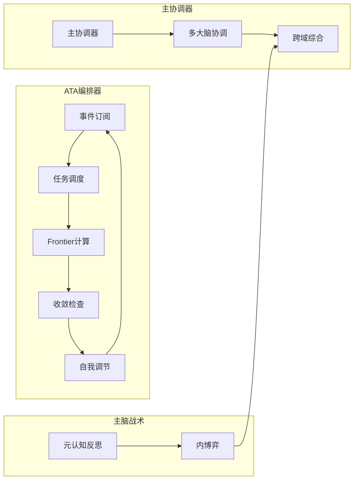
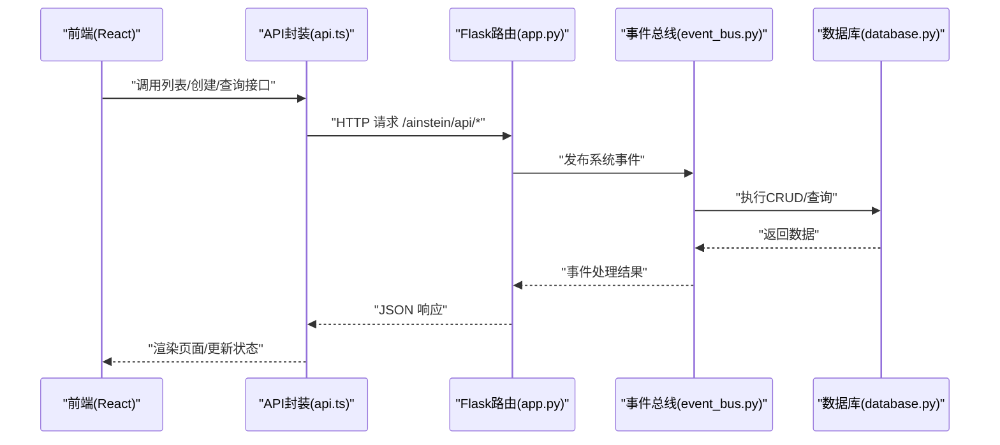
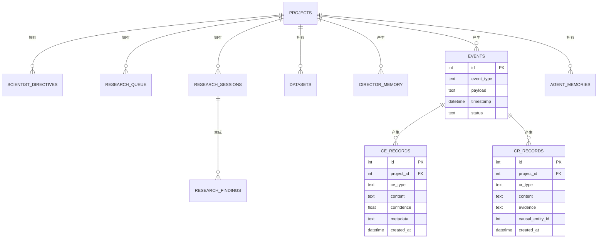
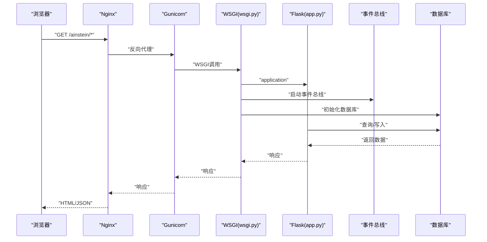
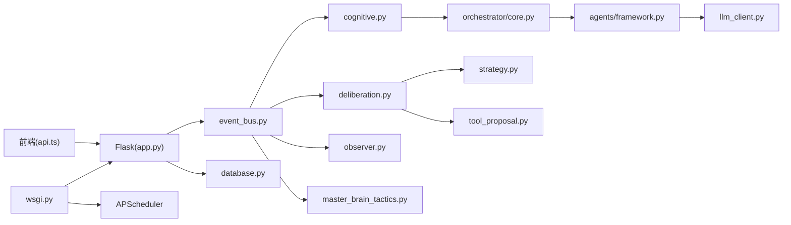

# 系统架构

<cite>
**本文引用的文件**
- [应用入口与路由](file://app.py)
- [WSGI与调度器](file://wsgi.py)
- [全局配置](file://config.py)
- [数据库层与Schema](file://database.py)
- [科学家代理](file://agents/scientist.py)
- [主任代理](file://agents/director.py)
- [研究员代理](file://agents/researcher.py)
- [代理框架](file://agents/framework.py)
- [LLM客户端](file://agents/llm_client.py)
- [引擎基类](file://engines/base.py)
- [三轮研究引擎](file://engines/three_round.py)
- [工具注册中心](file://tools/registry.py)
- [前端应用入口](file://frontend/src/App.tsx)
- [前端API封装](file://frontend/src/api.ts)
- [前端Vite配置](file://frontend/vite.config.ts)
- [前端package.json](file://frontend/package.json)
- [项目说明与架构图](file://README.md)
- [系统架构设计](file://docs/design.md)
- [事件总线](file://event_bus.py)
- [认知引擎](file://cognitive.py)
- [审议引擎](file://deliberation.py)
- [观察者](file://observer.py)
- [主脑战术](file://master_brain_tactics.py)
- [编排器](file://orchestrator/core.py)
- [主协调器](file://orchestrator/master_coordinator.py)
- [审议触发器](file://orchestrator/deliberation_trigger.py)
- [策略](file://orchestrator/strategy.py)
- [工具提案](file://orchestrator/tool_proposal.py)
</cite>

## 目录
1. [引言](#引言)
2. [项目结构](#项目结构)
3. [核心组件](#核心组件)
4. [架构总览](#架构总览)
5. [详细组件分析](#详细组件分析)
6. [依赖关系分析](#依赖关系分析)
7. [性能考量](#性能考量)
8. [故障排查指南](#故障排查指南)
9. [结论](#结论)
10. [附录](#附录)

## 引言
本文件面向开发者与运维人员，系统化阐述AInstein v3.1+的全新事件驱动多智能体认知系统架构设计。系统已从早期"科学家/主任/研究员 + 三轮研究引擎"演进为**事件驱动、去层级化、博弈共识、自我调节**的多智能体认知系统。涵盖11个关键模块的完整系统栈，包括ATA编排器、多角色代理框架、事件驱动的认知引擎、博弈审议机制、观察者系统和主脑战术等核心组件。

## 项目结构
AInstein v3.1+采用全新的事件驱动架构，包含11个关键模块的完整系统栈：

- **表现层**：React单页应用，路由与页面组件，API封装统一调用后端
- **控制层**：Flask应用，负责路由、请求解析、响应序列化、静态资源托管
- **事件层**：事件总线驱动的异步处理，支持实时状态更新
- **认知层**：多角色代理框架，支持6种角色的动态涌现
- **审议层**：博弈引擎实现三轨模式的决策机制
- **编排层**：ATA编排器协调整个认知过程
- **数据层**：SQLite数据库，提供CRUD与索引，支持WAL模式
- **工具层**：动态工具注册与调度系统

```mermaid
graph TB
subgraph "前端(React)"
FE_App["App.tsx<br/>路由与页面"]
FE_API["api.ts<br/>REST封装"]
FE_Vite["vite.config.ts<br/>构建与路径"]
end
subgraph "后端(Flask)"
APP["app.py<br/>路由与控制器"]
WSGI["wsgi.py<br/>WSGI入口+调度器"]
CFG["config.py<br/>环境配置"]
DB["database.py<br/>SQLite层"]
end
subgraph "事件驱动架构"
EVENT["event_bus.py<br/>事件总线"]
COGNITIVE["cognitive.py<br/>认知引擎"]
DELIB["deliberation.py<br/>审议引擎"]
OBSERVER["observer.py<br/>观察者"]
MASTER["master_brain_tactics.py<br/>主脑战术"]
END
subgraph "编排系统"
ORCH["orchestrator/core.py<br/>ATA编排器"]
MASTER_COORD["master_coordinator.py<br/>主协调器"]
TRIGGER["deliberation_trigger.py<br/>审议触发器"]
STRATEGY["strategy.py<br/>策略引擎"]
TOOL_PROPOSAL["tool_proposal.py<br/>工具提案"]
END
subgraph "代理系统"
FRAMEWORK["agents/framework.py<br/>代理框架"]
SCIENTIST["scientist.py<br/>科学家"]
DIRECTOR["director.py<br/>主任"]
RESEARCHER["researcher.py<br/>研究员"]
LLM["llm_client.py<br/>LLM客户端"]
TOOLS["tools/registry.py<br/>工具注册"]
END
FE_App --> FE_API
FE_API --> APP
APP --> DB
APP --> EVENT
EVENT --> COGNITIVE
EVENT --> DELIB
EVENT --> OBSERVER
EVENT --> MASTER
COGNITIVE --> ORCH
ORCH --> FRAMEWORK
FRAMEWORK --> SCIENTIST
FRAMEWORK --> DIRECTOR
FRAMEWORK --> RESEARCHER
RESEARCHER --> LLM
SCIENTIST --> LLM
DIRECTOR --> LLM
DELIB --> STRATEGY
DELIB --> TOOL_PROPOSAL
TRIGGER --> DELIB
MASTER_COORD --> TRIGGER
WSGI --> APP
CFG --> APP
CFG --> DB
CFG --> LLM
```

**图表来源**
- [系统架构设计:32-46](file://docs/design.md#L32-L46)
- [应用入口与路由:1-182](file://app.py#L1-L182)
- [WSGI与调度器:1-83](file://wsgi.py#L1-L83)
- [全局配置:1-11](file://config.py#L1-L11)
- [数据库层与Schema:1-344](file://database.py#L1-L344)
- [事件总线:1-100](file://event_bus.py#L1-L100)
- [认知引擎:1-200](file://cognitive.py#L1-L200)
- [审议引擎:1-250](file://deliberation.py#L1-L250)
- [观察者:1-150](file://observer.py#L1-L150)
- [主脑战术:1-120](file://master_brain_tactics.py#L1-L120)
- [编排器:1-180](file://orchestrator/core.py#L1-L180)
- [主协调器:1-140](file://orchestrator/master_coordinator.py#L1-L140)
- [审议触发器:1-100](file://orchestrator/deliberation_trigger.py#L1-L100)
- [策略:1-120](file://orchestrator/strategy.py#L1-L120)
- [工具提案:1-160](file://orchestrator/tool_proposal.py#L1-L160)
- [代理框架:1-1200](file://agents/framework.py#L1-L1200)
- [科学家代理:1-75](file://agents/scientist.py#L1-L75)
- [主任代理:1-124](file://agents/director.py#L1-L124)
- [研究员代理:1-114](file://agents/researcher.py#L1-L114)
- [LLM客户端:1-114](file://agents/llm_client.py#L1-L114)
- [工具注册中心:1-181](file://tools/registry.py#L1-L181)
- [前端应用入口:1-13](file://frontend/src/App.tsx#L1-L13)
- [前端API封装:1-45](file://frontend/src/api.ts#L1-L45)
- [前端Vite配置:1-12](file://frontend/vite.config.ts#L1-L12)

**章节来源**
- [系统架构设计:1-48](file://docs/design.md#L1-L48)
- [项目说明与架构图:71-83](file://README.md#L71-L83)

## 核心组件
- **事件驱动架构**
  - 事件总线作为系统中枢，支持同步分发和数据库持久化
  - 所有思考过程由事件触发，无预设固定流程
  - 实现实时状态更新和可追溯的认知过程
- **多智能体认知系统**
  - 代理框架支持6种角色的动态涌现和协作
  - 科学家：制定战略指令与初始主题
  - 主任：每日复盘与评审发现
  - 研究员：驱动研究会话与产出发现
  - 其他角色：explorer、critic、synthesizer等
- **博弈审议机制**
  - 5步流程的审议引擎，支持三轨模式
  - 通过博弈、矛盾检测、共识形成演化认知图谱
  - 加权投票裁决而非中央调度
- **自我调节系统**
  - ATA编排器实现frontier计算和收敛检查
  - 主脑战术支持内博弈、跨域综合和元认知反思
  - 系统能感知自身偏差并主动纠偏
- **认知经济学原则**
  - 大部分Agent锚定"解题"，发散思考由极少数explorer承担
  - 配额受限的发散思考模式
  - 能量集中在解决问题上

**章节来源**
- [系统架构设计:21-31](file://docs/design.md#L21-L31)
- [事件总线:1-100](file://event_bus.py#L1-L100)
- [代理框架:1-1200](file://agents/framework.py#L1-L1200)
- [审议引擎:1-250](file://deliberation.py#L1-L250)
- [编排器:1-180](file://orchestrator/core.py#L1-L180)
- [主脑战术:1-120](file://master_brain_tactics.py#L1-L120)

## 架构总览
AInstein v3.1+采用"事件驱动多智能体认知系统"架构，突破传统层级化设计，实现真正的去中心化智能涌现。系统以事件总线为核心，通过多角色代理的自发协作、博弈审议和自我调节，形成动态的认知图谱演化。



**图表来源**
- [系统架构设计:32-46](file://docs/design.md#L32-L46)
- [应用入口与路由:1-182](file://app.py#L1-L182)
- [WSGI与调度器:1-83](file://wsgi.py#L1-L83)
- [事件总线:1-100](file://event_bus.py#L1-L100)
- [认知引擎:1-200](file://cognitive.py#L1-L200)
- [审议引擎:1-250](file://deliberation.py#L1-L250)
- [观察者:1-150](file://observer.py#L1-L150)
- [主脑战术:1-120](file://master_brain_tactics.py#L1-L120)
- [编排器:1-180](file://orchestrator/core.py#L1-L180)
- [代理框架:1-1200](file://agents/framework.py#L1-L1200)

## 详细组件分析

### 事件驱动架构与认知引擎
- **事件总线设计**
  - 单例模式的事件总线，支持同步分发和数据库持久化
  - 所有认知活动通过事件触发，实现完全的去层级化
  - 支持事件订阅、发布和持久化，确保可追溯性
- **认知引擎(Cognitive Engine)**
  - CE/CR CRUD操作，支持置信度更新和frontier计算
  - 实现状态机管理，跟踪认知过程的演化
  - 提供客观可追溯的产出记录(CE/CR)
- **数据流设计**
  - 事件驱动的异步处理，避免阻塞式调用
  - 实时状态更新和历史追踪相结合
  - 支持认知过程的重放、审计和证伪



**图表来源**
- [事件总线:1-100](file://event_bus.py#L1-L100)
- [认知引擎:1-200](file://cognitive.py#L1-L200)
- [编排器:1-180](file://orchestrator/core.py#L1-L180)
- [代理框架:1-1200](file://agents/framework.py#L1-L1200)
- [审议引擎:1-250](file://deliberation.py#L1-L250)

**章节来源**
- [事件总线:1-100](file://event_bus.py#L1-L100)
- [认知引擎:1-200](file://cognitive.py#L1-L200)
- [编排器:1-180](file://orchestrator/core.py#L1-L180)

### 多智能体代理系统与角色分工
- **代理框架**
  - 支持6种角色的动态涌现：scientist、director、researcher、explorer、critic、synthesizer
  - AgentPool管理代理生命周期和协作关系
  - 统一的BaseAgent基类，支持角色特化和通用功能
- **角色职责**
  - 科学家：制定战略指令与初始主题，沉淀发现分类与策略记忆
  - 主任：每日复盘，评审发现、调整队列、累积记忆、生成简报
  - 研究员：从队列取主题，驱动研究会话，产出发现与后续方向
  - Explorer：承担发散思考，配额受限的创造性角色
  - Critic：负责质疑和批判性评估
  - Synthesizer：整合和综合不同观点
- **协作机制**
  - 基于事件的松耦合协作
  - 通过博弈审议形成共识
  - 自我调节避免过度收敛或发散



**图表来源**
- [代理框架:450-650](file://agents/framework.py#L450-L650)
- [代理框架:1073-1120](file://agents/framework.py#L1073-L1120)
- [科学家代理:13-75](file://agents/scientist.py#L13-L75)
- [主任代理:13-124](file://agents/director.py#L13-L124)
- [研究员代理:13-114](file://agents/researcher.py#L13-L114)

**章节来源**
- [代理框架:1-1200](file://agents/framework.py#L1-L1200)
- [科学家代理:1-75](file://agents/scientist.py#L1-L75)
- [主任代理:1-124](file://agents/director.py#L1-L124)
- [研究员代理:1-114](file://agents/researcher.py#L1-L114)

### 博弈审议引擎与决策机制
- **五步流程设计**
  - 提案生成：基于当前认知状态生成审议提案
  - 观点收集：收集各角色的不同观点和证据
  - 质疑辩论：通过critic角色进行质疑和辩论
  - 加权投票：基于角色权重和证据质量进行投票
  - 结果执行：根据投票结果执行相应的认知操作
- **三轨模式**
  - 解题轨道：专注于问题解决的核心思考
  - 发散轨道：受配额限制的创造性思考
  - 综合轨道：整合不同观点的综合分析
- **裁决机制**
  - 基于加权投票的去中心化裁决
  - 避免中央调度的强约束
  - 支持动态的角色权重调整



**图表来源**
- [审议引擎:1-250](file://deliberation.py#L1-L250)
- [策略:1-120](file://orchestrator/strategy.py#L1-L120)
- [工具提案:1-160](file://orchestrator/tool_proposal.py#L1-L160)

**章节来源**
- [审议引擎:1-250](file://deliberation.py#L1-L250)
- [策略:1-120](file://orchestrator/strategy.py#L1-L120)
- [工具提案:1-160](file://orchestrator/tool_proposal.py#L1-L160)

### ATA编排器与自我调节系统
- **ATA编排器核心功能**
  - 事件订阅：监听系统事件并触发相应处理逻辑
  - 调度协调：管理代理任务分配和执行顺序
  - Frontier计算：基于当前认知状态计算前沿问题
  - 收敛检查：监控认知过程是否达到收敛条件
  - 自调节机制：根据系统状态主动调整行为策略
- **主协调器(Master Coordinator)**
  - 协调多个大脑实例的运行
  - 实现跨域综合和元认知反思
  - 支持创世主脑的战术指导
- **主脑战术**
  - 内博弈：大脑内部不同观点的博弈
  - 跨域综合：整合不同领域的知识和见解
  - 元认知反思：对认知过程本身的反思和改进



**图表来源**
- [编排器:1-180](file://orchestrator/core.py#L1-L180)
- [主协调器:1-140](file://orchestrator/master_coordinator.py#L1-L140)
- [主脑战术:1-120](file://master_brain_tactics.py#L1-L120)

**章节来源**
- [编排器:1-180](file://orchestrator/core.py#L1-L180)
- [主协调器:1-140](file://orchestrator/master_coordinator.py#L1-L140)
- [主脑战术:1-120](file://master_brain_tactics.py#L1-L120)

### 前后端交互与路由设计
- **前端架构**
  - React Router进行SPA路由，页面包含仪表盘与项目详情
  - API封装统一前缀/ainstein/api，便于后端静态资源映射与反向代理
  - 构建时设置base为/ainstein/，确保静态资源路径正确
- **后端接口**
  - Flask应用提供52个端点，支持完整的认知系统操作
  - 包括健康检查、项目管理、代理执行、审议操作、论文生成等
  - 静态资源托管：/ainstein/与/ainstein/assets/分别指向构建产物与静态资源
  - SPA回退：未匹配到具体文件时回退至index.html，保证路由刷新可用
- **数据流**
  - 前端通过WebSocket接收实时事件更新
  - 后端解析参数、调用事件总线与数据库层，返回JSON响应



**图表来源**
- [前端API封装:1-45](file://frontend/src/api.ts#L1-L45)
- [应用入口与路由:1-182](file://app.py#L1-L182)
- [事件总线:1-100](file://event_bus.py#L1-L100)
- [数据库层与Schema:1-344](file://database.py#L1-L344)

**章节来源**
- [前端应用入口:1-13](file://frontend/src/App.tsx#L1-L13)
- [前端API封装:1-45](file://frontend/src/api.ts#L1-L45)
- [前端Vite配置:1-12](file://frontend/vite.config.ts#L1-L12)
- [应用入口与路由:24-38](file://app.py#L24-L38)

### 数据库架构：SQLite设计、表关系与数据模型
- **Schema要点**
  - 项目表：存储项目元信息与配置
  - 指令表：科学家下发的战略指令，支持优先级与状态
  - 队列表：待处理的研究主题，支持优先级、来源与状态
  - 会话表：一次研究会话的完整记录，包含引擎类型、状态、中间结果与耗时
  - 发现表：研究产出的发现，支持分类、置信度、证据与行动建议
  - 记忆表：主任累积的策略与简报等上下文记忆
  - 数据集表：项目上传的数据文件，记录文件路径、模式与行数
  - 事件表：事件总线的持久化记录，支持可追溯性
  - CE/CR表：认知实体和因果关系的存储
- **索引优化**
  - 针对队列、会话、发现、记忆、数据集的关键字段建立索引
  - 事件表按时间戳和类型建立复合索引
  - CE/CR表支持快速的知识检索和推理
- **事务与一致性**
  - 使用上下文管理器封装连接，开启WAL与外键约束
  - 自动提交/回滚，保障一致性
  - 支持事件的原子性持久化



**图表来源**
- [数据库层与Schema:10-98](file://database.py#L10-L98)

**章节来源**
- [数据库层与Schema:10-344](file://database.py#L10-L344)

### WSGI部署架构：Gunicorn、Nginx与调度器
- **部署拓扑**
  - Nginx反向代理/ainstein/，转发到本机Gunicorn进程
  - Gunicorn承载Flask应用，使用多工作进程与超时配置
- **WSGI入口**
  - 初始化数据库，尝试获取调度器互斥锁，仅持有锁的工作进程启动APScheduler
  - 调度器按UTC时间周期触发科学家、主任、研究员任务，避免多实例重复执行
  - 启动事件总线和ATA编排器，确保系统正常运行
- **生产建议**
  - 使用systemd管理Gunicorn进程，结合Nginx统一入口与静态资源缓存
  - 前端构建产物置于Flask静态目录，便于Nginx直接服务静态资源
  - 配置适当的日志级别和监控指标



**图表来源**
- [项目说明与架构图:71-83](file://README.md#L71-L83)
- [WSGI与调度器:74-82](file://wsgi.py#L74-L82)
- [应用入口与路由:11-38](file://app.py#L11-L38)
- [事件总线:1-100](file://event_bus.py#L1-L100)

**章节来源**
- [WSGI与调度器:1-83](file://wsgi.py#L1-L83)
- [应用入口与路由:11-38](file://app.py#L11-L38)
- [项目说明与架构图:61-69](file://README.md#L61-L69)

## 依赖关系分析
- **组件耦合**
  - 事件总线作为系统中枢，连接所有核心模块
  - 代理框架依赖事件总线和认知引擎
  - 审审议引擎依赖策略和工具提案模块
  - 编排器协调整个认知过程，但保持低耦合
  - 前端通过REST接口与后端通信，解耦具体实现细节
- **外部依赖**
  - LLM客户端基于DashScope(兼容Anthropic协议)，通过环境变量配置
  - 调度器使用APScheduler，带互斥锁避免多实例竞争
  - 事件总线支持数据库持久化，确保系统可靠性
- **循环依赖**
  - 通过模块导入延迟与函数内导入规避循环依赖风险
  - 事件驱动架构天然避免了传统层级化的循环依赖



**图表来源**
- [前端API封装:1-45](file://frontend/src/api.ts#L1-L45)
- [应用入口与路由:1-182](file://app.py#L1-L182)
- [事件总线:1-100](file://event_bus.py#L1-L100)
- [认知引擎:1-200](file://cognitive.py#L1-L200)
- [审议引擎:1-250](file://deliberation.py#L1-L250)
- [观察者:1-150](file://observer.py#L1-L150)
- [主脑战术:1-120](file://master_brain_tactics.py#L1-L120)
- [编排器:1-180](file://orchestrator/core.py#L1-L180)
- [代理框架:1-1200](file://agents/framework.py#L1-L1200)
- [LLM客户端:1-114](file://agents/llm_client.py#L1-L114)
- [策略:1-120](file://orchestrator/strategy.py#L1-L120)
- [工具提案:1-160](file://orchestrator/tool_proposal.py#L1-L160)
- [数据库层与Schema:1-344](file://database.py#L1-L344)
- [WSGI与调度器:1-83](file://wsgi.py#L1-L83)

**章节来源**
- [前端API封装:1-45](file://frontend/src/api.ts#L1-L45)
- [应用入口与路由:1-182](file://app.py#L1-L182)
- [WSGI与调度器:1-83](file://wsgi.py#L1-L83)

## 性能考量
- **事件驱动优化**
  - 事件总线采用异步处理，避免阻塞式调用
  - 数据库持久化确保事件的可靠性和可追溯性
  - 实时状态更新通过WebSocket推送，减少轮询开销
- **认知引擎性能**
  - CE/CR索引优化，支持快速的知识检索和推理
  - frontier计算算法优化，减少不必要的认知负担
  - 置信度更新采用增量计算，提高响应速度
- **代理系统优化**
  - AgentPool管理代理生命周期，避免内存泄漏
  - 角色权重动态调整，优化资源分配
  - 发散思考配额控制，防止系统过载
- **数据库优化**
  - WAL模式提升写入吞吐；外键约束保障一致性
  - 关键字段建立索引降低查询成本
  - 事件表和CE/CR表的复合索引优化复杂查询
- **部署优化**
  - Gunicorn多进程与超时配置平衡并发与稳定性
  - Nginx缓存静态资源，降低后端压力
  - WebSocket长连接池管理，减少连接开销

## 故障排查指南
- **健康检查**
  - 访问/ainstein/api/health确认后端存活
  - 检查事件总线连接状态和事件处理情况
- **事件系统**
  - 查看事件总线日志，确认事件发布和订阅正常
  - 检查事件持久化是否成功
  - 验证WebSocket连接状态
- **数据库初始化**
  - 首次启动或迁移后，确保数据库初始化成功
  - 检查事件表、CE/CR表的创建和索引
  - 核对日志中初始化路径
- **LLM调用**
  - 检查环境变量中的API Key与Base URL
  - 关注JSON提取失败的日志，定位提示词与响应格式问题
  - 验证模型配置和调用频率限制
- **调度器**
  - 查看调度器启动日志，确认互斥锁获取状态
  - 核对UTC时间与期望是否一致
  - 检查代理任务的执行状态
- **前端静态资源**
  - 确认Vite构建产物位于Flask静态目录
  - 检查base路径与Nginx反代配置
  - 验证WebSocket连接和实时更新功能

**章节来源**
- [应用入口与路由:43-45](file://app.py#L43-L45)
- [WSGI与调度器:74-82](file://wsgi.py#L74-L82)
- [LLM客户端:24-44](file://agents/llm_client.py#L24-L44)
- [事件总线:1-100](file://event_bus.py#L1-L100)
- [数据库层与Schema:1-344](file://database.py#L1-L344)

## 结论
AInstein v3.1+以事件驱动多智能体认知系统架构，实现了真正的去中心化智能涌现。通过11个关键模块的协同工作，系统突破了传统AI的局限，形成了具有自我调节、博弈共识和客观可追溯能力的认知系统。事件总线作为系统中枢，连接了代理框架、认知引擎、审议机制和编排系统，实现了完全的去层级化设计。这种架构不仅提高了系统的可扩展性和可维护性，更为未来的认知科学研究提供了强大的技术基础。

## 附录
- **环境变量**
  - 数据库路径、数据集根目录、LLM API Key与Base URL、模型名称等均来自环境变量
  - 事件总线配置、日志级别、WebSocket设置等
- **前端构建与部署**
  - Vite构建产物输出至dist，base设置为/ainstein/
  - 配合Flask静态资源服务与Nginx反代使用
  - 支持WebSocket实时通信和事件推送
- **系统监控**
  - 建议监控指标：事件处理延迟、代理执行成功率、数据库连接数、内存使用率
  - 日志级别：INFO用于日常监控，DEBUG用于调试，ERROR用于故障排查
  - 健康检查端点：/ainstein/api/health

**章节来源**
- [全局配置:1-11](file://config.py#L1-L11)
- [前端Vite配置:1-12](file://frontend/vite.config.ts#L1-L12)
- [项目说明与架构图:61-69](file://README.md#L61-L69)
- [系统架构设计:32-46](file://docs/design.md#L32-L46)