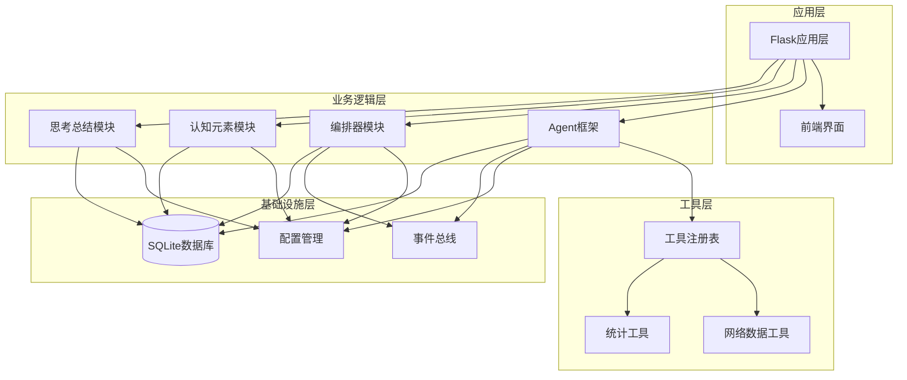
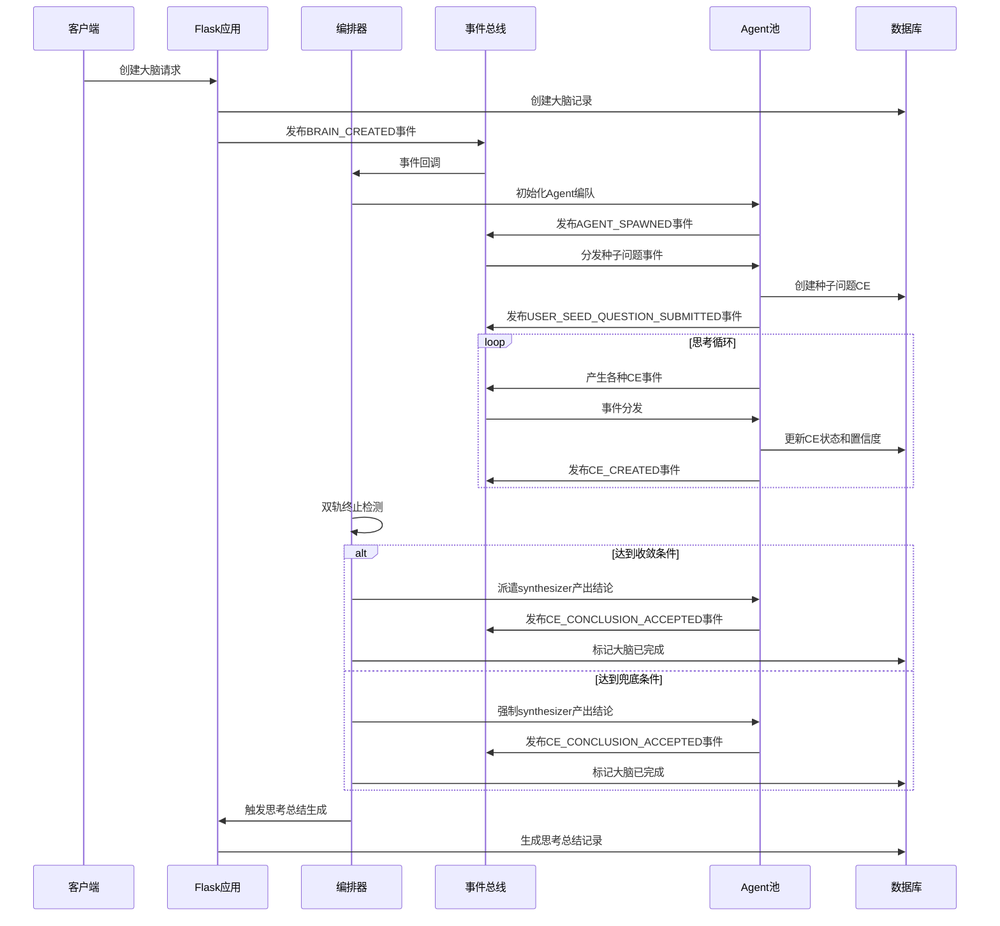
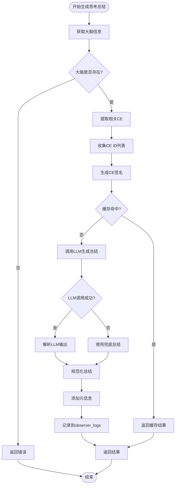
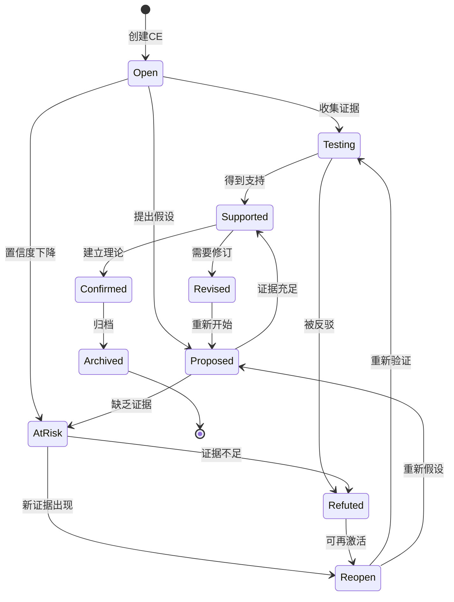
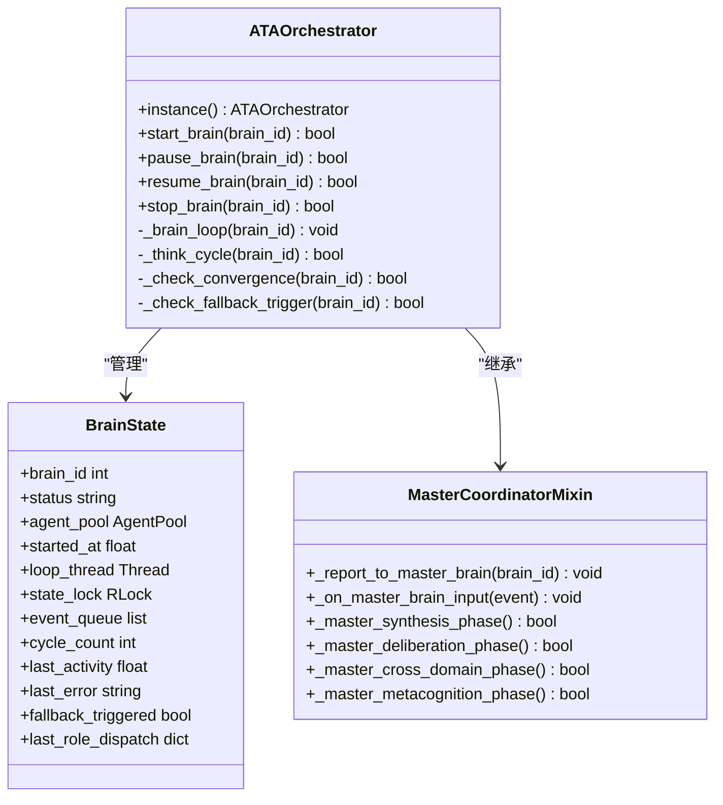
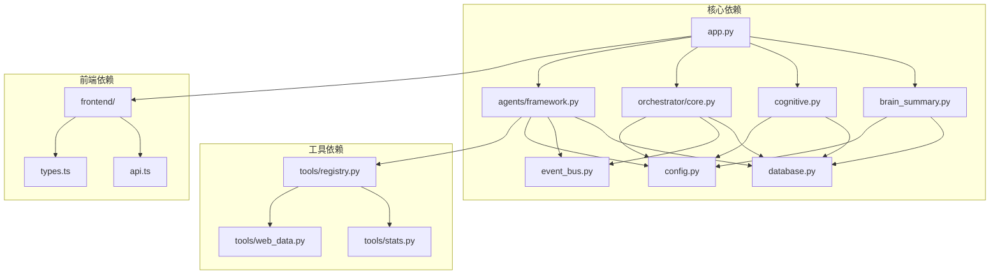

# 大脑摘要系统

<cite>
**本文档引用的文件**
- [README.md](file://README.md)
- [brain_summary.py](file://brain_summary.py)
- [app.py](file://app.py)
- [cognitive.py](file://cognitive.py)
- [config.py](file://config.py)
- [orchestrator/core.py](file://orchestrator/core.py)
- [orchestrator/master_coordinator.py](file://orchestrator/master_coordinator.py)
- [agents/framework.py](file://agents/framework.py)
- [database.py](file://database.py)
- [event_bus.py](file://event_bus.py)
</cite>

## 目录
1. [简介](#简介)
2. [项目结构](#项目结构)
3. [核心组件](#核心组件)
4. [架构概览](#架构概览)
5. [详细组件分析](#详细组件分析)
6. [依赖关系分析](#依赖关系分析)
7. [性能考虑](#性能考虑)
8. [故障排除指南](#故障排除指南)
9. [结论](#结论)

## 简介

大脑摘要系统是一个开源的「硅基大脑」孵化器——不是又一个 AI 工具，而是一次关于「机器能否独立思考」的长期实验。该系统旨在构造一个**自主思考的硅基大脑**，它不需要被人类一句一句地 prompt，不是 Chatbot，也不是研究助手；而是从一颗「种子问题」出发，**自我提问、自我求证、自我修订、自我收敛**，把整个思考过程毫无保留地展现给观察者。

系统的核心特性包括：
- **创世主脑（Master Brain）**——所有思考的汇流之处，具备内博弈、跨域综合、元认知反思三种自主思辨能力
- **ATA 事件驱动编排器**——事件驱动的大脑思考调度器，采用frontier探索和跨worker同步机制
- **6个平等角色**——investigator、reasoner、synthesizer、critic、explorer、observer，彼此完全平等
- **认知元素（CE）体系**——统一抽象为13种类型的思维产物，支持状态生命周期管理和置信度贝叶斯更新
- **三轨博弈引擎**——支持推翻式、建设性综合、建设性确认三种模式
- **自调节闭环**——像生物体一样感知认知偏差并主动纠正
- **思考总结与PDF论文生成**——自动总结大脑思考过程并生成学术论文

## 项目结构

该项目采用模块化设计，主要分为以下几个核心模块：

**图表来源**
- [app.py:1-800](file://app.py#L1-L800)
- [brain_summary.py:1-407](file://brain_summary.py#L1-L407)
- [cognitive.py:1-584](file://cognitive.py#L1-L584)
- [orchestrator/core.py:1-935](file://orchestrator/core.py#L1-L935)

**章节来源**
- [README.md:210-251](file://README.md#L210-L251)

## 核心组件

### 1. 思考总结模块（brain_summary.py）

思考总结模块负责围绕大脑的种子问题，从认知元素中聚合结论、共识和高置信洞察，让 LLM 凝练出结构化总结。该模块具有以下特点：

- **数据采集**：从数据库中提取结论、共识和高置信洞察，按置信度排序
- **LLM集成**：使用配置的RESEARCH_MODEL进行总结生成
- **缓存机制**：基于CE列表生成轻量指纹，避免重复计算
- **兜底策略**：当LLM失败时，使用基于现有数据的兜底总结

### 2. 认知元素模块（cognitive.py）

认知元素模块封装了硅基大脑蓝图中定义的认知元素与认知关系的读写、置信度更新、知识图谱聚合、认知边界计算等业务能力：

- **13种CE类型**：observation、question、hypothesis、evidence、counter_evidence、inference、argument、conclusion、perspective、insight、consensus、dissent、tool_gap
- **置信度管理**：支持置信度裁剪、历史记录和贝叶斯更新
- **知识图谱**：提供适配前端力导向图的数据结构
- **认知边界**：定义并计算当前的大脑认知边界候选元素

### 3. 编排器模块（orchestrator）

编排器模块是事件驱动的大脑思考调度器，承担单例、初始化、事件订阅、大脑生命周期管理等职责：

- **事件订阅**：订阅BRAIN_CREATED、USER_SEED_QUESTION_SUBMITTED等关键事件
- **大脑生命周期**：支持启动、暂停、恢复、停止等状态管理
- **双轨终止**：主轨（synthesizer产出高置信度结论）和兜底轨（CE数量或运行时长阈值）
- **共识收敛检测**：检查大脑是否达到共识收敛条件

### 4. Agent框架（agents/framework.py）

Agent框架实现了去层级化的6种功能性角色，每个角色代表不同的思维偏好与专长：

- **6种角色**：explorer（探索者）、investigator（调查者）、reasoner（推理者）、critic（批评者）、synthesizer（综合者）、observer（观察员）
- **动态化**：Agent可被动态spawn/despawn/transform_role
- **数据驱动**：Agent的行为由事件触发，产出统一为认知元素入图

**章节来源**
- [brain_summary.py:1-407](file://brain_summary.py#L1-L407)
- [cognitive.py:1-584](file://cognitive.py#L1-L584)
- [orchestrator/core.py:1-935](file://orchestrator/core.py#L1-L935)
- [agents/framework.py:1-1372](file://agents/framework.py#L1-L1372)

## 架构概览

系统采用事件驱动架构，通过事件总线连接各个组件：

**图表来源**
- [app.py:242-353](file://app.py#L242-L353)
- [orchestrator/core.py:394-800](file://orchestrator/core.py#L394-L800)
- [event_bus.py:234-293](file://event_bus.py#L234-L293)

## 详细组件分析

### 思考总结生成流程

思考总结模块的工作流程如下：

**图表来源**
- [brain_summary.py:333-398](file://brain_summary.py#L333-L398)

### 认知元素生命周期管理

认知元素模块提供了完整的生命周期管理：

**图表来源**
- [cognitive.py:533-584](file://cognitive.py#L533-L584)

### 编排器事件处理机制

编排器模块的事件处理机制：

**图表来源**
- [orchestrator/core.py:53-114](file://orchestrator/core.py#L53-L114)
- [orchestrator/master_coordinator.py:27-46](file://orchestrator/master_coordinator.py#L27-L46)

**章节来源**
- [brain_summary.py:1-407](file://brain_summary.py#L1-L407)
- [cognitive.py:1-584](file://cognitive.py#L1-L584)
- [orchestrator/core.py:1-935](file://orchestrator/core.py#L1-L935)
- [orchestrator/master_coordinator.py:1-355](file://orchestrator/master_coordinator.py#L1-L355)

## 依赖关系分析

系统各组件之间的依赖关系如下：

**图表来源**
- [app.py:1-800](file://app.py#L1-L800)
- [brain_summary.py:24-26](file://brain_summary.py#L24-L26)
- [cognitive.py:14-14](file://cognitive.py#L14-L14)
- [orchestrator/core.py:21-29](file://orchestrator/core.py#L21-L29)

**章节来源**
- [app.py:1-800](file://app.py#L1-L800)
- [database.py:1-1408](file://database.py#L1-L1408)

## 性能考虑

系统在设计时充分考虑了性能优化：

### 1. 缓存策略
- **思考总结缓存**：基于CE列表生成轻量指纹，避免重复LLM调用
- **角色配置缓存**：RoleRegistry使用内存缓存减少数据库查询
- **数据库连接池**：使用上下文管理器确保连接正确关闭

### 2. 事件驱动优化
- **按需思考**：通过事件触发而非定时轮询，减少CPU占用
- **指数退避**：空闲时采用指数退避策略，最长60秒
- **跨进程同步**：多worker场景下通过文件锁保证单写者

### 3. 数据库优化
- **WAL模式**：SQLite使用WAL模式提高并发性能
- **索引优化**：为常用查询字段创建索引
- **批量操作**：支持批量插入和查询

### 4. 内存管理
- **线程安全**：使用RLock保护共享状态
- **资源清理**：确保线程和数据库连接正确释放

## 故障排除指南

### 常见问题及解决方案

#### 1. 数据库连接问题
**症状**：应用启动时报数据库连接错误
**解决方案**：
- 检查DB_PATH环境变量设置
- 确认数据库文件权限
- 验证SQLite版本兼容性

#### 2. LLM调用失败
**症状**：思考总结生成失败，返回兜底结果
**解决方案**：
- 检查DASHSCOPE_API_KEY配置
- 验证网络连接和API访问权限
- 确认RESEARCH_MODEL配置正确

#### 3. 事件处理异常
**症状**：某些事件无法被正确处理
**解决方案**：
- 检查EventTypes常量定义
- 验证事件处理器注册
- 查看事件总线日志

#### 4. Agent生命周期问题
**症状**：Agent无法正确spawn或despawn
**解决方案**：
- 检查角色配置
- 验证AgentPool状态
- 确认数据库事务完整性

**章节来源**
- [database.py:339-371](file://database.py#L339-L371)
- [config.py:1-11](file://config.py#L1-L11)
- [event_bus.py:181-195](file://event_bus.py#L181-L195)

## 结论

大脑摘要系统是一个复杂而精巧的事件驱动架构，通过模块化设计实现了高度的可扩展性和可维护性。系统的核心优势包括：

1. **事件驱动架构**：通过事件总线实现松耦合的组件通信
2. **自调节机制**：像生物体一样感知认知偏差并主动纠正
3. **多Agent协作**：6个平等角色的动态化协作模式
4. **完整的生命周期管理**：从创建到完成的全流程自动化
5. **强大的总结能力**：自动生成结构化思考总结和学术论文

该系统为研究机器自主思考提供了宝贵的实验平台，虽然目前仍处于早期阶段，但其设计理念和技术架构为未来的进一步发展奠定了坚实基础。随着系统的不断完善，我们期待看到更多关于机器智能涌现的精彩案例。