# 认知架构层

<cite>
**本文档引用的文件**
- [cognitive.py](file://cognitive.py)
- [agents/framework.py](file://agents/framework.py)
- [engines/base.py](file://engines/base.py)
- [engines/three_round.py](file://engines/three_round.py)
- [deliberation.py](file://deliberation.py)
- [event_bus.py](file://event_bus.py)
- [database.py](file://database.py)
- [app.py](file://app.py)
- [config.py](file://config.py)
- [agents/director.py](file://agents/director.py)
- [agents/researcher.py](file://agents/researcher.py)
- [agents/scientist.py](file://agents/scientist.py)
- [brain_summary.py](file://brain_summary.py)
- [master_brain_tactics.py](file://master_brain_tactics.py)
- [orchestrator/core.py](file://orchestrator/core.py)
- [orchestrator/master_coordinator.py](file://orchestrator/master_coordinator.py)
- [orchestrator/constants.py](file://orchestrator/constants.py)
- [orchestrator/deliberation_trigger.py](file://orchestrator/deliberation_trigger.py)
- [orchestrator/strategy.py](file://orchestrator/strategy.py)
- [orchestrator/tool_proposal.py](file://orchestrator/tool_proposal.py)
</cite>

## 更新摘要
**所做更改**
- 新增大脑摘要系统章节，介绍思考总结生成功能
- 新增主脑战术系统章节，介绍跨分支矛盾检测、跨域综合和元认知反思
- 新增模块化编排器架构章节，介绍混合器模式的四个核心组件
- 更新架构总览，反映新的三层架构设计
- 更新依赖关系分析，体现新增组件的集成关系
- 新增性能考虑和故障排除指南的相关内容

## 目录
1. [简介](#简介)
2. [项目结构](#项目结构)
3. [核心组件](#核心组件)
4. [架构总览](#架构总览)
5. [详细组件分析](#详细组件分析)
6. [依赖关系分析](#依赖关系分析)
7. [性能考虑](#性能考虑)
8. [故障排除指南](#故障排除指南)
9. [结论](#结论)

## 简介
本文件聚焦于 AInstein 项目的"认知架构层"，系统性阐述如何将研究产出转化为可追溯、可演化的"认知元素"（Cognitive Elements，CE），并通过 10 种关系类型构建知识图谱，实现从"工具驱动研究"到"思维网络演进"的跃迁。该层以 SQLite 为持久化载体，围绕 CE 的创建、更新、关系建立、知识图谱聚合与认知边界计算，提供完整的业务逻辑与 API 接口，支撑后续 Phase 2 的"去层级化 Agent 框架"与 Phase 3 的"博弈引擎"。

**更新** 新增大脑摘要系统、主脑战术系统和模块化编排器架构三大核心组件，形成"认知元素层-编排器层-主脑管理层"的三层架构设计。

## 项目结构
认知架构层位于后端服务的核心位置，主要文件包括：
- 认知元素业务逻辑：cognitive.py
- Agent 框架与角色系统：agents/framework.py
- 研究引擎基类与三轮引擎：engines/base.py、engines/three_round.py
- 博弈引擎：deliberation.py
- 事件总线：event_bus.py
- 数据库层：database.py
- Web API 入口：app.py
- 配置：config.py
- 传统 Agent（保留用于兼容）：agents/director.py、agents/researcher.py、agents/scientist.py
- **新增** 大脑摘要系统：brain_summary.py
- **新增** 主脑战术系统：master_brain_tactics.py
- **新增** 模块化编排器架构：orchestrator/core.py、orchestrator/master_coordinator.py、orchestrator/constants.py、orchestrator/deliberation_trigger.py、orchestrator/strategy.py、orchestrator/tool_proposal.py

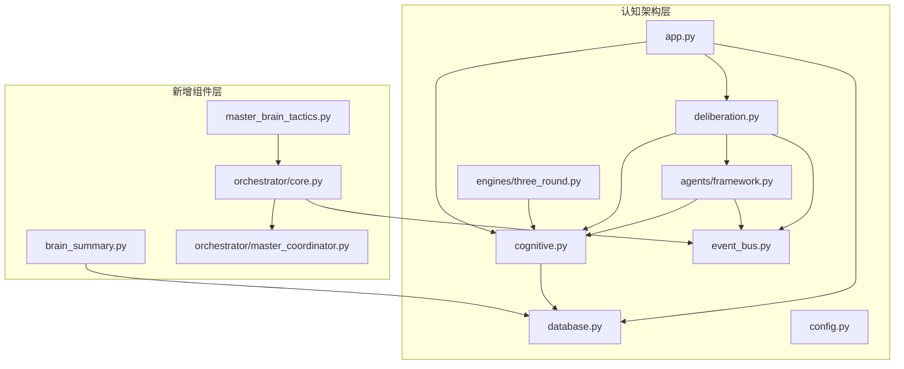

**图表来源**
- [cognitive.py](file://cognitive.py)
- [agents/framework.py](file://agents/framework.py)
- [engines/three_round.py](file://engines/three_round.py)
- [deliberation.py](file://deliberation.py)
- [event_bus.py](file://event_bus.py)
- [database.py](file://database.py)
- [app.py](file://app.py)
- [config.py](file://config.py)
- [brain_summary.py](file://brain_summary.py)
- [master_brain_tactics.py](file://master_brain_tactics.py)
- [orchestrator/core.py](file://orchestrator/core.py)
- [orchestrator/master_coordinator.py](file://orchestrator/master_coordinator.py)

**章节来源**
- [app.py:192-360](file://app.py#L192-L360)
- [cognitive.py:108-157](file://cognitive.py#L108-L157)
- [database.py:534-599](file://database.py#L534-L599)
- [brain_summary.py:1-407](file://brain_summary.py#L1-L407)
- [master_brain_tactics.py:1-674](file://master_brain_tactics.py#L1-L674)
- [orchestrator/core.py:1-935](file://orchestrator/core.py#L1-L935)

## 核心组件
- 认知元素（CE）与关系（Relation）：定义 12 种 CE 类型与 10 种关系类型，提供 CRUD、置信度更新、知识图谱聚合、认知边界计算等能力。
- Agent 框架：定义 6 种功能性角色，提供思考上下文、思考结果、事件响应、博弈参与等统一接口。
- 研究引擎：提供三轮引擎（假设生成→工具验证→总结结论），并在引擎内部实现"双写"到认知元素体系。
- 博弈引擎：实现多轮发言、投票、共识判定，产出共识/分歧/观点 CE 并建立关系。
- 事件总线：提供进程内事件发布/订阅、持久化、幂等消费与兜底重放能力。
- 数据库层：提供 CE/Relation/Agent/Deliberation/Events 等表的 CRUD 与索引，支撑认知架构的数据持久化。
- **新增** 大脑摘要系统：围绕种子问题从认知元素中聚合结论、共识、高置信洞察，生成结构化思考总结。
- **新增** 主脑战术系统：实现主脑内博弈、跨分支矛盾检测、跨域综合和元认知反思的多维节流机制。
- **新增** 模块化编排器架构：采用混合器模式，将策略、工具提案、主脑协调和博弈触发功能模块化。

**章节来源**
- [cognitive.py:24-51](file://cognitive.py#L24-L51)
- [agents/framework.py:57-106](file://agents/framework.py#L57-L106)
- [engines/three_round.py:75-81](file://engines/three_round.py#L75-L81)
- [deliberation.py:121-140](file://deliberation.py#L121-L140)
- [event_bus.py:162-196](file://event_bus.py#L162-L196)
- [database.py:105-285](file://database.py#L105-L285)
- [brain_summary.py:1-407](file://brain_summary.py#L1-L407)
- [master_brain_tactics.py:1-674](file://master_brain_tactics.py#L1-L674)
- [orchestrator/core.py:1-935](file://orchestrator/core.py#L1-L935)

## 架构总览
认知架构层采用"业务逻辑层 + 事件驱动 + 双写机制 + 主脑管理层"的三层设计：
- 业务逻辑层：cognitive.py 封装 CE/Relation 的读写、置信度更新、知识图谱聚合、认知边界计算。
- 事件驱动：event_bus.py 提供事件发布/订阅、持久化与幂等消费，Agent 与引擎通过事件触发协作。
- 双写机制：engines/three_round.py 在研究会话中同步将产出写入认知元素体系，实现新旧表平滑迁移。
- **新增** 主脑管理层：master_brain_tactics.py 实现主脑的多维节流、矛盾检测、跨域综合和元认知反思。
- **新增** 编排器层：orchestrator/core.py 采用混合器模式，将策略、工具提案、主脑协调和博弈触发功能模块化。

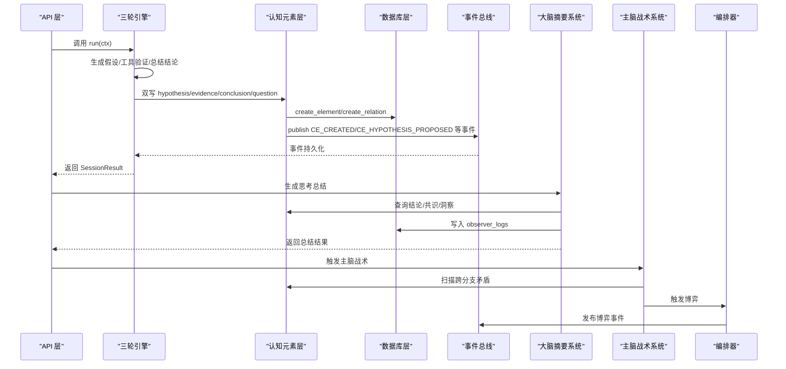

**图表来源**
- [engines/three_round.py:146-387](file://engines/three_round.py#L146-L387)
- [cognitive.py:108-157](file://cognitive.py#L108-L157)
- [event_bus.py:234-294](file://event_bus.py#L234-L294)
- [database.py:604-690](file://database.py#L604-L690)
- [brain_summary.py:333-407](file://brain_summary.py#L333-L407)
- [master_brain_tactics.py:183-311](file://master_brain_tactics.py#L183-L311)
- [orchestrator/core.py:394-501](file://orchestrator/core.py#L394-L501)

## 详细组件分析

### 认知元素与关系（Cognitive Layer）
- CE 类型与关系类型：严格遵循蓝图定义，涵盖 L0-L5 共 12 种 CE 类型与 10 种关系类型。
- CRUD 能力：create_element/get_element/list_elements/update_element，支持按类型与置信度过滤。
- 置信度更新：update_confidence 支持变更历史记录与版本号递增。
- 知识图谱聚合：get_knowledge_graph 返回 nodes/edges 结构，适配前端力导向图。
- 认知边界：get_frontier 基于"最近创建/低置信度/未被支撑"三类条件计算边界节点。

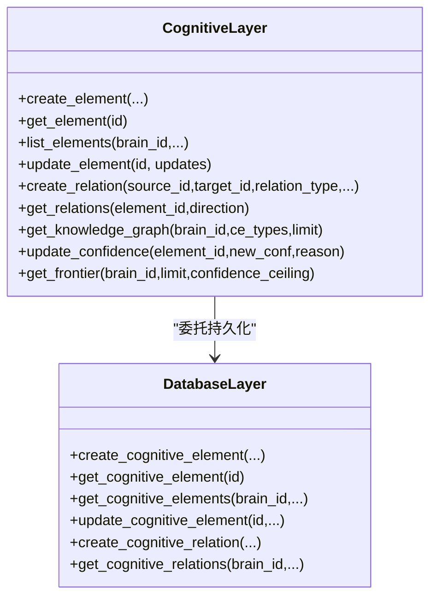

**图表来源**
- [cognitive.py:108-516](file://cognitive.py#L108-L516)
- [database.py:604-690](file://database.py#L604-L690)

**章节来源**
- [cognitive.py:24-51](file://cognitive.py#L24-L51)
- [cognitive.py:108-157](file://cognitive.py#L108-L157)
- [cognitive.py:192-238](file://cognitive.py#L192-L238)
- [cognitive.py:244-284](file://cognitive.py#L244-L284)
- [cognitive.py:286-321](file://cognitive.py#L286-L321)
- [cognitive.py:327-398](file://cognitive.py#L327-L398)
- [cognitive.py:404-443](file://cognitive.py#L404-L443)
- [cognitive.py:449-516](file://cognitive.py#L449-L516)

### Agent 框架与角色系统
- 角色定义：6 种功能性角色（探索者、调查者、推理者、批评者、综合者、观察员），包含偏好类型、默认配额等配置。
- 思考上下文：ThinkingContext/ThinkingResult 定义思考输入输出，支持相关 CE、最近观察、认知边界等锚点。
- 事件响应：BaseAgent.react_to_event 根据角色偏好决定是否触发思考。
- 博弈参与：BaseAgent.participate_in_deliberation 生成博弈发言，支持立场、引用 CE、提议动作。

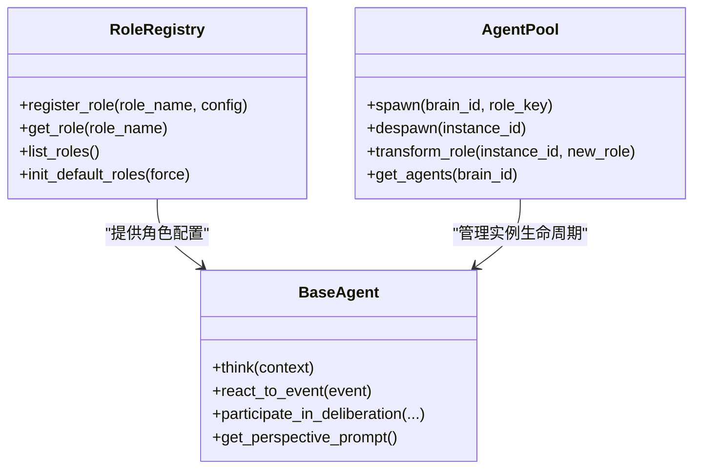

**图表来源**
- [agents/framework.py:182-301](file://agents/framework.py#L182-L301)
- [agents/framework.py:388-800](file://agents/framework.py#L388-L800)

**章节来源**
- [agents/framework.py:57-106](file://agents/framework.py#L57-L106)
- [agents/framework.py:113-177](file://agents/framework.py#L113-L177)
- [agents/framework.py:182-301](file://agents/framework.py#L182-L301)
- [agents/framework.py:388-800](file://agents/framework.py#L388-L800)

### 研究引擎与双写机制
- 引擎基类：ResearchEngine/ResearchContext/SessionResult 定义统一接口与上下文。
- 三轮引擎：Round 1 生成假设，Round 2 使用工具验证，Round 3 总结结论并建立关系。
- 双写策略：在引擎内部调用 cognitive.create_element/create_relation，失败仅记录日志，确保旧流程不受影响。

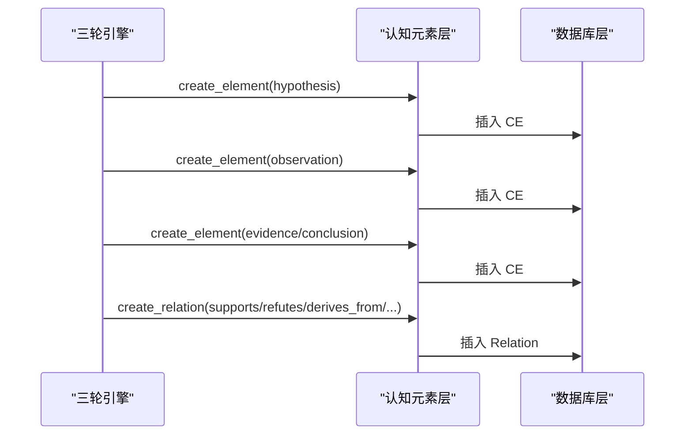

**图表来源**
- [engines/base.py:42-53](file://engines/base.py#L42-L53)
- [engines/three_round.py:75-81](file://engines/three_round.py#L75-L81)
- [engines/three_round.py:146-387](file://engines/three_round.py#L146-L387)
- [cognitive.py:108-157](file://cognitive.py#L108-L157)
- [cognitive.py:244-284](file://cognitive.py#L244-L284)

**章节来源**
- [engines/base.py:11-53](file://engines/base.py#L11-L53)
- [engines/three_round.py:75-81](file://engines/three_round.py#L75-L81)
- [engines/three_round.py:86-141](file://engines/three_round.py#L86-L141)
- [engines/three_round.py:146-387](file://engines/three_round.py#L146-L387)

### 博弈引擎（Deliberation）
- 流程：initiate → run_turn → collect_votes → judge_consensus → conclude。
- 参与者选择：必含 critic，覆盖 ≥3 个不同角色，按相关性与多样性挑选。
- 结果产出：根据 outcome 生成 consensus/perspective/dissent CE，并建立关系。

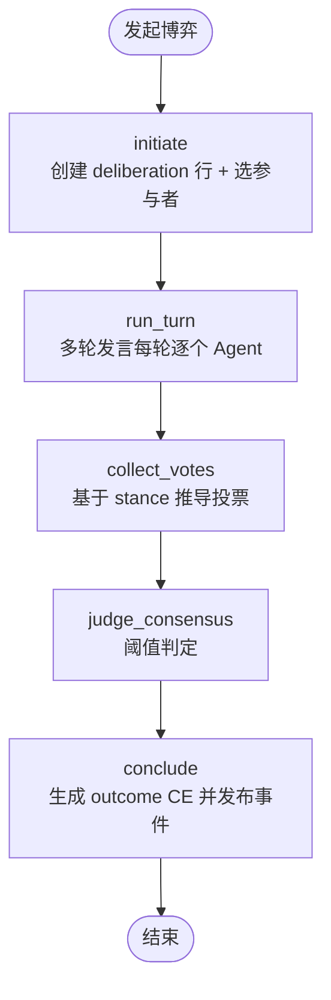

**图表来源**
- [deliberation.py:121-140](file://deliberation.py#L121-L140)
- [deliberation.py:144-206](file://deliberation.py#L144-L206)
- [deliberation.py:209-290](file://deliberation.py#L209-L290)
- [deliberation.py:294-344](file://deliberation.py#L294-L344)
- [deliberation.py:348-465](file://deliberation.py#L348-L465)

**章节来源**
- [deliberation.py:121-140](file://deliberation.py#L121-L140)
- [deliberation.py:144-206](file://deliberation.py#L144-L206)
- [deliberation.py:209-290](file://deliberation.py#L209-L290)
- [deliberation.py:294-344](file://deliberation.py#L294-L344)
- [deliberation.py:348-465](file://deliberation.py#L348-L465)

### 事件总线（EventBus）
- 单例模式：全局唯一 EventBus 实例，提供订阅/发布/消费/重放能力。
- 幂等消费：通过 event_consumption 表保证同一事件不会被同一消费者重复处理。
- 双写：事件先写 events 表，再分发给订阅器，支持兜底重放。

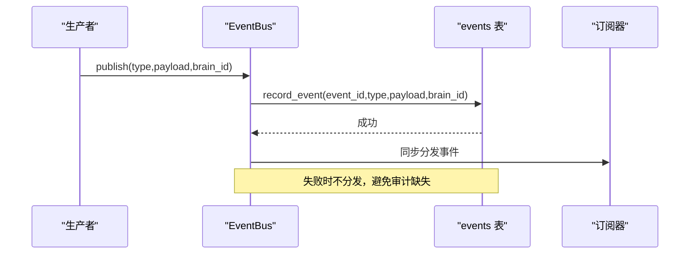

**图表来源**
- [event_bus.py:162-196](file://event_bus.py#L162-L196)
- [event_bus.py:234-294](file://event_bus.py#L234-L294)
- [event_bus.py:316-361](file://event_bus.py#L316-L361)
- [event_bus.py:381-434](file://event_bus.py#L381-L434)

**章节来源**
- [event_bus.py:162-196](file://event_bus.py#L162-L196)
- [event_bus.py:234-294](file://event_bus.py#L234-L294)
- [event_bus.py:316-361](file://event_bus.py#L316-L361)
- [event_bus.py:381-434](file://event_bus.py#L381-L434)

### 数据库层（Schema 与 CRUD）
- 硅基大脑 Schema：users/brains/cognitive_elements/cognitive_relations/agent_instances/deliberations/deliberation_turns/deliberation_votes/events/event_consumption/observer_logs/brain_snapshots。
- CRUD 辅助：提供 create/get/update/delete 等方法，支持索引优化与事务控制。

**章节来源**
- [database.py:105-285](file://database.py#L105-L285)
- [database.py:534-599](file://database.py#L534-L599)
- [database.py:604-690](file://database.py#L604-L690)
- [database.py:748-791](file://database.py#L748-L791)

### Web API 入口（RESTful）
- 认知元素 API：列出/创建/获取/更新/关系查询/知识图谱/认知边界。
- 博弈 API：发起/查询/手动推进/轮次控制。
- 传统 Agent API：科学家/主任/研究员运行接口。

**章节来源**
- [app.py:192-360](file://app.py#L192-L360)
- [app.py:367-497](file://app.py#L367-L497)

### **新增** 大脑摘要系统（Thinking Summary System）
- **职责**：围绕大脑的种子问题，从认知元素中聚合结论、共识、高置信洞察，生成结构化思考总结。
- **数据结构**：包含核心答案、关键洞察、被否定的主张、开放问题、方法论注记等字段。
- **缓存机制**：基于 CE 列表指纹和大脑状态进行缓存，避免重复计算。
- **兜底策略**：当 LLM 调用失败时，使用基于最高置信度 CE 的简化总结方案。

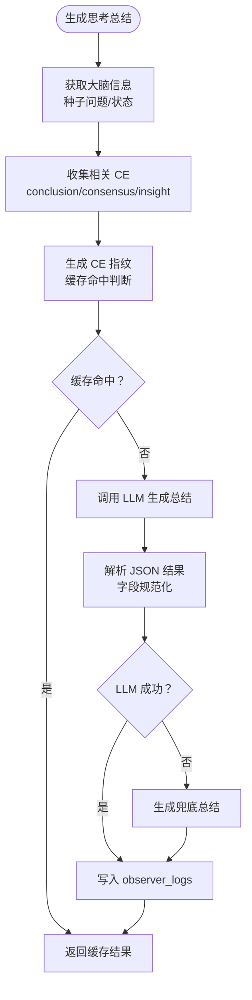

**图表来源**
- [brain_summary.py:333-407](file://brain_summary.py#L333-L407)
- [brain_summary.py:150-169](file://brain_summary.py#L150-L169)
- [brain_summary.py:236-277](file://brain_summary.py#L236-L277)

**章节来源**
- [brain_summary.py:1-407](file://brain_summary.py#L1-L407)

### **新增** 主脑战术系统（Master Brain Tactics）
- **多维节流**：实现综合思考、博弈、跨域综合、元认知反思的独立冷却机制。
- **跨分支矛盾检测**：扫描主脑 CE 间的矛盾关系，自动触发博弈解决跨分支冲突。
- **跨域综合**：识别不同领域的分支结论，促进跨学科知识融合。
- **元认知反思**：基于里程碑、冲突激增、收敛停滞等条件触发主脑的自我反思。

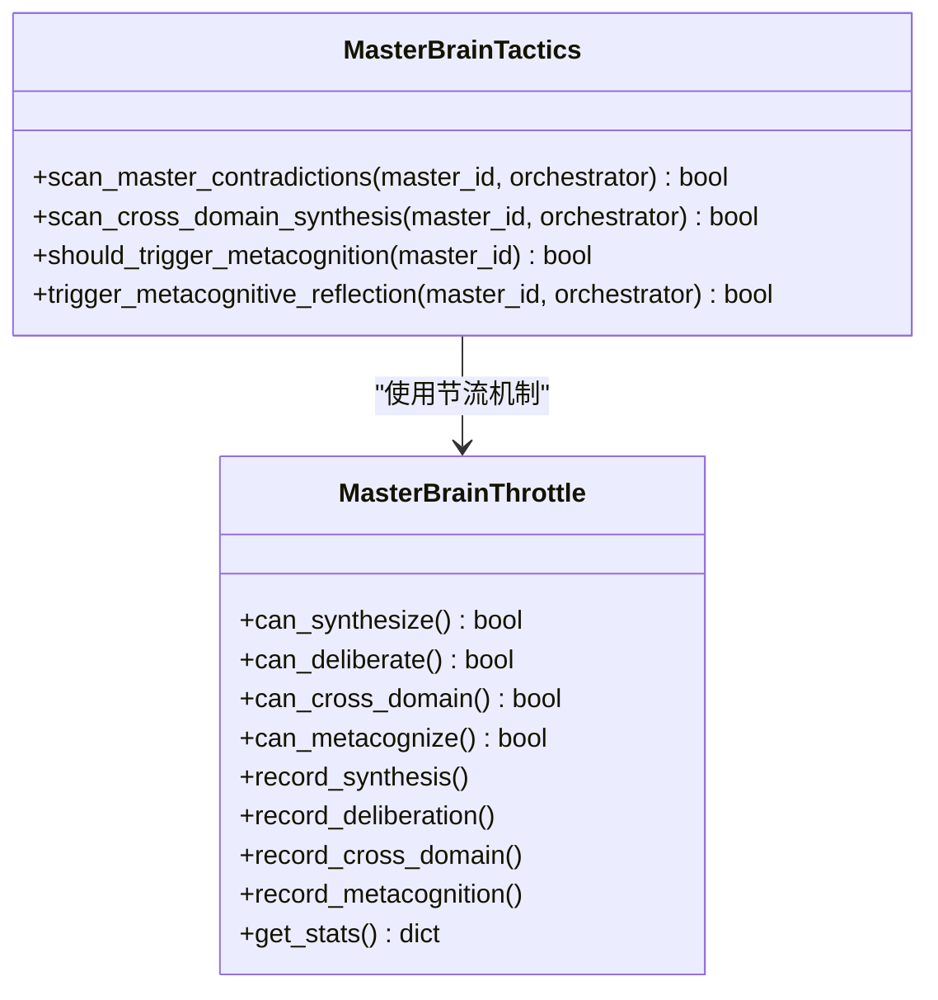

**图表来源**
- [master_brain_tactics.py:30-104](file://master_brain_tactics.py#L30-L104)
- [master_brain_tactics.py:183-311](file://master_brain_tactics.py#L183-L311)
- [master_brain_tactics.py:317-426](file://master_brain_tactics.py#L317-L426)
- [master_brain_tactics.py:460-534](file://master_brain_tactics.py#L460-L534)

**章节来源**
- [master_brain_tactics.py:1-674](file://master_brain_tactics.py#L1-L674)

### **新增** 模块化编排器架构（Modular Orchestrator Architecture）
- **ATAOrchestrator 主类**：单例模式，承担大脑生命周期管理和事件订阅。
- **混合器模式**：StrategyMixin、ToolProposalMixin、MasterCoordinatorMixin、DeliberationTriggerMixin 四个核心 mixin。
- **事件驱动**：统一的事件处理机制，支持大脑生命周期、CE 事件、博弈事件等。
- **智能调度**：基于收敛压力、异质性刺激、问题解决优先级的动态调度策略。

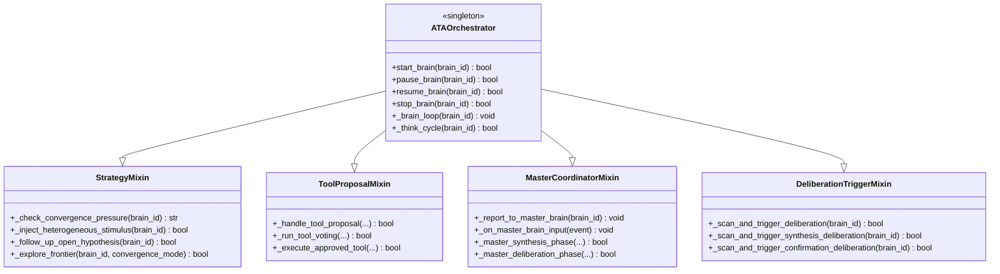

**图表来源**
- [orchestrator/core.py:53-115](file://orchestrator/core.py#L53-L115)
- [orchestrator/strategy.py:58-208](file://orchestrator/strategy.py#L58-L208)
- [orchestrator/tool_proposal.py:26-91](file://orchestrator/tool_proposal.py#L26-L91)
- [orchestrator/master_coordinator.py:27-86](file://orchestrator/master_coordinator.py#L27-L86)
- [orchestrator/deliberation_trigger.py:34-114](file://orchestrator/deliberation_trigger.py#L34-L114)

**章节来源**
- [orchestrator/core.py:1-935](file://orchestrator/core.py#L1-L935)
- [orchestrator/strategy.py:1-800](file://orchestrator/strategy.py#L1-L800)
- [orchestrator/tool_proposal.py:1-453](file://orchestrator/tool_proposal.py#L1-L453)
- [orchestrator/master_coordinator.py:1-355](file://orchestrator/master_coordinator.py#L1-L355)
- [orchestrator/deliberation_trigger.py:1-427](file://orchestrator/deliberation_trigger.py#L1-L427)
- [orchestrator/constants.py:1-344](file://orchestrator/constants.py#L1-L344)

## 依赖关系分析
- 认知元素层依赖数据库层进行持久化。
- Agent 框架依赖认知元素层创建 CE、依赖事件总线发布事件。
- 研究引擎依赖认知元素层进行双写。
- 博弈引擎依赖 Agent 框架与认知元素层，依赖事件总线进行参与者协调。
- Web API 入口依赖各层提供业务能力。
- **新增** 大脑摘要系统依赖数据库层查询 CE 信息，依赖 LLM 客户端进行总结生成。
- **新增** 主脑战术系统依赖编排器实例进行博弈触发，依赖数据库层进行 CE 查询。
- **新增** 模块化编排器架构采用混合器模式，各 mixin 通过继承关系共享核心功能。

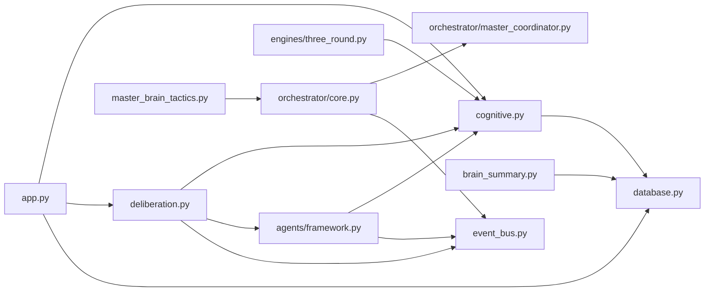

**图表来源**
- [app.py:192-360](file://app.py#L192-L360)
- [cognitive.py:108-157](file://cognitive.py#L108-L157)
- [agents/framework.py:388-800](file://agents/framework.py#L388-L800)
- [engines/three_round.py:146-387](file://engines/three_round.py#L146-L387)
- [deliberation.py:121-140](file://deliberation.py#L121-L140)
- [event_bus.py:162-196](file://event_bus.py#L162-L196)
- [database.py:604-690](file://database.py#L604-L690)
- [brain_summary.py:1-407](file://brain_summary.py#L1-L407)
- [master_brain_tactics.py:1-674](file://master_brain_tactics.py#L1-L674)
- [orchestrator/core.py:1-935](file://orchestrator/core.py#L1-L935)
- [orchestrator/master_coordinator.py:1-355](file://orchestrator/master_coordinator.py#L1-L355)

**章节来源**
- [app.py:192-360](file://app.py#L192-L360)
- [cognitive.py:108-157](file://cognitive.py#L108-L157)
- [agents/framework.py:388-800](file://agents/framework.py#L388-L800)
- [engines/three_round.py:146-387](file://engines/three_round.py#L146-L387)
- [deliberation.py:121-140](file://deliberation.py#L121-L140)
- [event_bus.py:162-196](file://event_bus.py#L162-L196)
- [database.py:604-690](file://database.py#L604-L690)
- [brain_summary.py:1-407](file://brain_summary.py#L1-L407)
- [master_brain_tactics.py:1-674](file://master_brain_tactics.py#L1-L674)
- [orchestrator/core.py:1-935](file://orchestrator/core.py#L1-L935)
- [orchestrator/master_coordinator.py:1-355](file://orchestrator/master_coordinator.py#L1-L355)

## 性能考虑
- 分页与过滤：list_elements 支持 limit/offset 与最小置信度过滤，Python 层二次裁剪以避免分页丢失。
- 索引优化：CE/Relation/Agent/Deliberation/Events 表均设置合适索引，提升查询效率。
- 双写容错：三轮引擎的双写在 try/except 内进行，失败仅记录日志，避免阻塞主流程。
- 事件持久化：事件先写入 events 表再分发，保证审计与可重放，但会增加一次数据库写入开销。
- **新增** 大脑摘要系统缓存：基于 CE 指纹和大脑状态的缓存机制，避免重复的 LLM 调用。
- **新增** 主脑节流机制：多维节流避免主脑过度消耗，通过独立冷却时间控制不同类型的思考频率。
- **新增** 模块化编排器：混合器模式减少代码重复，提高维护性和扩展性。

## 故障排除指南
- 认知元素类型非法：create_element/update_element 会校验 CE 类型合法性，非法类型抛出 ValueError。
- 关系类型非法：create_relation 校验关系类型与源/目标存在性，跨脑关系不支持。
- 置信度越界：update_confidence 与 create_element 内部使用裁剪函数，确保置信度在 [0,1]。
- 事件类型未注册：publish 前检查 EVENT_REGISTRY，未注册类型抛出 ValueError。
- 博弈参与者不足：initiate 时若参与者数量不足，标记为 aborted 并抛出异常。
- **新增** 大脑摘要生成失败：当 LLM 调用失败时，系统自动降级到兜底总结方案。
- **新增** 主脑战术触发异常：扫描过程中遇到数据库查询失败会记录异常并跳过当前检查。
- **新增** 编排器混合器异常：各 mixin 方法均带有异常保护，确保单个组件故障不影响整体功能。

**章节来源**
- [cognitive.py:130-132](file://cognitive.py#L130-L132)
- [cognitive.py:257-268](file://cognitive.py#L257-L268)
- [cognitive.py:419-420](file://cognitive.py#L419-L420)
- [event_bus.py:254-256](file://event_bus.py#L254-L256)
- [deliberation.py:181-188](file://deliberation.py#L181-L188)
- [brain_summary.py:160-168](file://brain_summary.py#L160-L168)
- [master_brain_tactics.py:211-212](file://master_brain_tactics.py#L211-L212)
- [orchestrator/core.py:452-457](file://orchestrator/core.py#L452-L457)

## 结论
认知架构层通过"认知元素 + 关系 + 事件驱动 + 双写机制 + 主脑管理层"的三层架构设计，实现了从工具驱动研究到思维网络演进的关键跨越。新增的大脑摘要系统提供了结构化的思考总结能力，主脑战术系统实现了多维度的智能决策机制，模块化编排器架构采用了现代化的混合器设计模式。这些组件不仅为 Phase 2 的去层级化 Agent 框架与 Phase 3 的博弈引擎提供了坚实的数据与交互基础，也为后续可视化与用户系统奠定了知识图谱与事件流的底层支撑。该层设计强调可追溯、可演进、可共识、可扩展，是 AInstein 从"研究平台"迈向"硅基大脑"的重要里程碑。