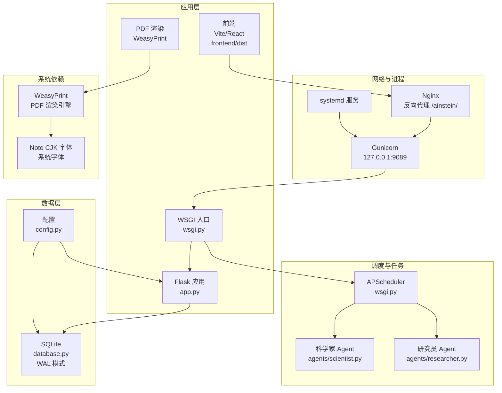
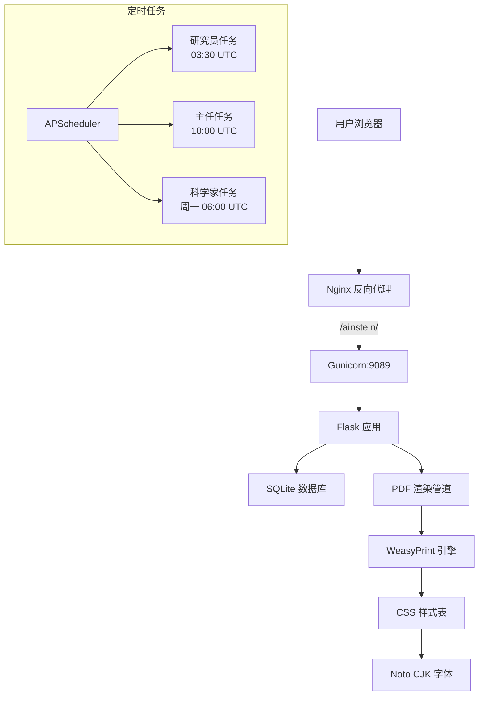
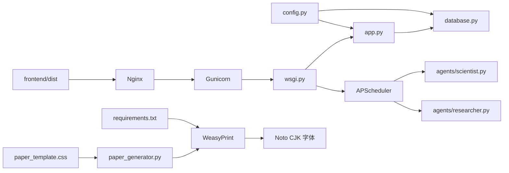

# 部署指南

<cite>
**本文引用的文件**
- [README.md](file://README.md)
- [docs/ops-manual.md](file://docs/ops-manual.md)
- [docs/design.md](file://docs/design.md)
- [app.py](file://app.py)
- [wsgi.py](file://wsgi.py)
- [config.py](file://config.py)
- [database.py](file://database.py)
- [frontend/vite.config.ts](file://frontend/vite.config.ts)
- [frontend/package.json](file://frontend/package.json)
- [requirements.txt](file://requirements.txt)
- [paper_generator.py](file://paper_generator.py)
- [paper_template.css](file://paper_template.css)
- [agents/researcher.py](file://agents/researcher.py)
- [agents/scientist.py](file://agents/scientist.py)
</cite>

## 目录
1. [简介](#简介)
2. [项目结构](#项目结构)
3. [核心组件](#核心组件)
4. [架构总览](#架构总览)
5. [详细组件分析](#详细组件分析)
6. [依赖关系分析](#依赖关系分析)
7. [性能考虑](#性能考虑)
8. [故障排查指南](#故障排查指南)
9. [结论](#结论)
10. [附录](#附录)

## 简介
本指南面向运维工程师与平台管理员，提供 AInstein 的完整部署与维护方案。内容覆盖生产环境部署（Nginx 反向代理、Gunicorn WSGI、systemd 服务）、前端构建与静态资源部署、Docker/Kubernetes 容器化思路、SSL 与网络安全、性能优化（连接池、缓存、并发）、部署检查清单与故障排查。

**更新** 本版本重点更新了 WeasyPrint 系统依赖要求和 PDF 生成功能的部署注意事项。

## 项目结构
AInstein 采用"Flask + Gunicorn + SQLite + APScheduler"的单机架构，前端基于 Vite + React 构建，静态资源由 Nginx 提供；后端通过 Gunicorn 暴露服务，定时任务由 APScheduler 在进程内运行并通过文件锁保证单实例。新增 WeasyPrint PDF 渲染引擎支持学术期刊级排版。

**图表来源**
- [app.py:1-182](file://app.py#L1-L182)
- [wsgi.py:1-83](file://wsgi.py#L1-L83)
- [database.py:1-344](file://database.py#L1-L344)
- [config.py:1-11](file://config.py#L1-L11)
- [frontend/vite.config.ts:1-12](file://frontend/vite.config.ts#L1-L12)
- [paper_generator.py:1-305](file://paper_generator.py#L1-L305)
- [requirements.txt:1-8](file://requirements.txt#L1-L8)

**章节来源**
- [README.md:71-124](file://README.md#L71-L124)
- [docs/ops-manual.md:12-47](file://docs/ops-manual.md#L12-L47)

## 核心组件
- Flask 应用与路由：提供健康检查、项目/队列/会话/发现/数据集等 API，并托管前端静态资源。
- WSGI 与调度器：通过 Gunicorn 启动，内置 APScheduler 并以文件锁确保单实例。
- 数据库：SQLite，WAL 模式，外键开启，带索引优化。
- 配置：集中于 config.py，读取环境变量。
- 前端：Vite 构建，输出至 frontend/dist，Nginx 直接提供静态资源。
- PDF 渲染：WeasyPrint 引擎，支持 Noto CJK 中文字体，提供学术期刊级排版。

**更新** 新增 WeasyPrint PDF 渲染组件，支持基于 CSS 2.1 + CSS 3 分页媒体子集的高质量 PDF 生成。

**章节来源**
- [app.py:15-182](file://app.py#L15-L182)
- [wsgi.py:13-83](file://wsgi.py#L13-L83)
- [database.py:101-123](file://database.py#L101-L123)
- [config.py:4-11](file://config.py#L4-L11)
- [frontend/vite.config.ts:4-11](file://frontend/vite.config.ts#L4-L11)
- [paper_generator.py:266-305](file://paper_generator.py#L266-L305)

## 架构总览
生产部署采用 Nginx 反向代理 + Gunicorn WSGI + systemd 管理的服务形态，前端静态资源由 Nginx 直接提供，后端 API 通过 /ainstein/ 前缀暴露。新增 PDF 渲染管道，通过 WeasyPrint 提供学术期刊级 PDF 生成服务。

**图表来源**
- [README.md:71-83](file://README.md#L71-L83)
- [docs/ops-manual.md:37-47](file://docs/ops-manual.md#L37-L47)
- [wsgi.py:27-71](file://wsgi.py#L27-L71)
- [paper_generator.py:266-305](file://paper_generator.py#L266-L305)

## 详细组件分析

### Nginx 反向代理配置
- 上游地址：127.0.0.1:9089（仅本机）
- 前缀：/ainstein/
- 静态资源：/ainstein/assets/ 缓存 30 天，immutable
- 健康检查：/ainstein/api/health
- 建议：启用 gzip/ssl，限制请求体大小，记录访问日志

**章节来源**
- [docs/ops-manual.md:44-47](file://docs/ops-manual.md#L44-L47)
- [docs/ops-manual.md:441-452](file://docs/ops-manual.md#L441-L452)

### Gunicorn WSGI 服务器设置
- 进程数：建议 2×CPU+1（按硬件能力调整）
- 绑定：127.0.0.1:9089
- 超时：300 秒
- 入口：wsgi:application
- 建议：使用 systemd 管理，配置 Restart/RestartSec，设置 LimitNOFILE

**章节来源**
- [README.md:61-67](file://README.md#L61-L67)
- [docs/ops-manual.md:409-421](file://docs/ops-manual.md#L409-L421)

### systemd 服务配置
- ExecStart：gunicorn 启动命令
- Restart/RestartSec：自动重启策略
- Environment：加载 /etc/ainstein.env
- WorkingDirectory：/opt/ainstein
- User/Group：非 root 用户（可选）
- 依赖：network.target

**章节来源**
- [docs/ops-manual.md:33](file://docs/ops-manual.md#L33)
- [docs/ops-manual.md:51-65](file://docs/ops-manual.md#L51-L65)

### 前端构建与静态资源部署
- 构建命令：npm run build
- 输出目录：frontend/dist
- 基础路径：/ainstein/
- 资源缓存：assets 加入哈希名，Nginx 设置 30 天缓存
- 热更新：修改后重新构建并刷新缓存

**章节来源**
- [frontend/vite.config.ts:4-11](file://frontend/vite.config.ts#L4-L11)
- [frontend/package.json:6-10](file://frontend/package.json#L6-L10)
- [docs/ops-manual.md:165-196](file://docs/ops-manual.md#L165-L196)

### 后端 API 与静态托管
- 前端入口：/ainstein/ 与 /ainstein/<path>
- 静态资源：/ainstein/static 与 /ainstein/assets/<path>
- 健康检查：/ainstein/api/health
- 数据库初始化：应用启动前确保数据库存在

**章节来源**
- [app.py:24-38](file://app.py#L24-L38)
- [app.py:43-45](file://app.py#L43-L45)
- [app.py:11-12](file://app.py#L11-L12)

### 调度器与定时任务
- 研究员：每日 03:30 UTC
- 主任：每日 10:00 UTC
- 科学家：每周一 06:00 UTC
- 锁机制：文件锁 /tmp/ainstein-scheduler.lock，避免多实例
- 日志：journalctl 观察 APScheduler 启动与任务执行

**章节来源**
- [wsgi.py:27-71](file://wsgi.py#L27-L71)
- [docs/ops-manual.md:210-222](file://docs/ops-manual.md#L210-L222)

### 数据库与数据集
- 存储：/opt/ainstein/data/ainstein.db（WAL 模式）
- 数据集：/opt/ainstein/data/datasets/{pid}/
- 备份：.db 文件复制与 .dump SQL 导出
- 清理：定期删除旧会话与拒绝发现，VACUUM 释放空间

**章节来源**
- [docs/ops-manual.md:102-163](file://docs/ops-manual.md#L102-L163)
- [database.py:101-123](file://database.py#L101-L123)

### WeasyPrint 系统依赖与 PDF 渲染
- WeasyPrint 版本：≥60.0（基于 Cairo/Pango 渲染引擎）
- 系统字体：Noto Sans/Serif CJK SC（系统安装）
- 字体配置：通过 fontconfig 解析到 /usr/share/fonts/opentype/noto/
- PDF 样式：paper_template.css（CSS 2.1 + CSS 3 分页媒体子集）
- 渲染流程：Markdown → HTML（markdown2）→ PDF（WeasyPrint + 样式表）
- 字体嵌入：所有中文字体嵌入到 PDF 内部，确保跨平台一致性

**新增** WeasyPrint PDF 渲染功能是本次部署更新的核心变化，需要特别关注系统依赖和字体配置。

**章节来源**
- [requirements.txt:7-7](file://requirements.txt#L7-L7)
- [paper_generator.py:266-305](file://paper_generator.py#L266-L305)
- [paper_template.css:1-30](file://paper_template.css#L1-L30)

### Docker 容器化部署方案
- 基础镜像：python:3.10-alpine 或 python:3.10-slim
- 依赖安装：pip install flask gunicorn apscheduler anthropic pandas numpy scipy weasyprint
- 系统依赖：apt-get install libpango-1.0-0 libharfbuzz0b libfribidi0
- 端口：9089（容器内映射至宿主机 9089，仅本机访问）
- 环境变量：DASHSCOPE_API_KEY、DASHSCOPE_BASE_URL、AINSTEIN_DB
- 前端：构建后将 dist 目录挂载或复制进 nginx/html
- 建议：使用 docker-compose 管理前后端与 Nginx

**更新** Docker 部署需要额外安装 WeasyPrint 系统依赖包（libpango、libharfbuzz、libfribidi）。

**章节来源**
- [requirements.txt:1-8](file://requirements.txt#L1-L8)

### Kubernetes 部署配置
- Deployment：后端 Pod（Gunicorn），副本数 1（调度器单实例），资源限制
- Service：ClusterIP 暴露 9089
- Ingress：/ainstein/ 前缀路由，启用 TLS
- ConfigMap：环境变量（API Key、模型参数）
- PersistentVolume：/opt/ainstein/data/（数据库与数据集）
- CronJob：替代 APScheduler（分布式调度）
- 建议：使用 InitContainer 初始化数据库
- 容器镜像：需要包含 WeasyPrint 系统依赖

**更新** Kubernetes 部署同样需要在容器中安装 WeasyPrint 系统依赖。

**章节来源**
- [docs/design.md:715-768](file://docs/design.md#L715-L768)

## 依赖关系分析

**图表来源**
- [config.py:4-11](file://config.py#L4-L11)
- [app.py:1-12](file://app.py#L1-L12)
- [wsgi.py:1-8](file://wsgi.py#L1-L8)
- [agents/scientist.py:1-10](file://agents/scientist.py#L1-L10)
- [agents/researcher.py:1-11](file://agents/researcher.py#L1-L11)
- [requirements.txt:1-8](file://requirements.txt#L1-L8)
- [paper_generator.py:266-305](file://paper_generator.py#L266-L305)
- [paper_template.css:1-30](file://paper_template.css#L1-L30)

**章节来源**
- [app.py:1-12](file://app.py#L1-L12)
- [wsgi.py:1-8](file://wsgi.py#L1-L8)

## 性能考虑
- Gunicorn 工作进程数：按 CPU 数调整（建议 2×CPU+1），注意内存上限
- SQLite 优化：WAL 模式、外键开启；可选 cache_size 与 synchronous 调优
- 前端缓存：assets 30 天缓存，index.html no-cache
- 网络：Nginx 启用 gzip、超时合理设置
- 并发：限制单机并发，避免 LLM 调用拥塞
- PDF 渲染：WeasyPrint 内存占用较高，建议单独配置资源限制

**更新** PDF 渲染功能对内存占用较大，需要在 Gunicorn 配置中适当调整工作进程数和内存限制。

**章节来源**
- [docs/ops-manual.md:409-421](file://docs/ops-manual.md#L409-L421)
- [docs/ops-manual.md:425-440](file://docs/ops-manual.md#L425-L440)
- [docs/ops-manual.md:441-452](file://docs/ops-manual.md#L441-L452)

## 故障排查指南
- 服务无法启动
  - 检查 systemd 日志与端口占用
  - 确认 venv 激活与依赖安装
  - 校验文件权限（/opt/ainstein、/etc/ainstein.env）
- LLM 调用失败
  - 校验 API Key 与模型名称
  - 手动调用 llm_client 进行连通性测试
- 调度器不执行
  - 查看 APScheduler 启动日志与锁文件
  - 如锁失效，清理锁并重启服务
  - 手动触发 /ainstein/api/projects/{pid}/sessions/run 与 /ainstein/api/projects/{pid}/director/run
- 前端 404
  - 确认 dist 目录存在且 Nginx 配置正确
  - 重新构建并重载 Nginx
- 数据集上传失败
  - 检查文件存在与权限
  - 使用 pandas 手动解析验证编码与格式
- PDF 生成失败
  - 检查 WeasyPrint 系统依赖是否正确安装
  - 验证 Noto CJK 字体是否可用
  - 查看 PDF 渲染错误日志
  - 确认 CSS 样式文件存在且可访问

**更新** 新增 PDF 生成相关的故障排查步骤，重点关注 WeasyPrint 系统依赖和字体配置问题。

**章节来源**
- [docs/ops-manual.md:249-367](file://docs/ops-manual.md#L249-L367)

## 结论
AInstein 的生产部署以 Nginx + Gunicorn + systemd 为核心，结合 SQLite 与 APScheduler 实现轻量级自动化研究流程。新增的 WeasyPrint PDF 渲染功能提供了学术期刊级的排版质量，通过合理的前端缓存、数据库优化与安全加固，可在低成本环境下稳定运行。若业务增长，可平滑迁移到 PostgreSQL、分布式调度与容器化平台。

**更新** WeasyPrint PDF 渲染功能的加入使得 AInstein 不仅是一个研究平台，更是一个完整的学术论文生成解决方案，需要在部署时特别关注系统字体和渲染引擎的配置。

## 附录

### 部署检查清单
- 服务器准备：Ubuntu 22.04、Python 3.10、Node 18+
- 依赖安装：Flask、Gunicorn、APScheduler、Anthropic、pandas、numpy、scipy、WeasyPrint
- WeasyPrint 系统依赖：libpango-1.0-0、libharfbuzz0b、libfribidi0
- 字体配置：Noto Sans/Serif CJK SC 系统字体
- 环境变量：DASHSCOPE_API_KEY、AINSTEIN_DB、模型参数
- 数据库：初始化 /opt/ainstein/data/ainstein.db
- 前端：构建 dist 并确认 Nginx 配置
- Nginx：/ainstein/ 反代 127.0.0.1:9089，静态资源缓存
- Gunicorn：systemd 管理，自动重启，超时设置，内存限制
- 安全：防火墙仅放通 80，Gunicorn 仅监听 127.0.0.1，API Key 权限 600
- 监控：健康检查、日志采集、磁盘空间告警、PDF 渲染状态监控

**更新** 新增 WeasyPrint 系统依赖和字体配置的检查项，以及 PDF 渲染状态监控。

**章节来源**
- [README.md:17-70](file://README.md#L17-L70)
- [docs/ops-manual.md:37-85](file://docs/ops-manual.md#L37-L85)
- [docs/ops-manual.md:454-481](file://docs/ops-manual.md#L454-L481)
- [requirements.txt:1-8](file://requirements.txt#L1-L8)

### WeasyPrint 系统依赖安装指南
- Ubuntu/Debian：sudo apt-get install libpango-1.0-0 libharfbuzz0b libfribidi0
- CentOS/RHEL：sudo yum install harfbuzz fribidi
- macOS：brew install pango
- 验证安装：weasyprint --version

**新增** 专门的 WeasyPrint 系统依赖安装指南，确保 PDF 渲染功能正常工作。

**章节来源**
- [requirements.txt:7-7](file://requirements.txt#L7-L7)
- [README.md:261-261](file://README.md#L261-L261)