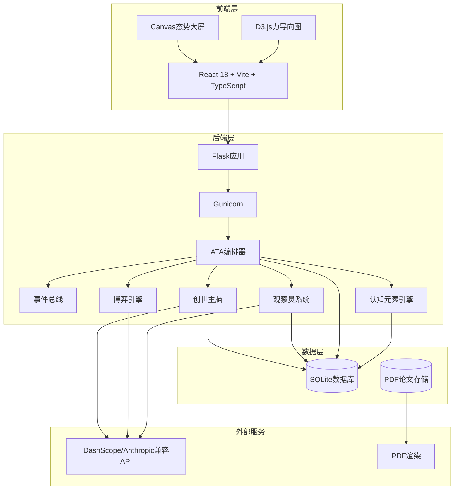
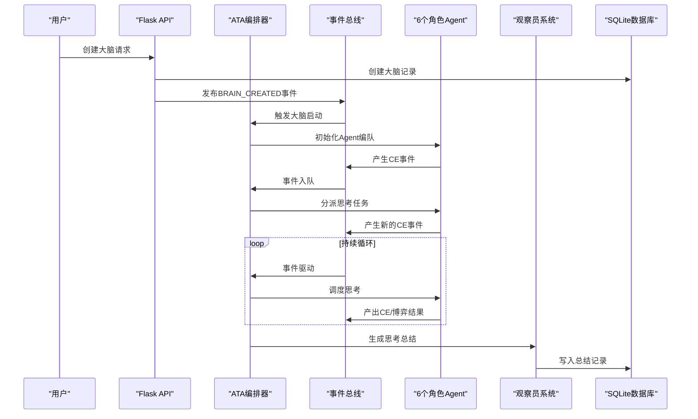
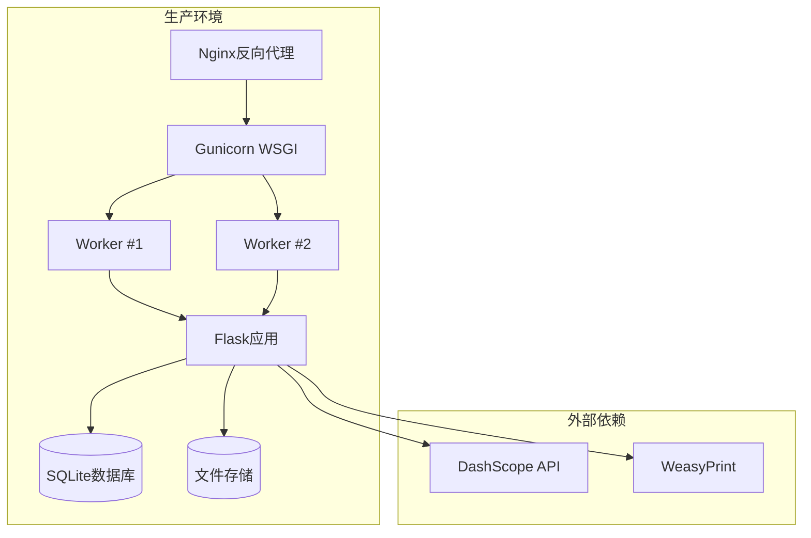

# 营销材料

<cite>
**本文档引用的文件**
- [README.md](file://README.md)
- [app.py](file://app.py)
- [orchestrator/core.py](file://orchestrator/core.py)
- [cognitive.py](file://cognitive.py)
- [master_brain_tactics.py](file://master_brain_tactics.py)
- [deliberation.py](file://deliberation.py)
- [observer.py](file://observer.py)
- [brain_summary.py](file://brain_summary.py)
- [paper_generator.py](file://paper_generator.py)
- [config.py](file://config.py)
- [agents/director.py](file://agents/director.py)
- [engines/base.py](file://engines/base.py)
</cite>

## 目录
1. [项目简介](#项目简介)
2. [核心特性概览](#核心特性概览)
3. [架构与组件](#架构与组件)
4. [营销定位与差异化优势](#营销定位与差异化优势)
5. [目标受众与应用场景](#目标受众与应用场景)
6. [技术亮点与创新点](#技术亮点与创新点)
7. [实施与部署建议](#实施与部署建议)
8. [风险提示与局限性](#风险提示与局限性)
9. [结语](#结语)

## 项目简介

AInstein（爱因斯坦）是一个开源的「硅基大脑」孵化器项目，致力于探索「机器能否独立思考」这一根本性问题。该项目并非传统意义上的AI工具或聊天机器人，而是一个长期、开放、非商业优先的实验项目，旨在通过多智能体协作与事件驱动的思考循环，让AI在群体心智中实现「自组织、自调节、自我收敛」的智能涌现。

项目的核心理念包括：
- 单个LLM是计算单元，智能在协作思维链上涌现
- 群脑高于单脑，分支大脑的死亡是更大思维的养料
- 思考不只是否定，也是综合与确认，好的群体心智三者并存
- 认知经济学：大部分Agent锚定"解题"，像生物体一样不浪费能量

## 核心特性概览

### 1. 创世主脑（Master Brain）
- 全局唯一单例，系统初始化即存在，归属管理员，不可删除
- 自动上报：分支大脑收敛终止时，筛选confidence > 0.7的精华结论整体注入主脑
- 三种自主思辨：主脑内博弈、跨域综合、元认知反思
- 多维节流（cooldown-based）：以"按需思考"代替硬上限，让主脑像生物一样平稳呼吸

### 2. ATA事件驱动编排器
- 每颗大脑由_brain_loop主循环驱动，事件即神经递质
- 事件驱动：CE落库即触发事件，唤醒相关Agent，而非定时轮询
- frontier探索：维护一个待展开的认知前沿，按价值排序消费
- 跨worker同步：Gunicorn多worker下通过文件锁保证单写者，DB轮询保持状态一致

### 3. 6个平等角色 + Observer
- 去层级化后的6个角色彼此完全平等，没有谁能拍板
- 角色定位与行为偏好：
  - investigator：求证者，行动导向，优先调用工具获取事实
  - reasoner：推导者，结论导向，基于已有证据做逻辑推导
  - synthesizer：综合者，终局思维，整合CE为完整回答
  - critic：质检者，建设性批判，确保结论正确性
  - explorer：探索者，唯一允许自由发散，受50%能量预算约束
  - observer：观察员，上帝视角叙事推送，不参与博弈
- 认知经济学原则：大部分Agent以"解决问题"为核心驱动；只有explorer被允许少量发散，且严格预算

### 4. 认知元素（CE）体系
- 一切"思维产物"被统一抽象为CE节点，分布在13种类型上
- 状态生命周期：open → testing/supported/refuted/revised → confirmed/archived
- CE再激活：被refute的CE遇到新证据时自动reopen
- 置信度贝叶斯更新 + 反向传播：底层CE被证伪时，依赖它的高层CE自动进入at_risk

### 5. 三轨博弈引擎
- 旧版本只懂"推翻"。v3起，博弈引擎拥有三种模式，对应思维的三种姿态
- 博弈类型与触发条件：
  - 推翻式：检测contradicts/refutes关系，否定与质疑
  - 建设性综合：关系密集的CE簇可被合并，整合与提炼
  - 建设性确认：高置信度CE已有充分证据支撑，正式承认
- 共识阈值0.6（v3从0.75下调，让建设性共识更容易形成）
- 否决阈值0.25，介于其间记录为dissent
- 每个Agent持有性格向量（risk_appetite、skepticism、novelty_bias…），同一角色不同实例产出不同观点

### 6. tool_proposal：工具调用作为可博弈的认知元素
- Agent提议使用工具 → 落库为inference类型CE（payload.tool_status='pending_vote'）
- 触发轻量级博弈（≤2Agent投票） → 通过则执行
- 工具结果作为evidence类型CE注入，建立derives_from关系
- 工具调用不是硬编码的ifneeds_searchthencall_search——它是一个可被讨论、可被否决、可被追溯的认知行为

### 7. 自调节闭环（v3.1+）
- 大脑现在拥有完整的自我调节系统——像生物体一样，能感知自己的认知偏差并主动纠正
- 偏差信号与调节机制：
  - 积压问题太多：已知问题优先解决，派investigator/reasoner解答最老的open question
  - 共识太顺、无人反对：异质性刺激，派explorer引入新变量 + critic充当魔鬼代言人
  - 发散过多、不收敛：收敛压力，切换到reasoner/synthesizer/critic，暂停explorer
  - 长时间不综合：强制综合脉冲，每20CE强制synthesizer综合一次
  - 工具不够用：tool_gap元认知CE，agent调查无果时主动产出"我需要什么工具"

### 8. 双轨终止 + 自动上报
- 主轨：synthesizer产出conclusion且confidence ≥ 0.75，自动停止 → 思考总结 → 论文生成
- 兜底轨：CE总数≥500或运行时长≥1小时，强制综合 + 终结
- 任何方式终止后，结论自动上报创世主脑——这一颗思维的死亡，是更大思维的养料

### 9. 管理员"上帝视角" + 态势大屏
- 全局态势视图：主脑C位发光，分支按owner分组
- 态势大屏：主脑-分支脑拓扑图（力导向Canvas），可俯瞰整个群脑的呼吸状态

### 10. 力导向知识图谱 + Observer叙事
- 前端D3力导向图：节点质量∝confidence、种子节点固定为图心引力源、实时CE流随思考同步更新
- Observer实时监听事件总线，以上帝视角的自然语言叙事讲述大脑当前正在发生什么

### 11. 思考总结 + PDF论文生成
- 思考总结：大脑停止时自动生成，前端以可折叠卡片展示
- PDF论文：基于CE知识图谱自动撰写，WeasyPrint学术期刊级排版，NotoCJK中文字体完整支持

### 12. 强密码注册（部署中）
- 8位 + 大小写字母 + 数字 + 特殊字符
- 前后端双重校验，防止弱口令账号污染思考容器

## 架构与组件

### 系统架构图

**图表来源**
- [app.py](file://app.py)
- [orchestrator/core.py](file://orchestrator/core.py)
- [cognitive.py](file://cognitive.py)
- [observer.py](file://observer.py)
- [master_brain_tactics.py](file://master_brain_tactics.py)

### 核心组件交互流程

**图表来源**
- [app.py](file://app.py)
- [orchestrator/core.py](file://orchestrator/core.py)
- [observer.py](file://observer.py)

## 营销定位与差异化优势

### 市场定位
AInstein定位于"机器独立思考"的探索性产品，区别于传统的AI工具和聊天机器人，专注于以下市场空白：

1. **学术研究与知识发现**
   - 为研究人员提供全新的思维工具，支持复杂问题的深度探索
   - 自动生成研究总结和论文，提升学术研究效率

2. **企业创新与战略决策**
   - 辅助企业进行复杂问题分析和方案评估
   - 提供多角度的思维碰撞和观点整合

3. **教育与培训**
   - 作为教学工具，展示复杂问题的解决思路
   - 培养学生的批判性思维和综合分析能力

### 差异化优势

#### 1. 独特的思维架构
- **群脑协作**：多个AI角色平等协作，模拟人类群体智慧
- **自组织思考**：无需人工干预，系统自动寻找最优解决方案
- **自我调节**：具备认知偏差识别和纠正能力

#### 2. 透明的思考过程
- **可视化思维流**：力导向知识图谱实时展示思维演进
- **上帝视角叙事**：Observer提供自然语言的思考过程解读
- **可追溯性**：每个观点、证据、结论都有完整的历史记录

#### 3. 高度可定制化
- **角色配置**：可根据不同场景调整Agent的角色和权重
- **阈值调节**：支持自定义共识阈值和收敛条件
- **工具集成**：开放的工具调用机制，支持第三方工具接入

#### 4. 学术级输出质量
- **论文自动生成**：基于WeasyPrint的学术期刊级排版
- **结构化总结**：提供可折叠的思考总结卡片
- **多格式导出**：支持PDF、Markdown等多种格式

## 目标受众与应用场景

### 目标受众

#### 1. 学术研究机构
- 高校和科研院所的研究人员
- 需要进行复杂问题分析的学术团队
- 关注AI思维机制的学者和研究人员

#### 2. 企业研发部门
- 需要进行技术路线评估的企业
- 制定创新战略的研发团队
- 进行市场分析和竞品研究的商业分析师

#### 3. 教育培训机构
- 高校计算机学院和人工智能专业
- 培训机构的课程教学
- 继续教育和终身学习项目

### 应用场景

#### 1. 复杂问题分析
- 技术难题攻关：如算法优化、系统架构设计等
- 商业策略制定：如市场进入策略、产品定价等
- 科学研究：如理论验证、实验设计等

#### 2. 知识整合与发现
- 文献综述：自动整理和分析大量文献资料
- 竞品分析：全面评估竞争对手的优势和劣势
- 趋势预测：基于历史数据预测未来发展方向

#### 3. 教学与培训
- 案例分析：展示复杂问题的解决过程
- 思维训练：培养批判性思维和综合分析能力
- 团队协作：模拟多角色协作的决策过程

## 技术亮点与创新点

### 1. 事件驱动的思考循环
- **零耦合设计**：CE事件触发Agent思考，避免了传统轮询的资源浪费
- **弹性扩展**：支持多Worker并发处理，通过文件锁保证数据一致性
- **实时响应**：新CE产生即刻触发相关Agent，响应速度极快

### 2. 多维度的自调节机制
- **认知节流**：替代硬上限的多维冷却机制，避免思维过载
- **偏差检测**：自动识别积压问题、共识饱和、发散过度等认知偏差
- **自适应调节**：根据思维状态动态调整探索与收敛的比例

### 3. 三轨博弈的思维模式
- **建设性思维**：不仅否定，更注重综合与确认
- **多视角平衡**：确保不同观点得到充分表达
- **可审计性**：完整的博弈过程记录，支持事后分析和改进

### 4. 开放的工具生态系统
- **工具提案机制**：工具调用需要经过Agent间的讨论和投票
- **元认知反馈**：当工具不足时，系统能够识别并提出改进需求
- **插件化设计**：支持第三方工具的无缝集成

### 5. 学术级的输出质量
- **WeasyPrint渲染**：基于Cairo/Pango的高质量PDF输出
- **中文字体支持**：完整支持Noto CJK字体，解决中文排版难题
- **结构化导出**：提供多种格式的标准化输出

## 实施与部署建议

### 技术栈要求
- **后端**：Python 3.10+，Flask + Gunicorn（2workers，timeout 300s）
- **前端**：React 18 + Vite + TypeScript
- **数据库**：SQLite（WAL模式），路径/opt/ainstein/data/ainstein.db
- **LLM**：DashScope Anthropic兼容API（默认kimi-k2.6）
- **PDF渲染**：WeasyPrint + Noto CJK
- **部署**：Nginx反代 + Gunicorn + systemd（Ubuntu 22.04）

### 部署架构

**图表来源**
- [config.py](file://config.py)
- [app.py](file://app.py)

### 配置建议

#### 1. 环境变量配置
- AINSTEIN_DB：数据库文件路径，默认/opt/ainstein/data/ainstein.db
- DASHSCOPE_API_KEY：DashScope API密钥
- DASHSCOPE_BASE_URL：DashScope基础URL
- RESEARCH_MODEL/SCIENTIST_MODEL/DIRECTOR_MODEL：各角色使用的模型名称

#### 2. 性能调优
- **Worker数量**：根据CPU核心数调整Gunicorn worker数量
- **超时设置**：根据任务复杂度调整timeout参数
- **数据库连接池**：合理配置SQLite连接池大小
- **缓存策略**：利用前端静态资源缓存减少服务器负载

#### 3. 监控与日志
- **应用日志**：记录关键操作和错误信息
- **性能监控**：监控响应时间和资源使用情况
- **用户行为追踪**：记录用户操作和思考过程

## 风险提示与局限性

### 技术局限性

#### 1. 计算资源限制
- **内存占用**：随着CE数量增长，内存使用呈指数级增长
- **CPU消耗**：多Agent并发思考会消耗大量CPU资源
- **存储空间**：长期运行会产生大量数据，需要定期清理

#### 2. 模型依赖风险
- **API稳定性**：依赖外部LLM API的稳定性
- **成本控制**：大规模使用会产生较高的API费用
- **模型更新**：外部模型更新可能影响系统稳定性

#### 3. 数据一致性挑战
- **多Worker同步**：虽然有文件锁保护，但在极端情况下仍可能出现数据竞争
- **事务处理**：SQLite在高并发写入场景下可能存在性能瓶颈

### 应用风险

#### 1. 结果可靠性
- **AI偏见**：LLM可能产生偏见或错误信息
- **过度自信**：系统可能对不确定的结果表现出过高置信度
- **结果解释**：Observer的叙事可能带有主观色彩

#### 2. 用户期望管理
- **思考质量**：系统的思考质量取决于输入问题的质量和Agent配置
- **收敛速度**：复杂问题可能需要较长的思考时间
- **输出准确性**：系统输出需要用户进行二次验证

### 风险缓解措施

#### 1. 技术防护
- **资源监控**：实时监控系统资源使用情况
- **超时保护**：为长时间运行的任务设置合理的超时限制
- **错误恢复**：实现自动化的错误检测和恢复机制

#### 2. 质量保障
- **多轮验证**：对关键结论进行多Agent交叉验证
- **人工审核**：重要决策需要人工最终确认
- **版本控制**：对系统配置和模型版本进行严格管理

#### 3. 用户教育
- **使用指南**：提供详细的使用说明和最佳实践
- **期望管理**：帮助用户理解系统的局限性和适用范围
- **反馈机制**：建立用户反馈渠道，持续改进系统

## 结语

AInstein项目代表了AI发展的一个重要方向——从工具化向思维化的转变。虽然目前仍处于实验阶段，但其独特的设计理念和技术实现已经展现了巨大的潜力。

对于寻求创新解决方案的研究机构、企业团队和个人开发者来说，AInstein提供了探索"机器独立思考"这一前沿领域的宝贵机会。通过参与这个项目，您不仅可以体验到最新的AI思维技术，还能为推动AI向更高层次的发展做出贡献。

项目的长期愿景是构建一个真正能够独立思考的AI系统，这需要整个社区的共同努力。我们诚邀各界人士加入这个充满挑战和机遇的项目，共同见证和参与这一历史性的技术突破。

---

**项目特色总结**：
- 🧠 独特的群脑协作架构
- 🔄 自我调节的思维循环
- 📊 可视化的思维过程
- 📚 学术级的输出质量
- 🔧 开放的工具生态系统
- 🎯 面向未来的创新理念

**联系方式**：
- GitHub Issues：Bug报告和功能请求
- Discussions：概念探讨和哲学讨论
- Pull Requests：代码贡献和功能增强

让我们一起见证机器思维的诞生，开启AI发展的新篇章！