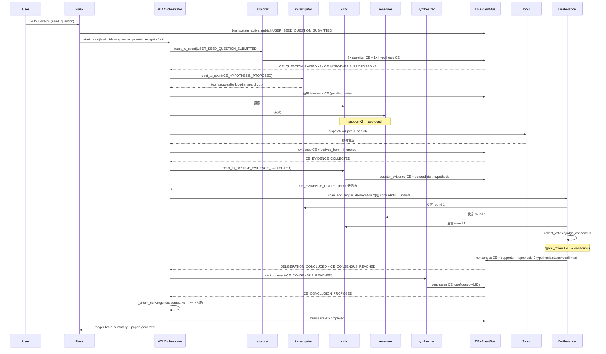

# AInstein 认知机制详解

> 本文档详述硅基大脑的认知层运作机理，包括认知元素（CE）类型体系、关系语义、事件驱动循环、博弈裁决、收敛压力、工具博弈机制等。
>
> 配套阅读：[docs/design.md](./design.md)（系统架构）、[docs/silicon-brain-blueprint.md](./silicon-brain-blueprint.md)（设计蓝图）。

---

## 1. 认知元素（CE）层次体系

认知元素是硅基大脑的「**思维粒子**」。所有 Agent 的产出都必须落地为 CE，否则不存在。

### 1.1 12 种 CE 类型

完整列表定义于 [cognitive.CE_TYPES](file:///Users/gaodongyue/私人文件/唤活大模型/ainstein/cognitive.py#L24-L37)。按抽象层次分为 5 层：

| 层级 | 类型 | 定义 | 典型内容 | 主要产出角色 |
| --- | --- | --- | --- | --- |
| **L0 原始** | `observation` | 来自工具或外部数据的客观观察 | "REM 睡眠期间脑电图与清醒时相似（来源：Wikipedia）" | investigator |
| **L1 推测** | `question` | 提出待解的问题 | "梦境与记忆巩固有什么关系？" | explorer |
| | `hypothesis` | 可证伪的命题 | "梦是大脑在 REM 期巩固情景记忆的副产物" | explorer / investigator |
| **L2 证据** | `evidence` | 支持某 hypothesis 的证据 | "实验：REM 剥夺组次日记忆测试得分下降 23%" | investigator |
| | `counter_evidence` | 反证某 hypothesis 的证据 | "盲人也做梦，且包含视觉意象" | critic / investigator |
| **L3 推理** | `inference` | 从证据/前提推导出的中间命题 | "若 REM 剥夺影响记忆，则梦至少与记忆部分相关" | reasoner |
| | `argument` | 完整论证（前提+推导+结论） | "由 evidence#3 + hypothesis#1，推出..." | reasoner |
| **L4 认知** | `conclusion` | 阶段性结论 | "梦是 REM 期记忆巩固过程的体验副产物" | reasoner / synthesizer |
| | `perspective` | 整体观点 | "从演化视角看，梦是次级现象，非独立功能" | synthesizer |
| | `insight` | 跨层洞察 | "梦的'无意义感'恰恰证明它是副产物而非目的" | synthesizer |
| **L5 集体** | `consensus` | 博弈共识产物 | （由 deliberation 自动生成） | （博弈裁决） |
| | `dissent` | 博弈分歧产物 | （同上） | （博弈裁决） |

### 1.2 客观性与可证伪性

所有 CE 必须满足：

- **可追溯**：通过 `created_by_agent_id` / `source_session_id` / `payload.confidence_history` 完整记录来源；
- **可验证**：通过 `derives_from` / `supports` 关系连接到 evidence；
- **可证伪**：可被新 evidence 否决（→ `counter_evidence` + `refutes` 关系）。

### 1.3 角色与 CE 偏好

每个角色有偏好的 CE 类型（不是限制）：

```python
ROLES = {
    "explorer":     preferred = ["question", "observation", "hypothesis"],
    "investigator": preferred = ["evidence", "counter_evidence", "observation"],
    "reasoner":     preferred = ["inference", "argument", "conclusion"],
    "critic":       preferred = ["counter_evidence", "dissent"],
    "synthesizer":  preferred = ["insight", "perspective", "consensus"],
    "observer":     preferred = ["insight"],   # 仅元认知 insight
}
```

实际产出由 LLM 根据上下文自由决定，但 prompt 会引导其往偏好类型上靠。

---

## 2. CE 关系网络

### 2.1 10 种关系类型

定义于 [cognitive.RELATION_TYPES](file:///Users/gaodongyue/私人文件/唤活大模型/ainstein/cognitive.py#L40-L51)，分为 3 类语义：

| 语义大类 | 关系 | 含义 |
| --- | --- | --- |
| **支持/推导** | `supports` | A 支持 B（A 是 B 的论据） |
| | `derives_from` | A 由 B 推导而来（含工具结果 → 工具提议） |
| | `elaborates` | A 细化了 B |
| | `requires` | A 依赖 B 成立 |
| **反驳/矛盾** | `refutes` | A 反驳 B（事实层面） |
| | `contradicts` | A 与 B 矛盾（命题层面） |
| | `supersedes` | A 取代了旧版 B |
| **其他关联** | `generalizes` | A 是 B 的泛化 |
| | `inspires` | A 启发了 B |
| | `relates_to` | 任意关联（兜底） |

### 2.2 图结构

CE + 关系构成一个**有向图**，整体上是 DAG（有向无环），但通过 `supersedes` / `version` 字段允许"修订链"：

```
hypothesis_v1 (refuted)
    │ supersedes
    ▼
hypothesis_v2 (open) ──supports──▶ inference#5 ──derives_from──▶ conclusion#1
                                        ▲
                                        │ supports
                                  evidence#3 (from wikipedia_search)
                                        ▲
                                        │ derives_from
                                  inference#tool_proposal_2
```

### 2.3 自动派生的关系

部分关系不由 LLM 显式输出，而由编排器自动建立：

| 触发场景 | 自动建立的关系 |
| --- | --- |
| `tool_proposal` 通过博弈并执行 | `derives_from`：evidence CE → 工具提议 inference CE |
| 博弈得出 `consensus` | `supports`：consensus CE → 目标 CE（target_ce） |
| 博弈得出 `dissent` | `contradicts`：dissent CE → 目标 CE |
| 假设跟进生成 evidence | `supports` / `refutes`：evidence → hypothesis |

### 2.4 矛盾扫描

[orchestrator._scan_and_trigger_deliberation](file:///Users/gaodongyue/私人文件/唤活大模型/ainstein/orchestrator.py#L2185) 每个 think_cycle 扫描最近 ~30 个 CE 上的 `contradicts` / `refutes` 关系，自动发起博弈。这是图中"矛盾边"驱动的认知裁决。

---

## 3. 事件驱动认知循环

### 3.1 完整事件类型清单

定义于 [event_bus.EventTypes](file:///Users/gaodongyue/私人文件/唤活大模型/ainstein/event_bus.py#L66-L110)。

#### 认知元素事件

| 事件 | 何时发布 |
| --- | --- |
| `CE_CREATED` | 任何 CE 创建后（通用兜底事件） |
| `CE_UPDATED` | CE 内容/状态/置信度变更后 |
| `CE_CHALLENGED` | CE 被 critic 质疑 |
| `CE_OBSERVATION_CREATED` | observation 类型 CE 创建 |
| `CE_QUESTION_RAISED` | question 类型 CE 创建 |
| `CE_HYPOTHESIS_PROPOSED` | hypothesis 类型 CE 创建 |
| `CE_EVIDENCE_COLLECTED` | evidence / counter_evidence 创建 |
| `CE_HYPOTHESIS_SATURATED` | 假设证据饱和（由 reasoner 触发或 frontier 收敛模式伪事件） |
| `CE_CONCLUSION_PROPOSED` | conclusion 创建 |
| `CE_CONCLUSION_ACCEPTED` | 结论被博弈确认 |
| `CE_PERSPECTIVE_FORMED` | perspective 创建 |
| `CE_CONSENSUS_REACHED` | 博弈得出 consensus |
| `CE_DISSENT_DETECTED` | 博弈得出 dissent |
| `CE_INSIGHT_EMERGED` | insight 创建 |

#### Agent 生命周期事件

| 事件 | 何时发布 |
| --- | --- |
| `AGENT_SPAWNED` | AgentPool.spawn |
| `AGENT_DESPAWNED` | AgentPool.despawn |
| `AGENT_ROLE_CHANGED` | AgentPool.transform_role |
| `AGENT_COMPLETED` | Agent 完成一次思考 |

#### 博弈事件

| 事件 | 何时发布 |
| --- | --- |
| `DELIBERATION_REQUESTED` | DeliberationEngine.initiate（同时编排器订阅以代理执行） |
| `DELIBERATION_CONCLUDED` | 博弈 conclude 后；synthesizer 监听以推进综合 |

#### 大脑生命周期事件

| 事件 | 何时发布 |
| --- | --- |
| `BRAIN_CREATED` | 数据库 brains 行创建 |
| `BRAIN_PAUSED` / `BRAIN_RESUMED` / `BRAIN_ARCHIVED` | 状态变更 |
| `BRAIN_CYCLE_TICK` | 每个 think_cycle 末端发布（诊断用） |

#### 用户与观察员事件

| 事件 | 何时发布 |
| --- | --- |
| `USER_SEED_QUESTION_SUBMITTED` | 创建大脑时由 app.py 发布 |
| `OBSERVER_SUMMARY_DUE` | 观察员定时兜底总结 |

### 3.2 事件 → 角色映射（_EVENT_TO_ROLES）

orchestrator 根据事件类型选择候选角色集合：

```python
_EVENT_TO_ROLES = {
    USER_SEED_QUESTION_SUBMITTED: {investigator, explorer},
    CE_OBSERVATION_CREATED:       {explorer, investigator},
    CE_QUESTION_RAISED:           {investigator, reasoner},
    CE_HYPOTHESIS_PROPOSED:       {investigator, critic},
    CE_EVIDENCE_COLLECTED:        {reasoner, critic},
    CE_HYPOTHESIS_SATURATED:      {reasoner},
    CE_CONCLUSION_PROPOSED:       {critic, synthesizer},
    CE_CONCLUSION_ACCEPTED:       {synthesizer, observer},
    CE_PERSPECTIVE_FORMED:        {synthesizer},
    CE_CONSENSUS_REACHED:         {synthesizer, observer},
    CE_DISSENT_DETECTED:          {critic, synthesizer},
    CE_INSIGHT_EMERGED:           {synthesizer, observer},
    CE_CHALLENGED:                {critic},
    DELIBERATION_CONCLUDED:       {synthesizer},
    CE_CREATED:                   {investigator},  # 兜底
}
```

### 3.3 一次完整的思维循环示例

种子问题：「人为什么会做梦？」



### 3.4 思考的「自驱」与「他驱」

- **他驱**：事件队列非空时，从队列取事件 → 派给对应角色（事件驱动）；
- **自驱**：事件队列为空时，从 frontier 拉一个低置信度元素 → 构造伪事件派给 explorer / investigator / reasoner（取决于 idle 优先级或收敛模式）。

`wake.wait(backoff)` 让线程在没事时进入指数退避休眠（1s → 60s），事件入队会立即唤醒。这是大脑的「呼吸节律」。

---

## 4. 博弈与共识

### 4.1 5 步博弈流程

```
┌─────────────────────────────────────────────────────────────┐
│  initiate          建 deliberation 行                        │
│                    选 3-5 名参与者（按 _ROLE_PREFERRED_CE）   │
│                    发布 DELIBERATION_REQUESTED                │
│  ─────                                                        │
│  run_turn × 3      每轮内每个参与者依序发言                  │
│                    Agent.participate_in_deliberation         │
│                    输出 stance + speech + cited_ce_ids       │
│                    写 deliberation_turns 表                  │
│  ─────                                                        │
│  collect_votes     取每个 Agent 最后一轮 stance              │
│                    映射：propose/support→agree                │
│                          oppose→disagree                     │
│                          其他→abstain                        │
│                    weight = agent_instances.weight (默认 1.0) │
│                    写 deliberation_votes 表                   │
│  ─────                                                        │
│  judge_consensus   weighted_agree_ratio = w_agree/(w_agree+w_disagree)│
│                    if ratio ≥ 0.6 and agree_count ≥ 2:       │
│                        outcome = consensus                    │
│                    elif ratio ≥ 0.5 and agree > disagree:    │
│                        outcome = majority                     │
│                    else:                                      │
│                        outcome = dissent                      │
│  ─────                                                        │
│  conclude          consensus → 创建 consensus CE             │
│                    majority → 创建 perspective CE            │
│                    dissent → 创建 dissent CE                 │
│                    建立 supports/contradicts 关系到 target   │
│                    写 deliberations.outcome / resolved_at    │
│                    发布 DELIBERATION_CONCLUDED                │
└─────────────────────────────────────────────────────────────┘
```

### 4.2 阈值

```python
DEFAULT_CONSENSUS_THRESHOLD = 0.6   # 加权赞成比阈值
DEFAULT_MAJORITY_THRESHOLD  = 0.5   # 多数阈值
MIN_PARTICIPANTS = 3
MAX_PARTICIPANTS = 5
DEFAULT_MAX_ROUNDS = 3
```

> 历史上为 2/3 (≈0.667)，因 37:1 的 dissent/consensus 失衡问题降到 0.6。

### 4.3 stance → vote 映射

```python
_STANCE_TO_VOTE = {
    "propose":  "agree",
    "support":  "agree",
    "oppose":   "disagree",
    "abstain":  "abstain",
    # 其他/未发言 → "abstain"
}
```

### 4.4 性格向量影响发言

`agent_instances.personality_json` 存储性格向量（如 `{"open_mindedness": 0.8, "skepticism": 0.3}`），在生成发言 prompt 时注入，使同角色多实例产生差异化输出，避免博弈成为"自言自语"。

### 4.5 博弈结果对 CE 状态的影响

| outcome | target_ce 状态变化 |
| --- | --- |
| `consensus` | 维持原 type；若是 hypothesis → `confirmed`；并新建 `consensus` CE 通过 `supports` 关联 |
| `majority` | 维持 `open`；新建 `perspective` CE 表达"主流观点" |
| `dissent` | 状态 → `contested`；新建 `dissent` CE 通过 `contradicts` 关联 |

---

## 5. 置信度传播

### 5.1 单点更新

[`cognitive.update_confidence(element_id, new_confidence, reason)`](file:///Users/gaodongyue/私人文件/唤活大模型/ainstein/cognitive.py#L413):

- 裁剪到 [0, 1]；
- 旧值 → 新值 + reason 追加到 `payload.confidence_history`；
- `version` 自增（乐观锁简化版）。

### 5.2 关系驱动的传播

orchestrator 每 10 cycle 调用一次 `_propagate_confidence`：

```
对图中每条出边：
  关系=supports     → 置信度部分提升 dst.confidence
  关系=refutes      → 部分降低 dst.confidence
  关系=derives_from → dst.confidence = α * dst + β * src
  关系=contradicts  → 双方都降低（视权重）
  关系=elaborates   → 较弱传播
```

具体公式不是严格贝叶斯，而是经验性加权 —— 目标是让强证据快速反映到结论上，而不是数学严谨的概率推理。

### 5.3 收敛阈值依赖于此

收敛主轨判据是 synthesizer 产出的 conclusion CE 置信度 ≥0.75。这个阈值要求：

1. 多条 evidence 通过 `supports` 提升 hypothesis 置信度；
2. hypothesis 通过 `derives_from` 提升 conclusion 置信度；
3. 期间 critic 不能成功用 counter_evidence 把它打下来。

---

## 6. 收敛压力机制

设计目标：**避免大脑无限发散、结构松散**。

### 6.1 三种调度模式

`_check_convergence_pressure` 返回：

| 模式 | 触发条件 | 动作 |
| --- | --- | --- |
| `explore` | 默认 | frontier 派遣 explorer/investigator |
| `converge` | 探索/收敛 CE 比 > 5.0；或 open question 占比 > 30% | frontier 改派 reasoner/synthesizer/critic，prompt 强调"整合现有 CE，禁止新问题" |
| `force_synthesis` | 距上一次 conclusion/consensus/inference 已积累 ≥20 个 CE | 在 frontier 探索前先插入综合脉冲（直接派给 synthesizer） |

### 6.2 探索类 vs 收敛类 CE 分类

```python
_EXPLORATION_TYPES   = {observation, question, hypothesis, evidence, counter_evidence}
_CONSOLIDATION_TYPES = {inference, argument, conclusion, consensus, insight}
```

判断比例：

```python
recent_20_CE  → exploration_count / consolidation_count
if ratio > 5.0:  # 5 倍探索类积压
    mode = "converge"
```

### 6.3 问题深度限制

```python
_MAX_OPEN_QUESTION_RATIO = 0.3
```

`_check_question_depth` 计算 `open_question_count / total_open_count`；超过 30% 则强制进入 converge 模式（不再产生新 question）。

### 6.4 强制综合脉冲

`_FORCED_SYNTHESIS_INTERVAL = 20`：每产出 20 个 CE 强制 synthesizer 综合一次。即使没有矛盾、没有共识，也要定期"喘口气"形成阶段性结论。

---

## 7. 双轨终止策略

### 7.1 主轨：高置信度自然收敛

```python
_CONVERGENCE_CONFIDENCE_THRESHOLD = 0.75
_CONVERGENCE_ROLE_KEY = "synthesizer"
_CONVERGENCE_CE_TYPE = "conclusion"
```

判定：synthesizer 产出 `conclusion` 类型 CE 且 `confidence ≥ 0.75` → 大脑自动停止（state=completed）。

阈值历史：

- 0.9（初版）→ 太严苛，开放性问题永远收敛不了；
- **0.75**（当前）→ 适配哲学性、社会性、开放性问题。

### 7.2 兜底轨：CE 数量 / 时长封顶

```python
_FALLBACK_CE_COUNT          = 500    # CE 总数
_FALLBACK_DURATION_SECONDS  = 3600   # 运行时长（秒）
```

任一满足 → `_force_synthesizer_conclusion`：

- 构造伪 `SYNTHESIS_REQUIRED` 事件；
- 直接派给 synthesizer，prompt 要求"基于目前所有 CE 综合产出最终结论 + 置信度评分"；
- `BrainState.fallback_triggered = True`，**仅触发一次**；
- 后续是否真正收敛交由下一轮 `_check_convergence` 判断（仍按 0.75 阈值）。

兜底设计哲学：思考再深也要有截止 —— 否则大脑会无限消耗 LLM 配额。

---

## 8. CE 状态生命周期

### 8.1 状态枚举

```
open           初始
proposed       提议中
testing        正在被验证
being_explored 处于 frontier 中
at_risk        受到反证挑战（信号灯，尚未推翻）
contested      博弈分歧后置（dissent 后）
refuted        被证伪
confirmed      被确认（≥2 evidence 支持，或博弈共识）
superseded     被新版本取代
```

### 8.2 自动迁移规则

| 触发场景 | 状态变化 |
| --- | --- |
| 博弈得出 `consensus` | target_ce → `confirmed`（若是 hypothesis） |
| 博弈得出 `dissent` | target_ce → `contested` |
| hypothesis 收到 ≥2 条 `evidence` 支持 | → `confirmed` |
| hypothesis 收到 `counter_evidence` | → `at_risk` 或 `refuted`（视权重） |
| 历史批量修正：被 `contradicts` 指向的 hypothesis | → `contested` |
| 历史批量修正：被 evidence `derives_from` 指向的 inference | → `confirmed` |

### 8.3 再激活机制

[`cognitive.reactivate_element(element_id, reason)`](file:///Users/gaodongyue/私人文件/唤活大模型/ainstein/cognitive.py#L531)：

- 仅当 status ∈ {refuted, contested} 时允许；
- 重置 `confidence = 0.5`，status → `open`；
- 历史记录追加到 `payload.reactivations`；
- 日志：`[CE-lifecycle] CE#X 重新激活: refuted → open`。

应用场景：早期被否决的假设，在新数据出现后重新进入辩论。

### 8.4 frontier 边界判定

`cognitive.get_frontier(brain_id, limit=50, confidence_ceiling=0.7)` 返回三个桶并取并集：

| 桶 | 判据 |
| --- | --- |
| `recent` | 最近 N 个创建的元素 |
| `low_confidence` | confidence < 0.7 且 status ∈ {open, proposed, testing, at_risk, being_explored, contested} |
| `unverified` | 未被任何 `supports` / `derives_from` 边作为目标方引用（无下游证据） |

这是大脑「未完成区」的近似定义，是 `_explore_frontier` 自驱思考的素材来源。

---

## 9. 工具调用作为认知行为

### 9.1 与传统 tool-use 的对比

| 维度 | 传统 tool-use loop | AInstein tool_proposal |
| --- | --- | --- |
| 决策者 | 单 Agent（LLM 直接 call） | 多 Agent（轻量级博弈） |
| 调用前可见性 | 不可见 | 提议作为 inference CE 落库，可被其他 Agent 看到 |
| 调用结果归属 | 仅返回给提议者 | 作为 evidence CE 注入图谱，所有 Agent 可见 |
| 失败可追溯 | 否 | 是（rejected 状态保留在 payload.tool_status） |
| 是否可博弈 | 否 | 是（投票通过/否决） |
| 是否影响置信度图 | 否 | 是（evidence 通过 supports 提升 hypothesis） |

这种设计使工具调用从"机械操作"升级为"自主认知行为"。

### 9.2 完整流程

```
┌─ Agent.think (LLM) ─────────────────────────────────────────┐
│  输出 JSON {                                                 │
│    "new_elements": [...],                                    │
│    "new_relations": [...],                                   │
│    "tool_proposal": {                                        │
│      "tool": "web_search",                                   │
│      "params": {"query": "REM sleep memory consolidation"}, │
│      "reason": "需要近 5 年的实验数据来验证 hypothesis#3"  │
│    }                                                         │
│  }                                                           │
└─────────────────┬────────────────────────────────────────────┘
                  ▼
┌─ orchestrator._handle_tool_proposal ────────────────────────┐
│  1. 验证 tool_name ∈ tools.registry.get_tool_names()       │
│  2. 落库提议 → inference CE                                 │
│       payload.tool_proposal = {...}                          │
│       payload.tool_status = "pending_vote"                   │
│  3. 选 ≤2 名非提议者、非 observer Agent 投票                │
│       LLM 返回 {"vote": "support|oppose", "reason": "..."}  │
│       support_count ≥1 → approved                            │
│  4. 否决 → payload.tool_status = "rejected"  RETURN          │
│  5. 通过 → tools.registry.dispatch(tool_name, params)       │
│       结果落库 → evidence CE                                 │
│       建立 derives_from 关系：evidence → inference           │
│       payload.tool_status = "executed"                       │
│       发布 CE_EVIDENCE_COLLECTED                             │
└─────────────────────────────────────────────────────────────┘
```

### 9.3 Prompt Schema 要求

> ⚠️ **关键约束**：要让 Agent 真正能产出 `tool_proposal`，必须在 [roles.prompt_template](file:///Users/gaodongyue/私人文件/唤活大模型/ainstein/agents/framework.py#L351) 的 JSON Schema 输出格式中**显式声明** `tool_proposal` 字段。

framework.py 中的默认 prompt 模板片段：

```text
可以在输出中填写 tool_proposal 字段（不需要时保持 null）：
"tool_proposal": {{
    "tool": "web_search | wikipedia_search | arxiv_search | google_trends | ...",
    "params": {{ ... }},
    "reason": "为什么需要这个工具的简短说明"
}}

约束：
- 一次思考最多提一个 tool_proposal；
- 优先在确无现成证据时才使用；
- 若不需要工具，必须显式输出 "tool_proposal": null。
```

### 9.4 已注册的 11 个工具

| 类别 | 工具 | 主要参数 |
| --- | --- | --- |
| 统计 | `descriptive_stats` | dataset, columns |
| | `correlation` | dataset, col_a, col_b, method |
| | `t_test` | dataset, group_col, value_col |
| | `regression` | dataset, x_cols, y_col |
| | `anomaly_detection` | dataset, col, method |
| | `distribution_fit` | dataset, col |
| | `group_stats` | dataset, group_col, value_cols |
| 外部 | `web_search` | query, max_results |
| | `wikipedia_search` | query, lang |
| | `arxiv_search` | query, max_results |
| | `google_trends` | keywords, geo, timeframe |

> 统计工具需要 `project_id` 才能定位数据集；适用于挂载到大脑的「带数据集」研究项目。外部工具不需要数据集，适用于纯思考型大脑。

---

## 10. 认知经济学原则

### 10.1 设计前提

所有 Agent 的核心主旨都是「**解决问题**」（用繁衍/存活作为隐喻）。非目标导向的发散思考（脑洞）只由极少数专用角色（explorer）承担。

### 10.2 角色的"思维财政预算"

| 角色 | 默认配额 | 思维倾向 |
| --- | --- | --- |
| explorer | 1-2 | 唯一被允许"发散"的角色；产出 question / observation / hypothesis |
| investigator | 1-4 | 求证；最高配额（解题主力） |
| reasoner | 1-3 | 推导；解题骨干 |
| critic | 1-2 | 质疑；防止盲目收敛 |
| synthesizer | 0-1 | 终局；只在收敛时出场 |
| observer | 1-1 | 元认知；不参与博弈 |

**explorer 配额最低**（除 synthesizer/observer 外），且 idle 派遣优先级最低（`investigator > reasoner > explorer`）—— 发散是奢侈品。

### 10.3 收敛压力公式（直观表达）

```
压力 P = max(
    exploration_recent / consolidation_recent / 5.0,
    open_question_count / total_open_count / 0.3,
    ce_since_last_synth / 20
)

P > 1 → 切换收敛模式
```

### 10.4 双轨终止的经济学

- 主轨（0.75 阈值）：思考质量达标即收手；
- 兜底轨（500 CE / 1h）：思考成本封顶。

防止"无限发散导致 LLM 配额浪费"——LLM 调用是有成本的，思考必须有边界。

---

## 11. 观察员（observer）的元认知机制

观察员**不参与**思考与博弈。它的职责：

| 触发 | 输出 |
| --- | --- |
| `DELIBERATION_CONCLUDED` | 一段博弈复盘叙事 |
| 自上次总结新增 ≥10 个 CE | 阶段性思维进展报告 |
| 距上次总结 ≥1 小时 | 兜底定时总结 |
| `OBSERVER_SUMMARY_DUE` | 显式触发 |

输出落到 `observer_logs.body`（JSON 文本承载结构化数据 + 自然语言叙事）。前端 [ObserverPanel](file:///Users/gaodongyue/私人文件/唤活大模型/ainstein/frontend/src/components/ObserverPanel.tsx) 实时展示。

写作风格（强约束在 prompt 中）：

- 第三人称、客观但有温度（科学纪录片旁白）；
- 不用"我/你"，统一用「这个大脑」/「它」；
- 中文，每段不超过 120 字；
- 严禁解释自身是 AI、不寒暄。

---

## 12. 思考结束的产物

当大脑 state=completed 时自动触发：

### 12.1 思考总结（brain_summary.py）

- 提取所有 `confirmed` hypothesis、`conclusion`、`consensus`；
- LLM 生成自然语言总结；
- 默认折叠展示（前端规范）。

### 12.2 论文生成（paper_generator.py）

- 学术结构：摘要 / 引言 / 方法（思考过程） / 论证 / 结论 / 参考；
- 从 CE 图谱抽取论证链；
- 输出 HTML（用 [paper_template.css](file:///Users/gaodongyue/私人文件/唤活大模型/ainstein/paper_template.css) 渲染）和 PDF。

这两个产物把"思考过程"转换为"思考结果"，让用户看到"硅基大脑读完一本书后写下的笔记"。

---

## 附录：术语对照表

| 术语 | 英文 | 实际字段/常量 |
| --- | --- | --- |
| 认知元素 | Cognitive Element (CE) | `cognitive_elements` 表，12 类 type |
| 认知关系 | Cognitive Relation (CR) | `cognitive_relations` 表，10 类 relation |
| 大脑 | Brain | `brains` 表；`state` 字段而非 `status` |
| 角色 | Role | `roles` 表；`role_key` 字段（agent_instances 也用 role_key） |
| Agent 实例 | Agent Instance | `agent_instances` 表 |
| 博弈 | Deliberation | `deliberations` / `deliberation_turns` / `deliberation_votes` |
| 编排器 | ATA Orchestrator | [orchestrator.ATAOrchestrator](file:///Users/gaodongyue/私人文件/唤活大模型/ainstein/orchestrator.py#L186) 单例 |
| 事件总线 | Event Bus | [event_bus.EventBus](file:///Users/gaodongyue/私人文件/唤活大模型/ainstein/event_bus.py#L162) 单例 |
| 共识阈值 | Consensus Threshold | `DEFAULT_CONSENSUS_THRESHOLD = 0.6` |
| 收敛阈值 | Convergence Threshold | `_CONVERGENCE_CONFIDENCE_THRESHOLD = 0.75` |
| CE 总数兜底 | Fallback CE Count | `_FALLBACK_CE_COUNT = 500` |
| 时长兜底 | Fallback Duration | `_FALLBACK_DURATION_SECONDS = 3600` |
| 工具提案 | Tool Proposal | `ThinkingResult.tool_proposal` |
